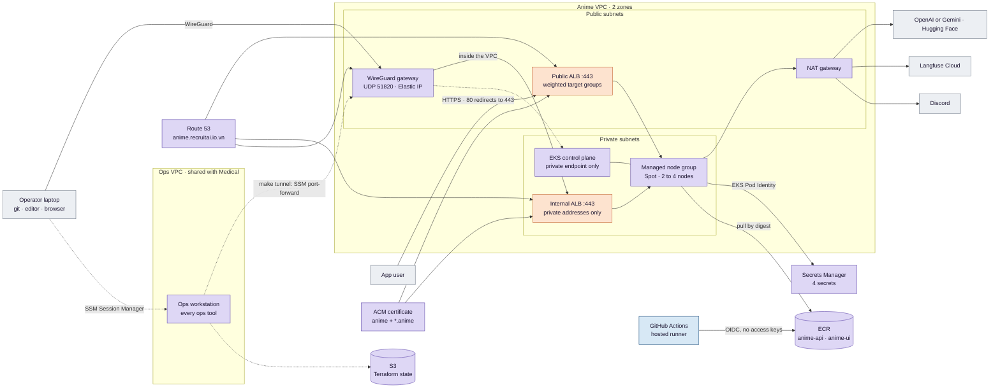
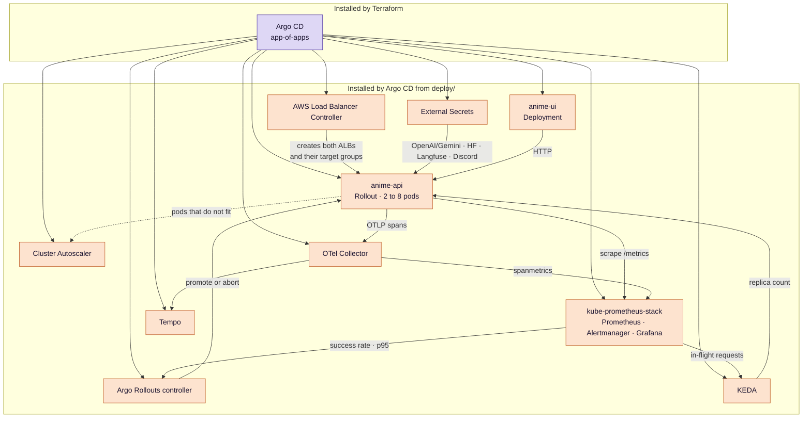
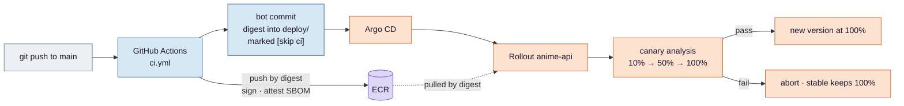
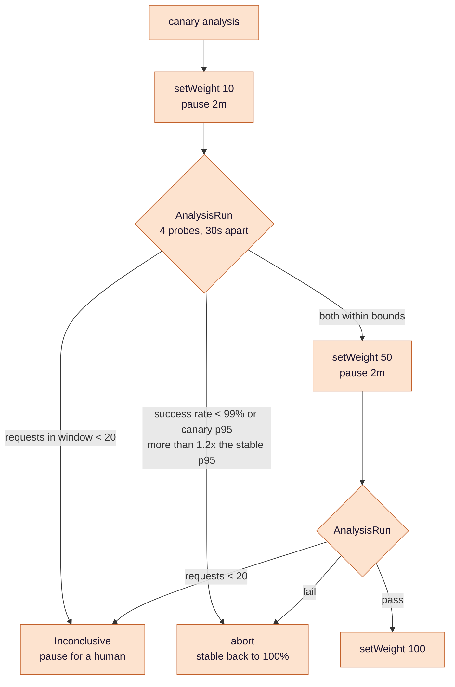

# Anime Recommender — SRE practice on EKS

**A RAG recommender is the workload; the subject is running it the way an SRE team would: SLOs with burn-rate
alerts, a canary that rolls itself back, autoscaling on the right signal, and an LLM you can see the cost of.**


**Status, 2026-09-23.** The cluster, the GitOps tree and the CI/CD pipeline are **built and running on AWS**,
and the load stage is under way: criteria #1, #3, #4, #5 and #6 are closed with evidence in
[`docs/evidence/`](docs/evidence/). The canary, the SLO alerting, the autoscaler and the tracing are **designed
and not yet built**. The pictures and tables that follow describe the target, and each one says where it stands.

- **This is the managed counterpart to
  [Medical-RAG-Chatbot](https://github.com/biabeogo147/Medical-RAG-Chatbot).** That one builds a cluster by
  hand with kubeadm and answers *can you run Kubernetes*. This one takes the cluster as given and answers
  *can you run a service on it* — which is a different job with different evidence.
- **Nothing is claimed here that was not measured.** Every number below links to the
  measurement that produced it; what is built but not yet evidenced says so, and so does what is only designed.
  Which capability sits where is in
  [what each project proves](docs/aws/what-each-project-proves.md#the-capability-matrix).
- **Failure is a first-class mode, not an accident.** A `fake` provider gives deterministic latency and a
  settable error rate, so a rollback drill and a load test cost nothing and repeat exactly.

## By the numbers

Measured on 2026-09-15, all of it local, before the cluster existed. What has since been measured **on the
cluster** is listed after them.

- **One 6.45 GB image became two: api 619 MB and ui 559 MB — 1.18 GB together, −82%.** The old image
  pulled PyTorch through an unused `sentence-transformers`; neither new image carries it
  ([build](docs/evidence/local.md#build-and-tests)). Quoting the api alone as −90% would compare one image
  against half of its replacement.
- **269 anime embedded in 8.5 s during the image build**, content hash `aa0c3ace7f67`. Build the image with
  `EXPECTED_DOCS=270` and it **fails** — the check is wired to fail
  ([build](docs/evidence/local.md#build-and-tests)).
- **The Hugging Face token appears 0 times in `docker history` and 0 times in `docker save`.** It arrives as a
  BuildKit secret mount and never becomes a layer ([build](docs/evidence/local.md#build-and-tests)).
- **`POST /recommend` answered in 3.0 s and 2.7 s** against Gemini, and two requests cost **$0.0025** at list
  price — 1,829 input and 790 output tokens
  ([runtime](docs/evidence/local.md#runtime-gemini-gemini-35-flash-lite)).
- **A 20% fault injection produced exactly 80 × 200 and 20 × 503**, and all three counters agreed
  ([drill](docs/evidence/local.md#failure-drill-fake-provider)).
- **17 tests, ruff clean, containers run as UID 10001** ([build](docs/evidence/local.md#build-and-tests)); the
  compose file also sets a read-only root filesystem, which is configured rather than measured.

Measured on the cluster since:

- **#1** — the `cluster` stack applied from empty, and a re-plan with no changes
  ([terraform](docs/evidence/terraform.md)).
- **#3, #4, #5** — a commit signed, pushed by digest and running; both image sizes; and a truncated catalogue
  refused at startup ([cicd](docs/evidence/cicd.md)). The pipeline's own duration is still *pending*.
- **#6** — the latency target the SLO will use: **T = 8 s**, from 230 real requests with 0 errors
  ([load](docs/evidence/load.md)).

Still not measured, because the stage that produces them has not run: the capacity of the minimum replica count
(#7), time-to-rollback (#9), time-to-alert (#10), cost per 1,000 requests (#12) and the replica count under load
(#14). Criteria **#2**, **#15** and **#16** — the GitOps tree, HTTPS on the app, and admin UIs that answer only
over the VPN — were exercised on the cluster in stage 2, but their evidence file is not written yet, so they are
counted as unevidenced here. The numbers are defined in [design
§6](docs/eks-sre-llmops-design.md#6-verification-and-evidence-definition-of-done).

## Architecture

Three pictures — what AWS holds, what runs inside the cluster, and what happens to a commit — then one
close-up of the box that does the most work. They describe the target, not today. Colour says who owns a box
once it exists — **Terraform**, **Argo CD**, **GitHub Actions** — and grey is what we neither build nor run:
people, and services belonging to someone else.

### 1. On AWS



**Two doors, and the Kubernetes API has neither.** Users reach the public ALB over HTTPS; port 80 exists only
to answer a redirect. The four admin names — `argocd`, `grafana`, `prometheus`, `alertmanager` under
`.anime.recruitai.io.vn` — are public DNS records that answer with **private** addresses, so they resolve for
anyone and open for nobody without the VPN. And because the VPN gateway is a machine of ours inside the VPC,
it can also be the SSM target that `make tunnel` forwards through, which lets the EKS endpoint be closed to
the internet completely: `endpointPublicAccess = false`, no allowlist to keep correct. One certificate from
ACM covers both load balancers, and AWS renews it. Details in
[design §4.7](docs/eks-sre-llmops-design.md#47-names-tls-and-the-two-ways-in).

### 2. Inside the cluster



Prometheus is read by two different controllers for two different purposes: Argo Rollouts asks it whether the
new version is worse than the old one, and KEDA asks it how much work is queued. The same scrape answers both
questions, which is why the app's metrics are designed before either controller is installed.

### 3. What happens to a commit



**The bot commit will be the only writer to `main` that is not a human.** It edits one line — the image digest —
and carries `[skip ci]` so it cannot trigger itself. It is how the registry and the cluster stay in step
without anyone typing a digest by hand.

### 4. Inside the canary

**Where this sits.** The `CANARY` box in [picture 3](#3-what-happens-to-a-commit).



Three outcomes, not two. **A canary that receives too little traffic to judge must not be promoted** — the
analysis returns `Inconclusive` and waits for a person, because "no errors observed" over four requests is not
evidence of anything.

**And the latency gate is relative, not absolute.** The canary is compared with the **stable** version in the
same window, not with the SLO threshold T. T is measured against the real model (OpenAI `gpt-4o-mini` by default); every canary drill runs the fake
provider at a fraction of that latency, so a `p95 ≤ T` gate would sail through saturation and could never
fail. Reasoning in [design §4.4](docs/eks-sre-llmops-design.md#44-progressive-delivery-argo-rollouts).

## The stack, in the order it will be built

Each tool exists because of what the one before it left unsolved. Read the last column of a row and you have
the reason for the next one. Rows 1 to 3 are done and measured; the rest is designed and not built.

| # | Tool | The problem before it | What it solves | What it does not solve |
|---|---|---|---|---|
| 1 | **FastAPI api + thin Streamlit ui** | Streamlit talks over a websocket: there is no HTTP status code to count and no request to replay, so no SLI can be measured and no load test can be written | A real `POST /recommend`, plus `/healthz`, `/readyz`, `/metrics`. The UI becomes a client with no LangChain in it | The index was still whatever happened to be on the build machine's disk |
| 2 | **Index built during the image build, count asserted** | `chroma_db/` is gitignored and copied in by `COPY . .`; a clean build ships an **empty** index and nothing complains | 269 documents asserted at build time, a content hash recorded in the image, `.dockerignore` blocking any local copy | Every load test and failure drill would burn real Gemini and Hugging Face quota |
| 3 | **`fake` provider** | Drills against a rate-limited paid API are neither free nor repeatable, and a failure cannot be asked for on demand | Deterministic hash embeddings, settable latency and `FAULT_RATE`, synthetic token counts so the cost path still runs | It runs on one laptop, by hand, and nowhere else |
| 4 *(not built)* | **Terraform: VPC, EKS, Spot node group** | Nothing is reproducible; the cluster is a story, not an artifact | An account built from empty and a clean `plan` afterwards — criterion #1 | The cluster is empty, and nothing records what should be in it |
| 5 *(not built)* | **Argo CD app-of-apps** | Nobody can say what the cluster runs, or put it back after a teardown | Git is the record; one root Application renders the rest — criterion #2 | Traffic still has no way in, and later, a canary will have no way to split it |
| 6 *(not built)* | **AWS Load Balancer Controller** | An `Ingress` would sit `Pending` forever, and weighted routing does not exist | Two load balancers from one controller: a public one with the weighted target groups the canary depends on, and an internal one | Both answer on an `*.elb.amazonaws.com` name over plain HTTP, and the internal one has no name at all |
| 7 *(not built)* | **Route 53 + ACM + an internal ALB + WireGuard** | The app answers on an AWS load-balancer name over plain HTTP, and Argo CD, Grafana, Prometheus and Alertmanager would answer to anyone who found them | Real names under `anime.recruitai.io.vn`; one ACM wildcard on **both** load balancers, renewed by AWS with a key that cannot be exported; the four admin names resolve publicly but answer with **private** addresses, reachable only over the VPN. The gateway doubles as the SSM target for `make tunnel`, which lets the Kubernetes API endpoint be closed to the internet entirely — criteria #15, #16 | Keys and webhooks would still have to live in Git |
| 8 *(not built)* | **External Secrets + EKS Pod Identity** | The model keys, HF token, Langfuse keys and Discord webhook have nowhere safe to live | Values arrive from Secrets Manager; Git holds only their names, and no pod holds an AWS access key | Images are still built by hand, unscanned and unsigned |
| 9 *(not built)* | **GitHub Actions: test → index → build → Trivy → ECR → cosign** | Whoever can build can ship, and nobody can say what is inside an image | Commit to signed digest with no human in the path, over OIDC with no stored AWS credentials — criteria #3 and #5 | Nothing measures whether what shipped is healthy |
| 10 *(not built)* | **kube-prometheus-stack** | No metrics leave the pods; health is a guess | Scrape, dashboards, Alertmanager, and the one datastore both controllers below will read | "Healthy" is still a human reading a graph, with no threshold to compare against |
| 11 *(not built)* | **k6 baseline and ramp** | An SLO threshold chosen without a measurement is a number someone liked | Real latency in real mode, read from the server's own histogram, sets the target **T**; a fake-mode ramp at an open arrival rate measures what the minimum replica count can carry — criteria #6, #7 | A threshold nobody is paged about |
| 12 *(not built)* | **Sloth SLOs + multi-window burn-rate alerts** | A target with no alert is a wish; a naive alert either pages on noise or sleeps through an outage | Fast-burn pages, slow-burn tickets, each with a runbook link — criterion #10 | Alerts fire *after* users were hurt; a bad release still reaches everyone first |
| 13 *(not built)* | **Argo Rollouts canary + AnalysisRun** | A bad release reaches 100% of users at once, and rollback is a human noticing | 10/50/100 with Prometheus analysis at each step, automatic abort, and a pause when traffic is too thin to judge — criteria #8, #9 | Capacity is fixed: a spike queues behind whatever pods exist |
| 14 *(not built)* | **KEDA on in-flight requests, and the Cluster Autoscaler** | Capacity is whatever replica count was committed, and the obvious remedy does not work here: the pods spend their time waiting on two remote APIs, so CPU barely moves and an HPA on CPU would never fire | Scaling follows in-flight requests — the one signal that tracks demand when the work is waiting, not computing — between 2 and 8 pods; nodes added when pods no longer fit — criterion #14 | You can see *that* a request was slow, never *where* it was slow |
| 15 *(not built)* | **OpenTelemetry → Tempo + Langfuse, and cost metrics** | Latency is one number; retrieval versus generation is invisible, and so is the money | A span per stage with `gen_ai.*` attributes, traces in Tempo, real-model traces in Langfuse (prompt text once capture is built), dollars per 1,000 requests on a dashboard — criteria #11, #12 | A retrieval regression still ships: nothing tests answer quality |
| 16 *(not built, P1)* | **Retrieval eval gate** | Prompt and data changes are merged on opinion | `hit@4` over a golden set, compared against a stored baseline, run in CI with no LLM calls — criterion #13 | — |

**The workload itself:** FastAPI on uvicorn, LangChain, a Chroma index of 269 anime, embeddings from the
Hugging Face Inference API and generation from OpenAI or Gemini (the cluster runs OpenAI since 2026-09-22, design §4.1). `/readyz` reports the index, `/metrics` feeds
Prometheus, and `config/pricing.yaml` turns tokens into dollars.

## Trade-offs, on purpose

Decisions already taken in the design, and the price each one carries. None of them is running yet.

- **Spot nodes, 2 to 4.** Cheap, and interruption becomes something the design must survive rather than
  something it hopes to avoid. The api keeps `minAvailable: 1` and spreads across nodes. The bounds only matter
  because the Cluster Autoscaler moves the group within them; a node group does not scale itself.
- **One NAT gateway**, not one per zone: a cost choice, written down as a single point of failure.
- **Langfuse Cloud, not self-hosted.** Tempo in the cluster stays the source of truth; Langfuse is a second
  export that can fail without affecting a request.
- **The `fake` provider is never the default.** It is set per rollout in values, for drills only. A load-test
  number and a real-provider number are different claims and are always labelled with the mode they came from.
- **Certificates come from ACM, not cert-manager.** An ALB listener cannot read a Kubernetes Secret, so
  cert-manager would mean importing every issued certificate into ACM on a schedule — one more moving part
  that expires quietly when it stops. AWS issues, validates and renews instead, and with default issuance the
  key cannot be exported. Medical runs cert-manager on Let's
  Encrypt and pays for it with a backup-and-restore step on every rebuild, because Let's Encrypt allows five
  issuances per seven days. Two repositories, two answers, and the reason written down in each.
- **The names live in Medical's Route 53 zone.** `anime.recruitai.io.vn` rather than a second registered
  domain: cheaper, and the coupling is recorded rather than discovered.
- **Admin UIs are never public, and the API server is not either.** One small VPN gateway carries both the
  browser and `kubectl`; losing it costs all operator access at once while the service keeps serving.

## Run it

**The app, locally** — this part works today:

```bash
cp .env.example .env         # GOOGLE_API_KEY, HF_TOKEN
docker compose up --build    # api on :8000, ui on http://localhost:8501
```

The image build embeds all 269 anime and fails if the count is wrong. For drills without network or quota:
`LLM_PROVIDER=fake FAULT_RATE=0.2 docker compose up -d api`.

| API endpoint | Purpose |
|---|---|
| `POST /recommend` | `{query}` → `{recommendations, model, retrieved_titles, trace_id}` |
| `GET /healthz`, `GET /readyz` | Liveness; readiness is 503 until the index is loaded and its count matches |
| `GET /metrics` | Prometheus metrics, listed in [design §4.1](docs/eks-sre-llmops-design.md#41-the-application) |

**The cluster, on AWS:** not yet. The plan for it — every resource, every parameter and the measurement that
closes each criterion — is the [design](docs/eks-sre-llmops-design.md). Commands will go in a runbook once
there is something to run them against.

## Docs

Each stage has a README — the problem, the decisions in the order they must be taken, and how the stage could
pass while broken — and a concepts page that defines every idea the README uses. They are written in build order,
and each one points at the box in the architecture it zooms into.

| Stage | Ideas | Step-by-step | Interview Q&A |
|---|---|---|---|
| 1 · AWS and a way in, with Terraform | [README](docs/1-terraform/README.md) · [concepts](docs/1-terraform/concepts.md) | [guide](docs/1-terraform/guide.md) | [questions](docs/1-terraform/questions.md) · [answers](docs/1-terraform/answers.md) |
| 2 · GitOps, and two doors | [README](docs/2-gitops/README.md) · [concepts](docs/2-gitops/concepts.md) | [guide](docs/2-gitops/guide.md) | [questions](docs/2-gitops/questions.md) · [answers](docs/2-gitops/answers.md) |
| 3 · CI/CD, to a signed digest | [README](docs/3-cicd/README.md) · [concepts](docs/3-cicd/concepts.md) | [guide](docs/3-cicd/guide.md) | [questions](docs/3-cicd/questions.md) · [answers](docs/3-cicd/answers.md) |
| 4 · Load, and the numbers everything uses | [README](docs/4-load/README.md) · [concepts](docs/4-load/concepts.md) | [guide](docs/4-load/guide.md) | [questions](docs/4-load/questions.md) · [answers](docs/4-load/answers.md) |
| 5 · Delivery, a release that judges itself | [README](docs/5-delivery/README.md) · [concepts](docs/5-delivery/concepts.md) | [guide](docs/5-delivery/guide.md) | [questions](docs/5-delivery/questions.md) · [answers](docs/5-delivery/answers.md) |
| 6 · SLOs and alerting | [README](docs/6-slo/README.md) · [concepts](docs/6-slo/concepts.md) | [guide](docs/6-slo/guide.md) | [questions](docs/6-slo/questions.md) · [answers](docs/6-slo/answers.md) |
| 7 · Scaling, pods and nodes | [README](docs/7-scaling/README.md) · [concepts](docs/7-scaling/concepts.md) | [guide](docs/7-scaling/guide.md) | [questions](docs/7-scaling/questions.md) · [answers](docs/7-scaling/answers.md) |
| 8 · Tracing and cost | [README](docs/8-tracing/README.md) · [concepts](docs/8-tracing/concepts.md) | [guide](docs/8-tracing/guide.md) | [questions](docs/8-tracing/questions.md) · [answers](docs/8-tracing/answers.md) |
| The whole project | [design](docs/eks-sre-llmops-design.md) | | [questions](docs/common/questions.md) · [answers](docs/common/answers.md) |
| Managed against self-managed, beside Medical | [design §1](docs/eks-sre-llmops-design.md#1-goal) · [compared with Medical](docs/aws/compare-to-medical-rag-chatbot.md) · [stage by stage](docs/aws/compare-by-stage.md) · [what each project proves](docs/aws/what-each-project-proves.md) | | [questions](docs/aws/questions.md) · [answers](docs/aws/answers.md) |
| Measured results | [`docs/evidence/`](docs/evidence/) | | |

---

Application code adapted from
[data-guru0/ANIME-RECOMMENDER-SYSTEM-LLMOPS](https://github.com/data-guru0/ANIME-RECOMMENDER-SYSTEM-LLMOPS).
