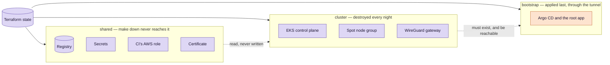
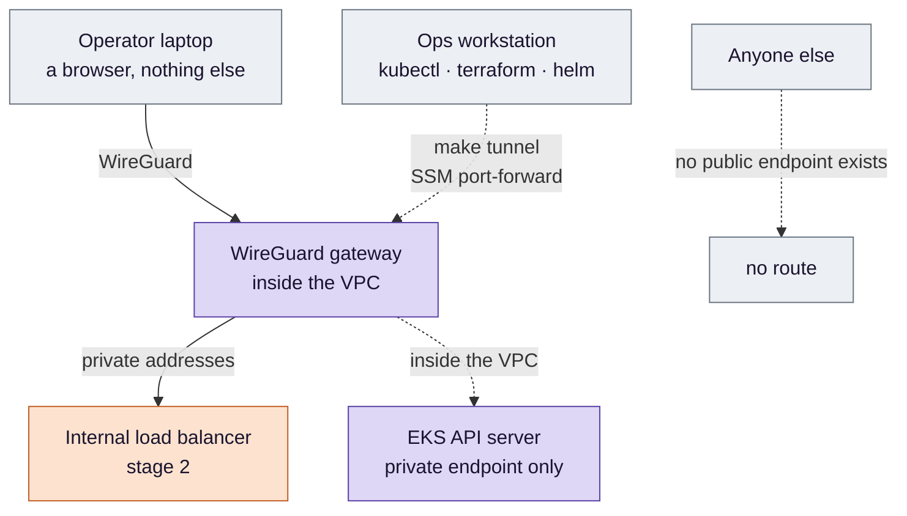
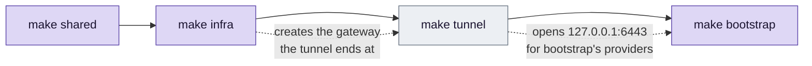

# Stage 1 — Terraform: an account, and a way in

**Everything the cluster needs before a cluster exists — split by how long each piece should live, and
reached through a door that has no address on the internet.**

**Where this sits.** The `EKSCP`, `WG`, `ACM` and `ARGO` boxes in
[design §3](../eks-sre-llmops-design.md#3-architecture), with the `ECR`, `SM`, `NAT` and `S3` boxes beside
them. This stage also writes one record, `vpn.anime`, into the `R53` zone — a zone it does not own. Criterion
**#1**.

Ideas are defined in [`concepts.md`](concepts.md); read the section a paragraph points to before the
paragraph. Parameters — instance types, counts, versions, the resource list — live in
[design §3](../eks-sre-llmops-design.md#3-architecture) and are not repeated here. This page is the reasoning.

## The problem

The application works. It is measured, containerised, and it runs on exactly one laptop, by hand. There is
no second copy and no way to make one: no network, no cluster, no registry anything else could pull from, no
place to keep a key that is not a `.env` file.

So the first thing to build is not a feature. It is **an account that can be rebuilt from nothing**, so every
later stage has somewhere to land and nobody has to remember what was clicked.

Criterion **#1** is the whole of it: apply from empty, then plan again, and see no changes against a
resource count written down beforehand.

## Decision 1 — split by lifetime, not by topic

*Concepts: [§1 state, configurations and a blast radius](concepts.md#1-state-configurations-and-a-blast-radius) ·
[§9 ACM, and what renewal depends on](concepts.md#9-acm-and-what-renewal-depends-on).*

The obvious shape is one configuration. It is wrong, and the certificate is the cleanest way to see why.

This cluster is destroyed most nights and rebuilt the next day. Put the certificate in the same state as the
cluster and every rebuild **issues a new one**. The design says AWS renews the certificate; with one state
file that sentence is false every day, and nothing would ever fail in a way that revealed it. The registry
has the same problem louder — a rebuild with no images means CI must run before anything can start — and so
do the secrets, which would need pasting in again each morning.

So the question that divides the configurations is not *what kind of thing is this* but *should `make down`
be allowed to touch it*:

**The arrows between them matter more than the boxes.** `cluster` reads `shared` and never writes it, which
is what makes `make down` safe to type without thinking: the destructive command can only reach what is meant
to die. And `bootstrap` depends on `cluster` in a way Terraform cannot see — not on its outputs, but on its
API server being *reachable*, which is the subject of the next decision.

`bootstrap` has one sharp edge worth knowing before it cuts. Its objects die with the cluster, but its
**state** does not. Leave that state behind and the next `make bootstrap` plans against a cluster that no
longer exists. `make down` has to discard it.

Medical splits by lifetime too, into three stacks and for its own reasons — an index that costs API quota to
rebuild, secrets typed by hand, a signing key whose loss invalidates every signature. Anime reuses the pieces
of Medical's third stack, the state bucket and the ops workstation, rather than building its own.

## Decision 2 — the API server has no public address

*Concepts: [§4 a managed control plane](concepts.md#4-a-managed-control-plane) ·
[§5 public and private endpoints](concepts.md#5-public-and-private-endpoints-and-the-name-on-the-certificate) ·
[§10 WireGuard and SSM](concepts.md#10-wireguard-and-ssm-port-forwarding).*

EKS by default gives the API server a public address open to the whole internet. Most setups then narrow
it to a list of addresses. This design removes the public address altogether.

That is only affordable because of something this stage builds for another reason. Stage 2's admin UIs must
be private, which means a VPN, which means **one small instance of ours inside the VPC** — and an instance
inside the VPC is exactly what an SSM port-forward needs as its far end. So one machine carries both:

The case against an allowlist is made in [design §11](../eks-sre-llmops-design.md#11-resolved-decisions) and
is not repeated here. The shape of it: an allowlist has to keep being true, and the day it stops being true it
does not say so — it produces a timeout, which is also what a dead cluster produces.

What the choice costs is a single line of configuration, and it is worth understanding rather than copying.
The API server's certificate names its own endpoint. A tunnelled `kubectl` connects to `127.0.0.1`. A
self-managed cluster can simply issue the certificate with `127.0.0.1` in it; a managed one's certificate is
not ours to reissue, so the client has to be told which name to expect — `tls-server-name`. Forget it and
every command fails with a certificate error that, once again, looks like the cluster is down.

**That is the failure this design keeps designing against.** Not downtime — a symptom that lies about its
cause.

## Decision 3 — Spot, and what it forces on every later stage

*Concept: [§6 Spot capacity and the disruption budget](concepts.md#6-spot-capacity-and-the-disruption-budget).*

Spot is chosen for cost, and it means **a node can be taken away with two minutes' warning**. That is not a
risk to mitigate away; it is a property every later stage is built against. The app runs at least two
replicas spread across nodes. The canary analysis has to tell "the new version is worse" apart from "a node
went away while I was measuring". The SLO has to survive the day AWS wants its capacity back.

One thing Spot does **not** get from the disruption budget: a PodDisruptionBudget governs *voluntary*
evictions, such as a drain. It cannot stop an instance being reclaimed. What protects the service is the
spread across nodes; the budget only keeps a drain from making things worse.

Deciding this in stage 1 is what keeps the later stages honest. Decide it late and each of them would have
been designed for a stable cluster and patched afterwards.

## Decision 4 — six identities, and none of them is a key

*Concepts: [§7 workload identity](concepts.md#7-workload-identity-pod-identity-irsa-and-the-node-role) ·
[§8 OIDC federation for CI](concepts.md#8-oidc-federation-for-ci).*

Nothing in this project holds an AWS access key. Six different things act on AWS, and the useful exercise is
asking, for each, *what is the worst it could do*:

| Who acts | Its identity | The worst it could do |
|---|---|---|
| GitHub Actions | A role assumed through OIDC, trusted for one repository **and one branch** | Push an image — nothing else |
| Each in-cluster controller | Its own Pod Identity association | Its own slice: one controller cannot use another's rights |
| The node, and what runs on its network | The node's instance role | Pull images, and the network rights the VPC CNI needs to attach addresses. Ordinary pods cannot borrow it — IMDSv2's hop limit of 1 keeps the metadata service to the node — but pods on the host network, such as the CNI itself, can |
| The EKS service | The cluster role | What AWS needs to run a control plane on our behalf |
| The WireGuard gateway | Its instance role | Read its own keys, and be an SSM target |
| The operator | The ops workstation's role, reached over SSM | Everything — which is why the workstation has no inbound port at all |

**One row was almost wrong, and how is instructive.** External Secrets reads secrets for the app. The natural
scope is `anime/*`. But the gateway's keys are also stored under `anime/`, so that one wildcard would let a
controller inside the cluster read the keys to the tunnel into the cluster. The scope is therefore three named
secrets, not a pattern. A wildcard is a promise about every name anyone will ever add, and nobody reads it
again when they add one.

DNS gets the same treatment. The zone belongs to Medical, so the identity that writes Anime's records may
touch that one zone, and only names under `anime.recruitai.io.vn`. A controller with a bug should not be able
to take Medical's app offline.

## What has to happen in what order

*Concept: [§2 providers, and why apply order is not optional](concepts.md#2-providers-and-why-apply-order-is-not-optional).*

One `terraform apply` cannot build all of this, and the reason is worth understanding rather than working
around.

Argo CD is installed by a configuration whose `helm` and `kubernetes` providers must talk to the Kubernetes
API. The private endpoint exists as soon as the cluster does, but nothing outside the VPC can reach it until
the tunnel is open — and the tunnel ends at the gateway that `make infra` creates. Configure a provider
against an endpoint it cannot reach yet and Terraform will often plan without complaint and fail halfway
through the apply, leaving state that describes half a cluster. The order is not tidiness; it is the only
order that works.

## How this stage can pass while being broken

*Concept: [§3 refresh, drift and a saved plan](concepts.md#3-refresh-drift-and-a-saved-plan).*

Criterion #1 is apply, then plan, and see no changes. That can be true while the thing it guards is not:

- **The plan never compared with reality.** `plan -refresh=false`, or re-reading a saved plan file, reports "no
  changes" without checking the managed resources against what exists — data sources are still read, which makes
  it look as if AWS was consulted. Drift is invisible to it.
- **Nothing was predicted.** "No changes" with no number beside it records a result instead of asserting
  one. The resource count has to be written down *before* the apply.
- **The wrong configuration.** Plan a different, already-applied configuration and it will truthfully report
  no changes — about something else. (An empty directory does not fool anyone: Terraform refuses to plan
  with no configuration at all.)
- **A clean plan over a cluster nobody can reach.** `shared` and `cluster` only ever talk to AWS's own APIs,
  so both can be perfect while the tunnel, `tls-server-name` or the gateway's SSM reachability is broken.

That last one is outside criterion #1 by construction, and it is the one that matters on the first morning.
So, beyond the criterion: the stage is not usable until `kubectl get --raw /readyz` prints `ok` from the
workstation, through the tunnel. That is the first check of every session in every later stage.

## What this stage proves, and what it only assumes

**Proves:** the account can be rebuilt from empty to a predicted resource count, and the API server answers
through the tunnel.

**Reasons, but does not prove:** that the API server answers from **nowhere else**. That follows from the
endpoint setting and the security groups; no test in this stage tries to reach it from outside and fails.

**Assumes, until time or a later stage says otherwise:**

- that Spot interruptions are handled as described — none has happened yet;
- that the certificate is **renewed** rather than re-issued. That depends on the validation record staying in
  place, and possibly on the certificate being attached to a load balancer at the moment renewal runs, which
  on a stack torn down nightly it often is not. The design records this as unverified
  ([design §10](../eks-sre-llmops-design.md#10-risks));
- that the split holds under a real teardown, which only the first `make down` can show.

## Known limits

The couplings to Medical — its Route 53 zone, its ops workstation, its state bucket — and the single NAT
gateway and single VPN gateway are recorded with their consequences in
[design §10](../eks-sre-llmops-design.md#10-risks) and [§11](../eks-sre-llmops-design.md#11-resolved-decisions).
The one worth carrying in your head: **losing the gateway costs every admin UI and `kubectl` at once, while
the service keeps serving.** Operator access is deliberately not in the request path.

---

[Concepts](concepts.md) · [Design §3](../eks-sre-llmops-design.md#3-architecture) ·
[Design §4.7](../eks-sre-llmops-design.md#47-names-tls-and-the-two-ways-in) ·
[Criterion #1](../eks-sre-llmops-design.md#6-verification-and-evidence-definition-of-done) ·
Next: [GitOps](../2-gitops/README.md)
