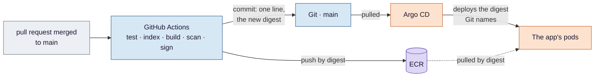
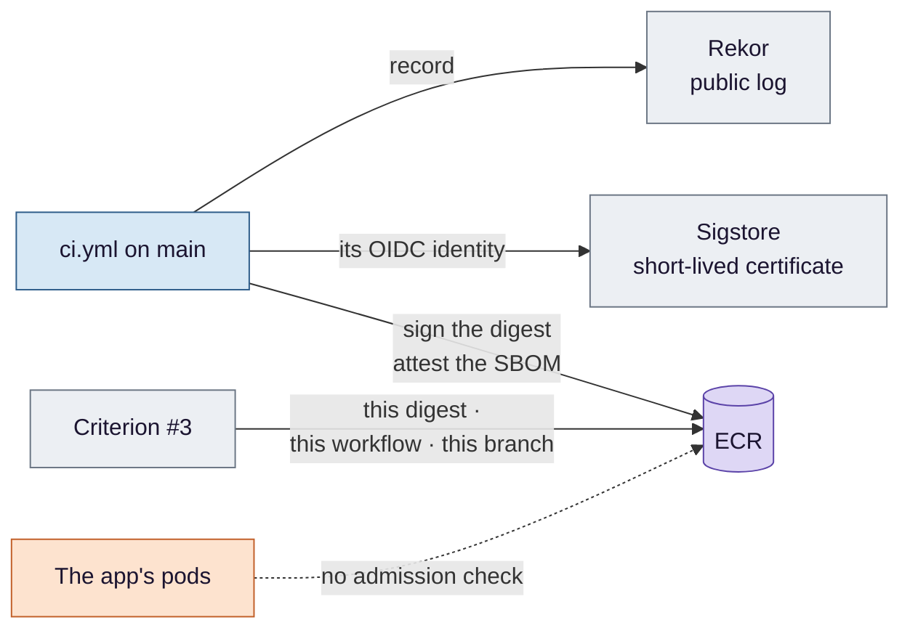
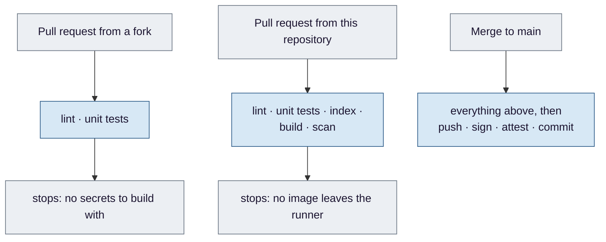

# Stage 3 — CI/CD: from a commit to a signed digest in Git

**GitHub Actions turns a merged change into a tested, scanned, signed image and a one-line change in Git — and
then stops. It never deploys anything. Deploying is Argo CD's job, and keeping the two apart is most of the
design.**

**Where this sits.** The `CI`, `GIT` and `ECR` boxes in
[design §3](../eks-sre-llmops-design.md#3-architecture). Build stages 3 and 9 (the P1 eval gate). Criteria
**#3**, **#4**, **#5** and **#13**.

**Compared with Medical:** Medical's `jenkins` stage, decision by decision, in [stage by stage](../aws/compare-by-stage.md#ci).

Ideas are in [`concepts.md`](concepts.md). The workflow's steps, its flags, the exact verification command and
the per-criterion false passes are in [design §4.6](../eks-sre-llmops-design.md#46-cicd-github-actions-githubworkflows)
and [§6](../eks-sre-llmops-design.md#6-verification-and-evidence-definition-of-done). This page is the reasoning
that connects them.

## The problem

After [stage 2](../2-gitops/README.md) the cluster runs whatever Git says. But the images Git points at were built
by hand on one laptop. Whoever could build could ship; nobody could say what was inside an image or prove which
commit it came from; and a release meant somebody typing a digest into a values file and hoping.

This stage makes the path from a merged change to a running image one no person has to walk — and one that
leaves something checkable at every step.

## Decision 1 — CI stops at a commit

*Concepts: [§1 CI and CD as separate jobs](concepts.md#1-ci-and-cd-as-separate-jobs) ·
[§2 a digest, not a tag](concepts.md#2-a-digest-not-a-tag) ·
[stage 1 §8 OIDC federation](../1-terraform/concepts.md#8-oidc-federation-for-ci).*

The pipeline's last act is a commit changing one line — the image digest in the chart's values. Argo CD sees
the commit and does the rest.

**Why stop there.** The alternative — CI running `kubectl` or `helm` — needs credentials to an API server that,
since stage 1, has no public address. It also moves the source of truth: the cluster would run whatever the last
pipeline left, and Git would describe it approximately. With a commit as the hand-off, Git states what *should*
run, CI's AWS rights stop at pushing images, and the two can disagree only visibly — during a canary, or after an
aborted one, where Argo CD shows the difference rather than hiding it.

**Why a digest.** Git records it, Argo CD deploys it, the signature is on it, so all three always refer to the
same image. Put a tag anywhere in that chain and the others can quietly point at something else.

**What a rollback needs.** Reverting the bot's commit restores the previous digest — *if that image still
exists*. The registry keeps a fixed number of recent images, and signatures and attestations can occupy space
alongside them. A rollback is only as far back as retention reaches, which is a number to check, not assume.

## Decision 2 — every check must be able to say no

*Concepts: [§3 a check wired to fail](concepts.md#3-a-check-wired-to-fail) ·
[§4 vulnerability scanning](concepts.md#4-vulnerability-scanning-and-a-gate-that-can-fail) ·
[§10 an evaluation gate](concepts.md#10-an-evaluation-gate-and-its-baseline).*

Lint, tests, the index assertion and the scanner can each stop a build; the eval gate, a separate workflow, can
stop a pull request. The question to ask of each is not *does it pass* but *has anyone seen it fail*. A check
that has only ever passed is indistinguishable from one that cannot fail, and a green tick from either buys
confidence nobody earned.

Two of them show why the question is not rhetorical.

**The index check has been seen to fail — but not on the failure that matters.** Locally it was made to fail
by setting the expected count off by one. Criterion #5 does something different and better: it truncates the
*data*. The first test proves the comparison works; the second proves it catches the fault that would actually
happen — a partial file — and it has to be the named error, since a build also fails for a dozen reasons that
have nothing to do with the index.

**The scanner has not been seen to fail, and on this base image it probably cannot.** It ignores findings with
no fix, which is right: blocking on the unpatchable trains people to switch the check off. But both images
start from Debian 12, where Medical found five critical findings and not one with a fix. On that base the gate
passes every build by construction. So it is reported as **unproven** until one deliberate run, with the
threshold lowered until a fixable finding is in scope, turns it red. The detail is in
[design §4.6](../eks-sre-llmops-design.md#46-cicd-github-actions-githubworkflows).

## Decision 3 — a signature has to name who, and where from

*Concepts: [§5 SBOM and attestation](concepts.md#5-sbom-and-attestation) ·
[§6 keyless signing](concepts.md#6-keyless-signing) ·
[§7 verifying a keyless signature](concepts.md#7-verifying-a-keyless-signature).*

Images are signed keylessly and carry a signed list of their contents. Why keyless, why the public log is
acceptable here and not in Medical, and why nothing in the cluster enforces it are argued in
[design §4.6](../eks-sre-llmops-design.md#46-cicd-github-actions-githubworkflows). What this page adds is what a
verification has to **say** to be worth anything:

A verification that names the **repository** only accepts a signature made by any workflow on any branch —
a feature branch, a pull request, the eval job. That is the same mistake stage 1 warns about for the AWS trust
([concepts §8](../1-terraform/concepts.md#8-oidc-federation-for-ci)): naming *where* without naming *which*.
So the check names three things: the digest Git recorded, the release workflow, and `main`.

And it runs once, by hand. Nothing refuses an unsigned image at deploy time. The signature proves an image
*could* be checked. Medical plans to close that gap with Kyverno, in production only; Anime leaves it open,
in writing.

## Decision 4 — one writer to `main` that is not a person

*Concept: [§8 the bot commit](concepts.md#8-the-bot-commit-and-a-pipeline-that-cannot-trigger-itself).*

The rule for `main` is that only reviewed, green changes reach it. The bot commit is the one hole in that rule,
by necessity — it runs after CI and its whole job is to write there. The discipline is to make the hole exactly
one line in the ruleset, naming one identity, rather than weakening the rule for everyone.

Which identity is not settled, and the choice has a consequence. If the ruleset can exempt the workflow's own
token, the bot's push cannot start another run by itself, and `[skip ci]` is a second guard. If it cannot — and
it may not — the bot needs a credential whose pushes *do* start runs, and `[skip ci]` becomes the only thing
standing between one commit and an endless loop. Either way the marker stays.

## Decision 5 — what a pull request from outside can prove

*Concept: [§9 forks and secrets](concepts.md#9-forks-and-secrets).*

The asymmetry is the point. Building the index needs a token a fork cannot read, and the index is inside the
image, so a change from outside is linted and unit-tested and never built. **CI proves much less about a change
from outside than about one from inside**, and that should never come as a surprise to whoever merges it.

## Two loose ends this stage owns

- **Criterion #4.** The app phase measured the images locally; CI re-measures the images it actually pushes, and
  states **both** — api and ui — against the single image they replaced. Quoting the api alone would commit
  exactly the false pass the criterion warns about.
- **The `MLops-Common` submodule** is removed in this stage, once nothing in CI calls the on-premises scripts
  it held.

## How this stage can pass while being broken

The false passes for #3, #5 and #13 are listed in
[design §6](../eks-sre-llmops-design.md#6-verification-and-evidence-definition-of-done). They share one shape in
this stage: **a green result that does not say what it was about** — which digest, which revision, which
error, which baseline, which workflow. Every fix is the same: make the record name it.

## What this stage proves, and what it only assumes

**Proves:** a merged change becomes a signed image and a one-line commit with no person in the path; the index
check catches a truncated file; the signature verifies against this workflow on this branch.

**Assumes:** that the scanner can fail, until its positive control has run; that a signed image is a safe one,
which nothing enforces; and that a rollback target still exists in the registry.

## Known limits

- **Nothing verifies signatures at admission.**
- **Signing depends on Sigstore's public services.** If they are unavailable, `main` cannot ship.
- **The eval gate is P1** and may not be built.

---

[Concepts](concepts.md) · [Design §4.6](../eks-sre-llmops-design.md#46-cicd-github-actions-githubworkflows) ·
[Criteria #3, #4, #5, #13](../eks-sre-llmops-design.md#6-verification-and-evidence-definition-of-done) ·
Previous: [GitOps](../2-gitops/README.md) · Next: [Load](../4-load/README.md)
