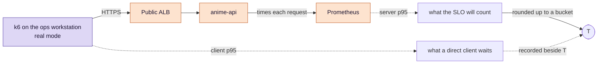
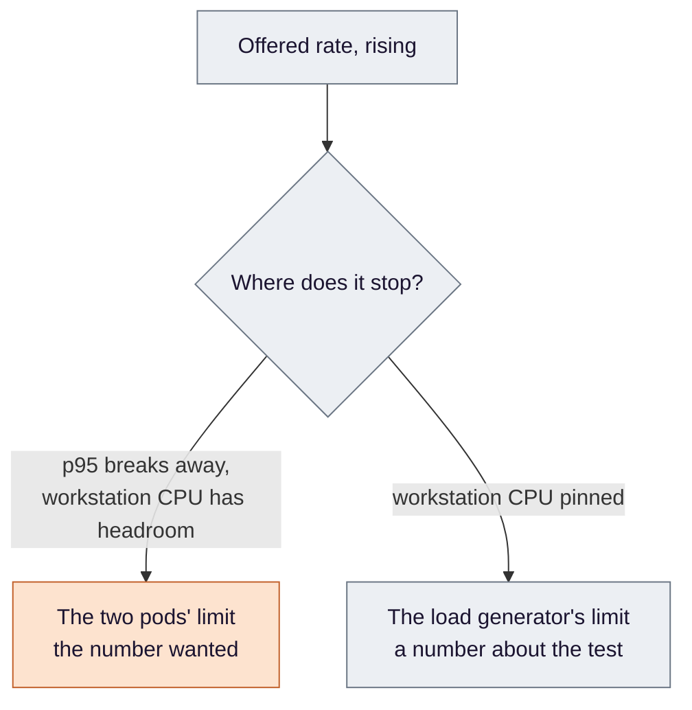
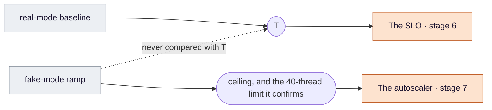

# Stage 4 — Load: the two numbers later stages depend on

**Before an SLO can be written or an autoscaler tuned, two numbers have to exist: how fast the service is when it
is healthy, and how much the smallest deployment can take. This stage measures both — and most of the work is
making each one a measurement of the thing it will later be used to judge.**

**Where this sits.** The `PROM` box in [design §3](../eks-sre-llmops-design.md#3-architecture), queried after k6
runs from the ops workstation drive traffic through the public door. Criteria **#6** and **#7**.

**Compared with Medical:** Medical has no such stage; why is in [stage by stage](../aws/compare-by-stage.md#only-in-anime).

Ideas are in [`concepts.md`](concepts.md). The scripts, rates, buckets and the exact definition of T are in
[design §4.5](../eks-sre-llmops-design.md#45-autoscaling-and-load-testing) and
[§4.3](../eks-sre-llmops-design.md#43-slos-and-alerting-deployslo). This page is the reasoning.

## The problem

Two later stages need numbers they cannot invent. The SLO needs a latency target, **T**. The autoscaler needs to
know how much work one pod carries before it struggles, so it can start adding pods before that point rather than
after. Pick either by feel and every later check inherits a guess dressed as a threshold.

Prometheus has been running since [stage 2](../2-gitops/README.md#decision-5--admin-uis-a-public-name-a-private-address)
— three of the admin UIs come with it — but nothing has relied on it yet. This stage is the first.

## Decision 1 — before measuring anything, prove the data exists

*Concepts: [§4 how Prometheus finds a target](concepts.md#4-how-prometheus-finds-a-target) ·
[§8 an empty result is not a zero](concepts.md#8-an-empty-result-is-not-a-zero).*

The first check of this stage is not a load test. It is whether the api is being scraped at all — because a
scrape configuration the monitoring stack does not select is accepted by the cluster and ignored without a word.
Nothing errors. Every query just comes back empty.

Empty is the most dangerous answer a monitoring system gives, because the tools around it are built to make it
look harmless. An alert over data that does not exist never fires. A panel shows "No data", which is easy to read
past — and the usual fix for that, making absent series count as zero so the graph looks tidy, turns "we are
measuring nothing" into a flat green line. So the stage opens by finding the api's target by name and requiring
it to be up, and it checks for data on the total request counter, not on the error series, which has none until
something fails.

## Decision 2 — T is read where it will be enforced

*Concepts: [§1 a histogram and its buckets](concepts.md#1-a-histogram-and-what-a-bucket-boundary-means) ·
[§3 client-side and server-side latency](concepts.md#3-client-side-and-server-side-latency).*

The baseline run produces two p95s, from two vantage points:

The SLO will be computed from the server's own histogram. So T is read from that histogram — not from k6 — over
exactly the baseline's window. That is a rule, not an optimisation, and it is worth being honest about its size
here: the two are expected to differ by a network round trip and the load balancer's time — milliseconds, against
buckets a quarter to half a second wide around where T will land — so once T is rounded up to a bucket the
difference will rarely show. The rule is kept because it is the right one, and because the record should say how
much it mattered, not assume it.

**What the rounding really means.** The SLO counts requests that fell at or below a bucket boundary. T therefore
has to *be* a boundary, and the target is only as fine as the buckets: whatever the p95 turns out to be, T is the
next boundary up. Which one is the measurement's answer, not something to confirm.

## Decision 3 — enough samples, and a record of what went into them

*Concept: [§2 percentiles and how many samples they rest on](concepts.md#2-percentiles-and-how-many-samples-they-rest-on).*

The baseline calls the real model, which is rate-limited, so it runs slowly — and the temptation is to stop after a
few minutes. But a p95 is decided by the slowest twentieth of the requests. With a few dozen, that is a handful,
and one unlucky call near a bucket boundary can push the target into the next bucket. So the run stops on a
**count of completed requests**, however long the provider's rate takes to get there.

It also records how many of those requests failed. If the provider starts refusing calls mid-run, quick refusals
land in the same histogram as slow successes and make the service look faster than it is. A T measured through a
wave of rejections is a flattering T.

## Decision 4 — capacity, measured so the limit can show

*Concepts: [§5 open and closed load models](concepts.md#5-open-and-closed-load-models) ·
[§6 saturation and where it can come from](concepts.md#6-saturation-and-where-it-can-come-from).*

The capacity run asks how much the **minimum** deployment — two pods, no autoscaler yet — can carry, using the fake
provider so it can push hard without a bill.

How the load is generated decides what the run can see. Simulated users who each wait for an answer before asking
again form a *closed* loop: as the service slows, they ask less often, and the latency they record understates
the queue that would form in real traffic. A generator that sends at a set, steadily rising **arrival rate**
regardless of answers keeps the pressure honest, and when it cannot keep up it counts the requests it failed to
start. That makes the knee visible.

A plateau at this stage has two possible owners, and only one of them is the answer:

Dropped iterations alone cannot tell them apart — a slowing service exhausts the generator's pool too — which is
why the workstation's own CPU is recorded beside them. The node group's ceiling is not a suspect here: with a
fixed replica count, no new pod is ever asked for. That ceiling belongs to the autoscaling run.

**What the capacity number is for.** At the point where p95 breaks away, the run also knows how many requests each
pod had in flight. That — not a figure chosen in advance — is what the autoscaler's threshold is set just below,
in [stage 7](../eks-sre-llmops-design.md#9-build-order), so scaling begins before the knee rather than at it.

**Changed after the runs:** that reading did not reproduce (170.5 against 117.5), so the threshold (30) comes from the
limit it stood in for: 40 threads per pod, which the 93.9 req/s ceiling corroborates ([evidence](../evidence/load.md)).

## Decision 5 — two modes, and a number per consumer

*Concept: [§7 the fake provider as a load source](concepts.md#7-the-fake-provider-as-a-load-source).*

Each number has one consumer and is produced in the mode that consumer will face. The fake provider's latency is a
setting — a p95 of well under two seconds, a fraction of any plausible T — so a fake-mode run compared with T would
pass through the early part of saturation and fail only long after the damage. Every recorded figure therefore
carries its mode on the same line.

## How this stage can pass while being broken

The per-criterion false passes are in
[design §6](../eks-sre-llmops-design.md#6-verification-and-evidence-definition-of-done). The shape they share here:
**a number that is correct about something other than what it will be used for** — a percentile that rests on a
handful of samples, a capacity that is really the test machine's, a latency flattered by fast refusals, a query
over nothing read as all-clear.

## What this stage proves, and what it only assumes

**Proves:** the api is scraped; T, read server-side from enough real requests, with the failure count beside it; a
93.9 req/s ceiling for two pods, measured twice, with the generator ruled out. **Does not:** a valid capacity figure
(its drop condition failed in both runs) or a reproducible in-flight reading at the knee.

**Assumes:** that one afternoon's latency from the provider represents other days — T is re-measured, not
re-used, if the model or its tier changes; and that the workstation, in another VPC, reaches the public door the way
a direct client would, which is close to but not the same path.

## Known limits

- **Metrics do not survive a teardown.** Each run's evidence is saved from k6's output and from queries made at the
  time, never read back from Prometheus later.
- **The buckets set T's resolution.** A finer target needs finer buckets, which is a change to the application.
- **Fake-mode capacity describes the platform, not the model.** It says how much routing, scheduling and the app's
  own work can carry, and nothing about how many real calls the provider would accept.

---

[Concepts](concepts.md) · [Design §4.5](../eks-sre-llmops-design.md#45-autoscaling-and-load-testing) ·
[Design §4.3](../eks-sre-llmops-design.md#43-slos-and-alerting-deployslo) ·
[Criteria #6, #7](../eks-sre-llmops-design.md#6-verification-and-evidence-definition-of-done) ·
Previous: [CI/CD](../3-cicd/README.md) · Next: [Delivery](../5-delivery/README.md)
