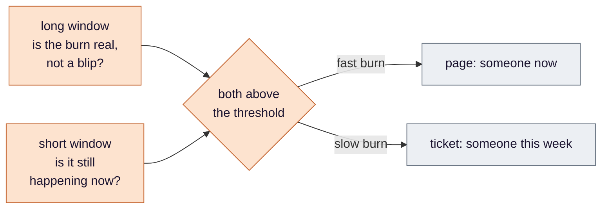
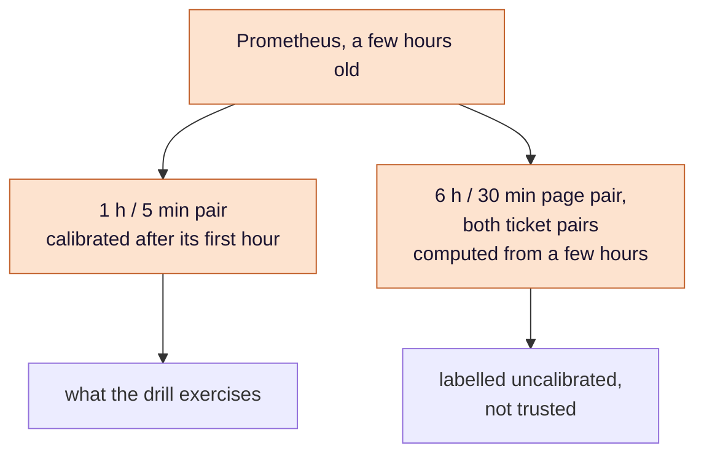
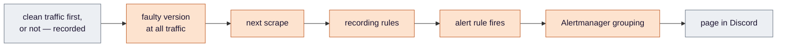

# Stage 6 — SLO: being told, in time, by the right rule

**An SLO turns "the service should be reliable" into a budget of allowed failure, and burn-rate alerts turn the
budget into a page only when it is being spent fast enough to matter. This stage builds both — and is honest about
what a platform that lives a few hours a day can and cannot show.**

**Where this sits.** The `PROM` and `DIS` boxes in [design §3](../eks-sre-llmops-design.md#3-architecture).
Criterion **#10**.

**Compared with Medical:** Medical has no such stage; why is in [stage by stage](../aws/compare-by-stage.md#only-in-anime).

Ideas are in [`concepts.md`](concepts.md). Objectives, windows, factors, routing and the drill's arithmetic are in
[design §4.3](../eks-sre-llmops-design.md#43-slos-and-alerting-deployslo). This page is the reasoning.

## The problem

After [stage 5](../5-delivery/README.md) a bad release is caught during its canary. Nothing else is. A provider outage,
a slow afternoon, a regression that only shows under real traffic — the system would notice none of them until
someone looked at a graph. And [stage 4](../4-load/README.md) left a measured latency target, **T**, that nothing
enforces.

The obvious alert — *error rate above some percent for five minutes* — fails both ways. Tight, it pages on every blip.
Loose, a slow and steady leak runs all week without a sound.

## Decision 1 — alert on the budget, not on the event

*Concepts: [§1 SLI, SLO and error budget](concepts.md#1-sli-slo-and-error-budget) ·
[§2 burn rate](concepts.md#2-burn-rate).*

An availability objective leaves a small share of requests allowed to fail — the **error budget**. The useful question
is not *did something fail?* but *at this rate, how soon is the budget gone?* That rate is the **burn rate**, and every
alert here is a threshold on it rather than on a raw error count. The same shape serves any objective, because the
burn rate already knows how strict the objective is.

The latency objective is built the same way, from T. That is why T had to be measured first: an objective whose
threshold was guessed produces a budget that was guessed, and every alert above it inherits the guess.

## Decision 2 — two windows per alert, two speeds of alert

*Concepts: [§3 multiple windows](concepts.md#3-multiple-windows-and-why-two-per-alert) ·
[§4 page and ticket](concepts.md#4-page-and-ticket).*

Each alert compares the burn rate over **two** windows at once and fires only when both agree:

A long window alone is slow to start and, after a large burn, slow to stop. A short window alone fires on every spike.
Together they are prompt in both directions. The fast pairs page — the budget will be gone within days. The slow
pairs open a ticket — a leak worth fixing, not worth waking anyone for.

## Decision 3 — the rules are generated, committed, and must be loaded

*Concept: [§5 generated rules, committed](concepts.md#5-generated-rules-committed).*

Burn-rate rules written by hand are where arithmetic mistakes live — several windows, two objectives, recording rules
beneath the alerts. Sloth generates them from a short spec, including the factors for this objective's 28-day period
rather than the 30-day ones most references quote. The output is committed as an ordinary manifest and CI regenerates
it on every change, so the spec and the rules cannot drift.

And then they have to be *picked up*. The monitoring stack ignores rules without its release label unless told
otherwise — the same silent trap stage 4 met for scrape targets. A rule file nothing loads produces no error and no
alert, forever, and a drill run against it ends in a silence that looks exactly like broken alerting.

## Decision 4 — what this platform can honestly exercise

*Concept: [§6 a window older than the data](concepts.md#6-a-window-older-than-the-data).*

The cluster lives a few hours a day and its metrics die with it. Two consequences, and they are different.

**The objective's period is a definition.** No 28-day window will ever exist here, so the period is not something
to measure — it is what fixes the size of the budget, and so the thresholds. Nothing in this project will claim the
objective was met.

**Most of the alert windows are longer than the data.** A window longer than the data does not come back empty once
there is some data; it is computed from what exists, keeping its threshold. So a rule named for a day behaves like a
rule for a few hours, and can fire on a burst it was built to ignore:

Only the one-hour page pair is calibrated for most of a session. But the two page pairs are one alert, and whichever
crosses first fires it — on a store holding only an hour of clean traffic, by the arithmetic, that is the six-hour
pair, computed from far less than six hours. So the drill runs about three hours of clean traffic first, which lets
the one-hour pair win, and records **each window's burn rate at the moment the page fired** — the only way to say
which pair it was. A page from any other pair on a young store is a different claim.

For time, this build ran the short drill instead: one clean hour. The prediction was that the six-hour pair would page
first; it did not. The store held hours of earlier clean traffic, the 6h leg reached 5.30 against 5.6, and the 1h/5m
pair paged at 9 m 30 s ([evidence](../evidence/slo.md), [guide](guide.md) section 3).

## Decision 5 — a drill whose number is explicable

*Concept: [§7 time-to-alert, and what it is made of](concepts.md#7-time-to-alert-and-what-it-is-made-of).*

The drill makes the service fail half its requests and times how long until a person is told. Three things decide
whether that time means anything.

- **The fault must reach all traffic.** Held at a canary's small share, half the canary's requests failing is a
  small fraction of the service's — below the page threshold. The drill version is promoted straight through, and
  silence at a canary share would be read, wrongly, as broken alerting.
- **What came before decides what is measured.** After clean traffic the long window climbs gradually, and
  the drill measures how long the rule takes to *notice*. Without it, the window sees only failures from the start and
  the drill measures how long the pipeline takes to *deliver*. Different questions; the record names which.
- **The total is a sum, and most of it is plumbing.** Scrape, recording rules, the alert's evaluation, Alertmanager's
  grouping, delivery:

Only the window arithmetic is about the objective. Recording each link is what turns "it took so many minutes" into
something that could be made faster.

## Decision 6 — alert on what users feel, and know what is not watched

*Concepts: [§8 a runbook written before the alert](concepts.md#8-a-runbook-written-before-the-alert) ·
[§9 proving delivery](concepts.md#9-proving-delivery-not-just-firing).*

Only the objectives' alerts reach Discord. A crash-looping pod or an unready node is not routed anywhere: if it hurts
users, the objective's burn will say so; if it does not, it is a cause to investigate, not a reason to wake someone.
Every alert that *is* routed links to a runbook entry written before the drill that fires it — writing the entry is
also the test of whether anyone could act on the alert at all.

What that leaves unwatched is the path itself. There is no dead-man's switch: the monitoring stack's heartbeat alert
is built to feed an outside service that complains when it goes quiet, and here it goes nowhere. So if the webhook
breaks between drills, pages simply vanish and nothing says so. Delivery is **proven at each drill and assumed in
between** — and the drill's evidence is the alert's name, its objective and its pair, never just "a message arrived".

## How this stage can pass while being broken

The false passes for #10 are in
[design §6](../eks-sre-llmops-design.md#6-verification-and-evidence-definition-of-done). The shape in this stage:
**an alert that is right in its arithmetic and wrong about its inputs** — rules nothing loaded, windows computed from
less data than they name, a fault the canary diluted, a webhook that refused. Each is avoided by recording what fired
and why, not only that something did.

## What this stage proves, and what it only assumes

**Proves:** the page fires from the one-hour pair and reaches Discord, with the time split into its parts and the
kind of run — noticing or delivering — named.

**Does not prove, and says so:** that the objective was met over any period; that the longer pairs behave as designed
on a store younger than their windows; that pages would arrive between drills.

## Known limits

- **No dead-man's switch.** A broken webhook is silent until the next drill.
- **Discord is the only delivery path.**
- **Prometheus and Alertmanager have no login** ([stage 2](../2-gitops/README.md#known-limits)): anyone on the VPN can
  silence a page.

---

[Concepts](concepts.md) · [Design §4.3](../eks-sre-llmops-design.md#43-slos-and-alerting-deployslo) ·
[Criterion #10](../eks-sre-llmops-design.md#6-verification-and-evidence-definition-of-done) ·
Previous: [Delivery](../5-delivery/README.md) · Next: [Scaling](../7-scaling/README.md)
