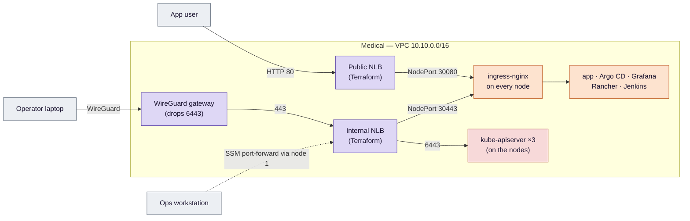
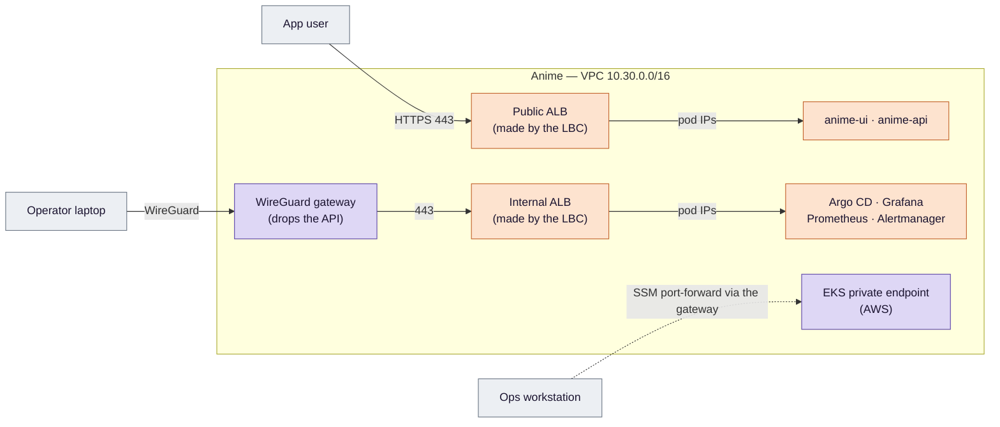

# Anime (EKS) compared with Medical (self-managed Kubernetes)

**The two projects run the same kind of workload on the same AWS account, and split one question between them:
what changes when AWS runs the cluster instead of you.** This page is the map from one to the other. It
explains the differences of design, not their interview answers; those are in the [AWS Q&A](questions.md)
([answers](answers.md)). The same comparison one stage at a time (Terraform, the app, GitOps and CI), with the
reason for each difference, and why each project's extra stages have no counterpart, is in
[stage by stage](compare-by-stage.md).

**Sources.**
- Medical:
  - `Medical-RAG-Chatbot/docs/selfmanaged-k8s-ops-design.md`;
  - under `Medical-RAG-Chatbot/infra/terraform/cluster/`: `loadbalancers.tf`, `rancher.tf` (the 443 pass-through listener) and `internal-ui.tf` (the UI records);
  - `Medical-RAG-Chatbot/deploy/argocd/values/ingress-nginx.yaml`;
  - `Medical-RAG-Chatbot/docs/evidence/drills.md`.
- Anime: the [design](../eks-sre-llmops-design.md) and the code in this repository.

**Names.** `anime` means `anime.recruitai.io.vn`, and `*.anime` its subdomains (`api.anime`, `grafana.anime`, `vpn.anime`, …).

## 1. In one sentence each

- **Medical** builds Kubernetes itself. Terraform creates three EC2 instances, and Ansible turns them into a
  kubeadm cluster, where every node is both control plane and worker.
- **Anime** asks AWS for Kubernetes. Terraform creates an EKS cluster whose control plane AWS runs, and a
  managed node group of Spot instances for the workloads.

Everything else on this page follows from that difference.

## 2. Who does what

| Layer | Medical: self-managed | Anime: EKS |
|---|---|---|
| API server, scheduler, controller manager | Me: kubeadm on 3 nodes, behind an internal NLB | **AWS**, across availability zones, out of sight |
| etcd | Me: 3 members on the same nodes, snapshots to S3 every 6 hours, a restore drill measured at 7 m 02 s | **AWS**. No access at all, so no etcd backup or restore exists to practise |
| Cluster certificates | Me: kubeadm generates them, so `127.0.0.1` could be added as a SAN for the tunnel | **AWS**. Its certificate cannot name `127.0.0.1`, so the kubeconfig for the tunnel sets `tls-server-name` to the real endpoint name (`make kubeconfig`) |
| Kubernetes upgrades | Me: an Ansible playbook, node by node (`upgrade.yml`); not yet run, since no newer 1.36 patch existed | AWS upgrades the control plane on request, and by itself when standard support ends (`upgrade_policy = STANDARD`, `eks.tf`); me for the node group and add-ons |
| Node operating system | Me: Ubuntu, containerd, kubelet, installed and pinned by Ansible | AWS supplies the node image; the managed node group replaces nodes |
| Pod network | Calico, VXLAN, pod CIDR `192.168.0.0/16`: pod addresses exist only inside the cluster | **VPC CNI**: every pod gets a real address from the VPC subnet |
| Pulling from ECR | An `ecr-credential-provider` binary, installed on each node by Ansible | The EKS node image already has the credential provider, and the node role the EKS module creates can read ECR. Nothing to install |
| IAM for pods | A self-hosted OIDC issuer (an S3 bucket) for the app's roles; the controllers use the node role | **EKS Pod Identity**: one role per controller's ServiceAccount, no issuer to host |
| Who may use kubectl | Whoever holds kubeadm's admin kubeconfig | **Access entries**: IAM identities mapped to cluster permissions by the EKS API |
| Disk volumes | EBS CSI driver installed by Argo CD, rights from the node role | EBS CSI as an EKS add-on, rights through Pod Identity |
| Control plane cost | Paid as the three nodes it runs on | A fixed hourly fee per cluster, on top of the nodes |

The pattern: in Medical, the **cluster** is my work product. In Anime, the cluster is a **service I configure**, and my
work moves up a level, to how the AWS integrations are wired.

## 3. What EKS is, and how it differs from Kubernetes you host yourself

EKS is the Kubernetes control plane run as an AWS service. You get an API endpoint, and AWS keeps the machines
behind it running, patched and replicated. The Kubernetes API is the same one kubeadm gives you. `kubectl`,
Helm and Argo CD work the same way on both.

**What you gain:**
- No control plane to keep alive: no etcd quorum to protect, and no certificates that expire.
- Tight AWS integrations: IAM for pods (Pod Identity), pod addresses in the VPC (VPC CNI), and load balancers
  made from Ingress objects (the AWS Load Balancer Controller).

**What you give up:** direct access to anything behind the API endpoint.
- **etcd:** no access, so no snapshots of your own.
- **Control-plane flags:** you cannot set the API server's options freely.
- **Control-plane metrics:** the scheduler and controller manager cannot be scraped the kubeadm way.
  - EKS publishes their metrics through a path on the API server instead, which this project does not use.
  - etcd publishes none.
  - So [`gitops-monitoring.yaml`](../../deploy/argocd/root/templates/gitops-monitoring.yaml) switches those targets off in kube-prometheus-stack, while Medical scrapes all of them.

**What moves rather than disappears:** failures move from the cluster to the integrations.
- Medical's hard problems were cluster problems: the etcd restore, the upgrade gate, the Calico mode.
- Anime's stage 2 failed twice on its first run, and neither failure was a cluster problem. Both were in how AWS integrations are wired, which is the part EKS leaves to you:
  - a YAML error in the app-of-apps chart (commit `805c9a2`);
  - the load balancer controller's webhook certificate not matching its CA, so every Ingress was refused (commit `9f05258`, and a row in the [gitops guide's troubleshooting](../2-gitops/guide.md#troubleshooting)).

## 4. The two architectures side by side

**Colours:**
- **Purple:** created by Terraform.
- **Orange:** created by Argo CD, or by something Argo CD installed.
- **Red:** built by Ansible (Medical's control plane).
- **Grey:** outside the VPC. The ops workstation is Medical's, in its own small VPC, and both projects use it.

In Medical both load balancers are purple; in Anime both are orange. That one colour change is most of section 5.

In both projects the VPN reaches only the admin UIs. The Kubernetes API is reached through the SSM tunnel from the
workstation, and the gateway drops VPN traffic to it.

| Concern | Medical | Anime |
|---|---|---|
| Reaching the Kubernetes API | `make tunnel`: SSM port-forward **through node 1** to the **internal NLB** on 6443, which fronts the three API servers | `make tunnel`: SSM port-forward **through the WireGuard gateway** to the EKS **private endpoint**; the API has no public address |
| The app's way in | Public NLB, **HTTP** 80 → ingress-nginx; app TLS is a non-goal | Public ALB, **HTTPS** 443, with 80 redirecting; ACM certificate on the ALB |
| Admin UIs | Internal NLB 443 → ingress-nginx, which allows only VPC addresses; names point at the internal NLB | Internal ALB (one IngressGroup for four UIs), with a security group allowing 443 only from the VPC and the VPN range |
| TLS certificates | cert-manager: a Let's Encrypt wildcard via DNS-01, backed up to Secrets Manager; a bought Sectigo certificate for Rancher | One ACM certificate for `anime` and `*.anime`, in the `shared` stack, renewed by AWS |
| DNS records | Terraform writes the alias records, since the NLBs are Terraform's; cert-manager writes only the `_acme-challenge` TXT record | **external-dns** writes the six load-balancer names from the Ingresses. Terraform writes only `vpn.anime` (cluster stack) and the ACM validation record (shared stack) |
| Secrets into pods | External Secrets, with the node role's rights | External Secrets, with a Pod Identity role limited to three ARNs |
| CI | Jenkins inside the cluster; cosign with a KMS key | GitHub Actions; cosign keyless (GitHub OIDC) |
| Image admission | Kyverno verifies image signatures | Nothing in the cluster verifies them: signed, checked by hand once (design §4.6) |
| CD | Argo CD, app-of-apps with sync waves | The same, plus one build stage switched on at a time (`enabled_stages`) |
| Releases | dev → prod by pull request | Argo Rollouts canary 10 → 50 → 100, judged by Prometheus |
| Scaling | Fixed: three nodes | KEDA scales pods on in-flight requests; the Cluster Autoscaler scales the Spot group from 2 to 4 |
| Alerts reach a person by | Email (SMTP) | Discord, from SLO burn-rate rules |
| Network policy | Calico enforces NetworkPolicy, including blocking the metadata address | None yet: with VPC CNI it is enforced only when switched on separately |
| Only in this project | ingress-nginx, cert-manager, Jenkins, Rancher, Kyverno, Calico | AWS Load Balancer Controller, external-dns, Argo Rollouts, KEDA, Cluster Autoscaler, OpenTelemetry Collector, Tempo, Langfuse, Sloth |

## 5. Why Medical uses NLBs and Anime uses ALBs

Neither choice is a preference. Each follows from what the cluster can do.

### Medical: static NLBs in front of NodePorts

- **Nothing in the cluster talks to the AWS load balancer API.** Medical does not run the AWS Load Balancer
  Controller, so the load balancers are ordinary Terraform resources, created before the cluster exists. They
  send traffic to fixed **NodePorts** on the three nodes (30080, 30443).
- **Pods have no VPC address.** Calico's pod CIDR `192.168.0.0/16` exists only inside the cluster, so a load
  balancer cannot send traffic to a pod directly. It can only reach a node, and let the node forward it.
- **So the load balancer only needs to move TCP (layer 4), and an NLB is the natural fit.** Everything at
  HTTP level happens in the cluster, in ingress-nginx:
  - routing by host name;
  - TLS for the internal names;
  - the VPC-only allowlist, which works because ingress-nginx uses `externalTrafficPolicy: Local`.
- **The TLS keys must never leave the cluster.** The internal 443 listener passes TLS through untouched, so the
  load balancer never sees the Rancher or wildcard key (`rancher.tf`). An ALB always ends TLS itself, so it
  would need those keys. It cannot pass TLS through.
- **The Kubernetes API needs a TCP load balancer.** Three API servers need one stable address, kubeadm's
  `controlPlaneEndpoint`. The API server must end TLS **itself**, because it authenticates clients by their
  certificates. A load balancer that ended TLS would cut that. On AWS the managed TCP pass-through choice is an
  NLB; keepalived or HAProxy on the nodes would be the self-hosted alternative. Medical's one internal NLB
  carries both pass-through listeners, 6443 and 443.

### Anime: ALBs made from Ingress objects

- **The API needs no load balancer.** EKS provides the endpoint; with `endpointPublicAccess = false` it is
  private, reached through the tunnel.
- **A controller in the cluster makes the load balancers.** The AWS Load Balancer Controller (LBC) is the
  Ingress controller here (IngressClass `alb`). It turns each Ingress into an ALB, or joins it to one through
  `group.name`.
  - The ALB works at HTTP level (layer 7), so routing by host and TLS happen **on the load balancer**, with the
    ACM certificate.
  - No proxy sits in the request path inside the cluster: the LBC only programs the ALB.
  - An ACM certificate lives in AWS, not in a Kubernetes Secret, so there is no key to keep away from the load
    balancer.
- **Pods have VPC addresses, so the ALB sends traffic straight to them** (`target-type: ip`). There is no
  NodePort hop, and the controller's **readiness gates** hold a pod back until the ALB counts it healthy.
- **The canary depends on it.** Argo Rollouts shifts traffic by rewriting the weights of the ALB's forward
  action across two target groups, stable and canary (stage 5). The LBC manages that action from an Ingress
  annotation. With NLBs and ingress-nginx, the split would have to happen inside the cluster instead, and the
  whole stage 5 design would be different.

### What the ALB approach costs

- **One controller holds both doors.** If the LBC is unhealthy, no Ingress can be created or changed, and no
  canary can move. The design names it as a single point of failure (§3), and stage 2's first run met it: a
  certificate mismatch in its webhook refused every Ingress.
- **Teardown order matters.** Terraform does not know the ALBs exist, so `make down` must delete every Ingress
  and wait for the LBC to remove the load balancers before it destroys the VPC.
- **The money is about the same.** Both projects run two load balancers. The new line on Anime's bill is EKS's
  fixed control-plane fee (section 2), not the ALBs.

### Summary

| | Medical: NLB (layer 4) | Anime: ALB (layer 7) |
|---|---|---|
| Created by | Terraform, before the cluster | The LBC, from Ingress objects, after the cluster |
| Sees | TCP connections | HTTP requests: host, path, headers |
| TLS ends at | ingress-nginx (the key stays in the cluster); none for the app | The ALB, with ACM |
| Sends traffic to | NodePorts on every node | Pod IPs directly |
| Routing by host | ingress-nginx | The ALB's listener rules |
| Weighted split for a canary | Not used; it would be done in-cluster | Built in, driven by Argo Rollouts |
| Also fronts the Kubernetes API | Yes, TCP 6443 pass-through | No: EKS provides the endpoint |
| Access limited to the VPN | ingress-nginx allowlist + NLB security group | The internal ALB's security group (`inbound-cidrs`) |

## 6. What stayed the same

- **Shared with Medical:** the ops workstation, the Route 53 zone `recruitai.io.vn` and the Terraform state
  bucket. They are Medical's; Anime reuses them and never rebuilds them.
- **Terraform stacks split by lifetime.** The name `bootstrap` means a different stack in each project: never
  destroyed in Medical, applied last and discarded first in Anime.
- **A WireGuard gateway,** and admin UIs reachable only through it.
- **Argo CD** is the only way into the cluster after bootstrap. **External Secrets** reads Secrets Manager, and
  **kube-prometheus-stack** collects metrics.
- **Kubernetes 1.36** on `m7i-flex.large` nodes. The AWS Free plan launches only free-tier-eligible types
  ([account check](../evidence/account.md)).

## 7. "In Medical I did X; in Anime it is Y"

| In Medical I… | In Anime… | Where |
|---|---|---|
| ran Ansible to build the cluster | `make infra` creates EKS and the node group; there is no Ansible | [1-terraform, 3](../1-terraform/guide.md#3-the-cluster-stack) |
| opened the tunnel through node 1 to the internal NLB | open it through the WireGuard gateway to the private endpoint (tmux window 2) | [1-terraform, 4](../1-terraform/guide.md#4-the-way-in) |
| added Terraform alias records for each name | let external-dns publish them once the ALB exists; check with `dig` | [2-gitops, 5](../2-gitops/guide.md#5-names--ops) |
| installed cert-manager and waited for Let's Encrypt | nothing in the cluster: the ACM certificate is in `shared`, attached by annotation | [2-gitops, 6](../2-gitops/guide.md#6-criterion-15--https--ops-off-the-vpn) |
| debugged ingress-nginx for a 502 | read the Ingress events and the LBC's log; a pod's readiness gate says whether the ALB counts it healthy | [2-gitops, 4](../2-gitops/guide.md#4-five-ingresses-two-load-balancers-and-the-readiness-gates--ops) |
| gave pods AWS rights through the node role | add a Pod Identity association for the controller's ServiceAccount | [1-terraform README](../1-terraform/README.md) |
| promoted dev → prod by pull request | let a canary judge itself, or roll itself back | [5-delivery](../5-delivery/guide.md) |
| took an etcd snapshot before risky changes | there is nothing to snapshot; Git plus `make down` and a rebuild are the recovery path | [M8, the timed rebuild](../evidence/guide-measurements.md#m8--a-timed-rebuild) |
| scraped the scheduler and etcd | those targets are off | [`gitops-monitoring.yaml`](../../deploy/argocd/root/templates/gitops-monitoring.yaml) |
| kept three nodes up | the node group runs 2 Spot nodes and grows to 4 when pods do not fit | [7-scaling](../7-scaling/guide.md) |
