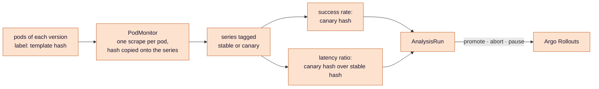
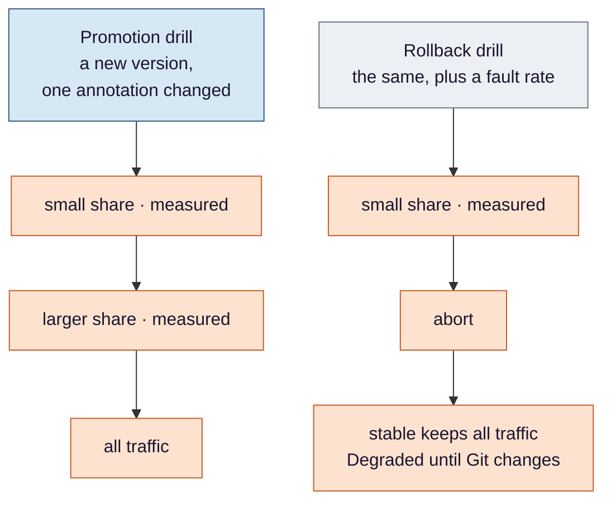

# Stage 5 — Delivery: a release that judges itself

**Argo Rollouts sends a new version a slice of real traffic, asks Prometheus whether it is worse than the old
one, and then widens the slice, rolls back, or stops and waits for a person. The hard part is not the decision.
It is making sure the numbers the decision reads are about the canary, and that the threshold on paper is the
threshold in effect.**

**Where this sits.** The `ROLLOUTS` and `API` boxes in [design §3](../eks-sre-llmops-design.md#3-architecture).
Criteria **#8** and **#9**.

Ideas are in [`concepts.md`](concepts.md); this stage also leans on two from stage 4 —
[histograms and buckets](../load/concepts.md#1-a-histogram-and-what-a-bucket-boundary-means) and
[how Prometheus finds a target](../load/concepts.md#4-how-prometheus-finds-a-target). Steps, thresholds, the window,
the drill rate and each criterion's false passes are in
[design §4.4](../eks-sre-llmops-design.md#44-progressive-delivery-argo-rollouts) and
[§6](../eks-sre-llmops-design.md#6-verification-and-evidence-definition-of-done); the decision tree is drawn in the
[README](../../README.md#4-inside-the-canary). This page is the reasoning behind them.

## The problem

After [stage 3](../cicd/README.md) a merged change reaches the cluster with no person in the path. That is only
safe if a bad change cannot reach everyone. Today it would: the api is a plain Deployment, and a new image replaces
every pod as fast as the old ones drain. The first sign of a broken release would be every user seeing it.

## Decision 1 — the release is a question, asked in slices

*Concepts: [§1 a Rollout instead of a Deployment](concepts.md#1-a-rollout-instead-of-a-deployment) ·
[§2 canary steps and traffic weights](concepts.md#2-canary-steps-and-traffic-weights).*

The api becomes a `Rollout`. A new version gets a small share of requests, waits, is measured, and only then gets
more. The share is set on the load balancer, so it is a share of *requests* rather than a ratio of pods, and it can
be small even when the canary is one pod among two.

The waits are not ceremony. Measured immediately after a shift, the numbers would describe the old traffic and the
new pods' first seconds — cold connections, empty caches — which say little about the version itself.

## Decision 2 — compare with the old version, not with a target

*Concept: [§6 a relative gate](concepts.md#6-a-relative-gate).*

Two things are checked: the canary's success rate against a floor, and its latency **against the stable version's
latency over the same minutes**. Not against the SLO's T.

That is forced rather than preferred. T is measured against the real model; the drills run the fake provider, whose
latency is a fraction of any plausible T, so an absolute gate would let a considerably slower version through. A
ratio of two versions measured side by side asks the one question that holds in either mode — *is the new one worse
than what it replaces?* — and whatever the provider is doing that afternoon affects both sides equally.

## Decision 3 — the numbers must be about the canary

*Concepts: [§4 the pod-template-hash](concepts.md#4-the-pod-template-hash-and-getting-it-onto-a-series) ·
[§5 a query window](concepts.md#5-a-query-window-and-the-scrape-interval).*

Both versions export identical metric names. The only thing that tells their series apart is a label on the *pod*,
and a pod label is on no series until the scrape copies it there:

The design lists what can break along that chain. What is worth understanding here is **how a broken chain
behaves**, because it is not how you would guess. When the canary's series are missing, the queries come back
empty, each measurement errors, and after a few errors the analysis fails and the release aborts. So a plumbing
mistake does not promote bad versions silently — it aborts *every* version, loudly, and each abort looks like the
new version's fault.

That is exactly the situation in which someone "fixes" the analysis: makes the query return zero when it finds
nothing, or writes the condition to accept an empty answer. The aborts stop. And from that moment an empty query
passes, and the gate can no longer fail. **The dangerous version of this bug is not the one that happens by
accident; it is the one somebody creates to make the first one go away.** The right answer to an empty query is
neither *pass* nor *abort* but *pause* — see Decision 5 — which stays loud without blaming the release. And it is
why criterion #8 asks for each measurement's value and the hash it belongs to, rather than for a rollout that
reached 100%.

## Decision 4 — the threshold on paper is not always the threshold in effect

*Concepts: [§6 a relative gate](concepts.md#6-a-relative-gate) ·
[§7 the resolution of a threshold](concepts.md#7-the-resolution-of-a-threshold).*

Both gates have a number, and both numbers can mean something other than what they say.

**The latency ratio.** The latency of each version is estimated from a histogram, and an estimate cannot move past a
bucket edge until enough requests have crossed it. With the fake provider's latency and the application's current
buckets, the stable version's estimated p95 sits just below one edge, and 1.2 times it lands just above. So the
canary's estimate is pinned at that edge until its latency is much worse — the gate written as **1.2×** actually
trips at roughly **1.4×**, and a version forty per cent slower passes. The fix is finer buckets, which the design
adds before the capacity run; with them, the gate trips close to where it says. Until then the true threshold is a
property of the bucket layout, and the record says so.

**The success-rate floor.** A 99% floor over a small window is a different, twitchier number: over sixty requests,
one error is already below it. Because each probe looks back over a window longer than the gap between probes, that
one error is counted by several probes in a row, which is enough to fail the analysis. The drill's request rate is
set so each window holds a few hundred requests, where a couple of stray errors pass and a real fault does not.

The shared lesson: **a threshold is a claim about the instrument as much as about the service.** Check what it can
actually resolve before trusting what it is set to.

## Decision 5 — too little evidence stops the release

*Concept: [§3 an AnalysisRun and its three outcomes](concepts.md#3-an-analysisrun-and-its-three-outcomes).*

An analysis can succeed, fail, or be **inconclusive**, and too few requests is inconclusive by design: the rollout
pauses for a person and never promotes on silence. "No errors across four requests" is not evidence.

*Too few* and *none* are different, though. If Spot takes the canary's only node, its samples age out of the window
and the query becomes empty — which, as Decision 3 showed, errors rather than pauses, and would abort the release
for a capacity event. Argo Rollouts has no separate condition for *inconclusive* — a measurement is inconclusive
when it matches neither its success nor its failure condition — so **both** conditions have to require a non-empty
result before comparing it. That guard exists only because a node can disappear, and its exact form is to be checked
against the Argo Rollouts version in use.

## Decision 6 — after an abort, Git and the cluster disagree on purpose

*Concept: [§8 abort, and what Git says afterwards](concepts.md#8-abort-and-what-git-says-afterwards).*

When the analysis fails, the canary is scaled away and the stable version keeps all the traffic, while Git still
names the new digest. Argo CD shows this as a healthy sync with a **Degraded** health — the disagreement lives in
health, not in sync status. It is the one moment where Git deliberately does not describe what runs, and it is
visible, which is the difference between a rollback and a drift.

It should end in Git: revert the change, or fix it. The rollout can also be pushed through by hand, which clears the
Degraded state without anyone deciding the version was fine — and that is the move the Degraded state exists to make
someone think twice about.

## Decision 7 — drills that are known to have broken something

*Concept: [§9 fault injection that actually injects](concepts.md#9-fault-injection-that-actually-injects).*

Both drills run with the whole api in fake mode, so the two versions are compared on equal terms. The rollback
drill's only difference is a fault rate — and it is worth checking, before trusting the abort, that the canary
really did fail some requests. A drill that injected nothing and still recorded "rollback works" would be worse
than no drill.

## How this stage can pass while being broken

The false passes for #8 and #9 are listed in
[design §6](../eks-sre-llmops-design.md#6-verification-and-evidence-definition-of-done). The shape in this stage is the
sharpest so far: **a decision taken on numbers that were not about the thing being decided** — or on a threshold
that was not the one written down. Each is fixed the same way: record the measurement, its hash and its value, not
the outcome.

## What this stage proves, and what it only assumes

**Proves:** a good version reaches all traffic on recorded, canary-attributed measurements; a faulty one is aborted
by the analysis itself, with its failing value on record.

**Computes, but does not measure:** the latency gate's real sensitivity. The 1.4× and 1.2× figures come from the
fake provider's distribution and the bucket layout, not from a run. A drill with a deliberately *slower* version —
not a failing one — is what would measure it, and it is not among the criteria.

## Known limits

- **The load balancer controller is in the path of every release.** If it cannot apply weights, nothing moves.
- **The latency gate's real sensitivity is computed from the bucket layout, not measured.**
- **One operator answers every pause.** Inconclusive is safe only if someone notices it.

---

[Concepts](concepts.md) · [Design §4.4](../eks-sre-llmops-design.md#44-progressive-delivery-argo-rollouts) ·
[Criteria #8, #9](../eks-sre-llmops-design.md#6-verification-and-evidence-definition-of-done) ·
Previous: [Load](../load/README.md) · Next: [SLO](../slo/README.md)
