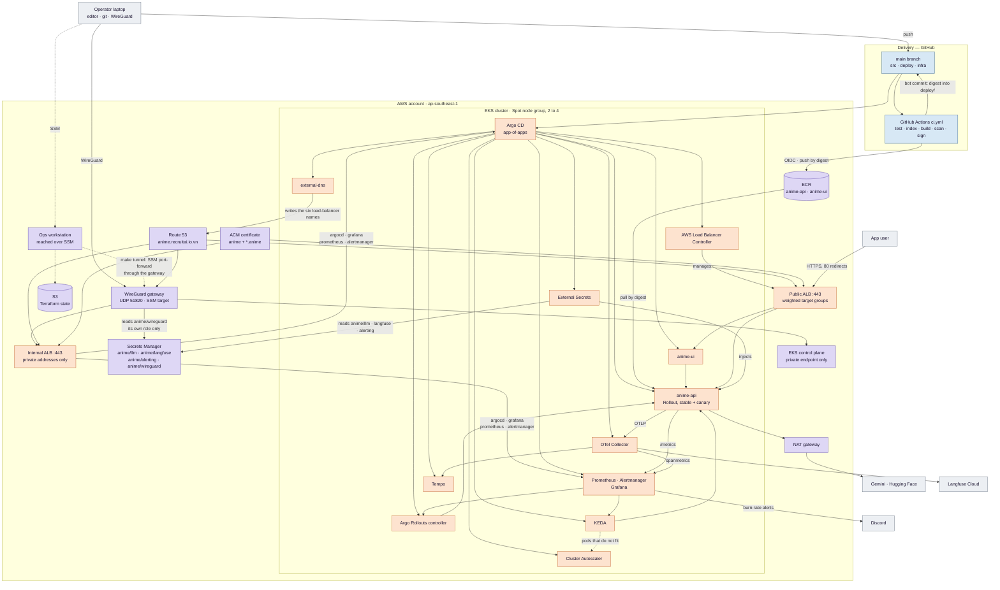
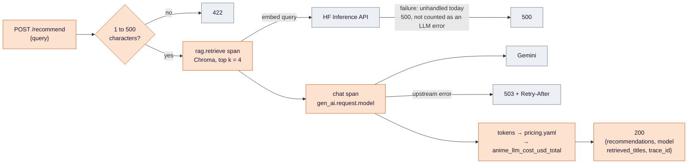
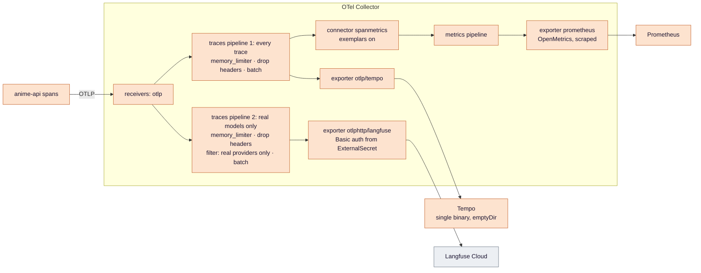
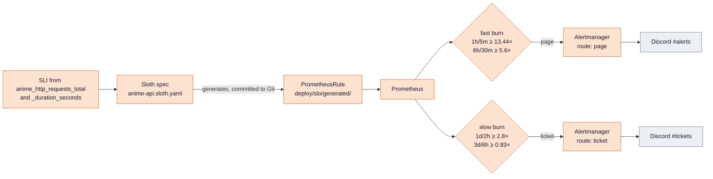
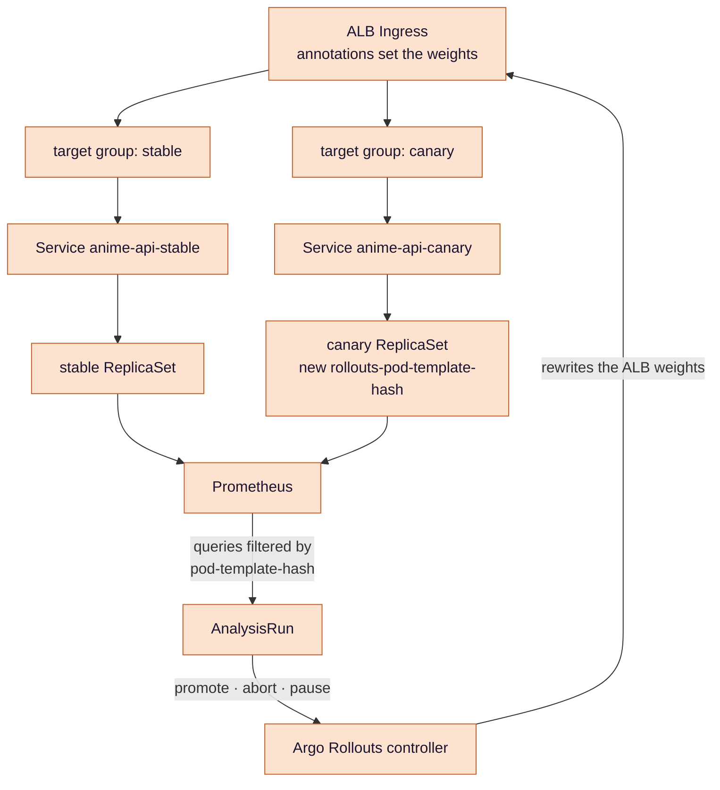
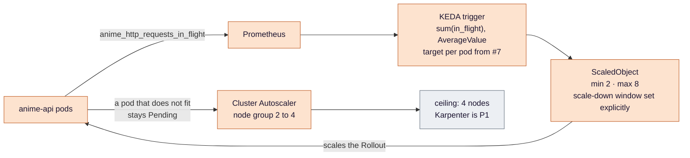
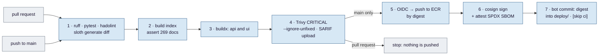
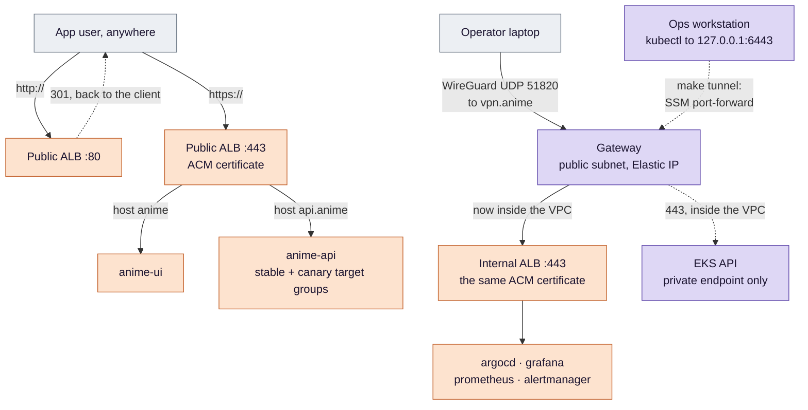

# Anime Recommender — EKS, SRE and LLMOps (Ops Upgrade Design)

The single design document for this repository. It is written once and **appended to**, never rewritten: the
criterion numbers in [§6](#6-verification-and-evidence-definition-of-done) are cited from everywhere else, and
renumbering them would break those references. When a build stage decides differently from what is written
here, the decision is appended to the end of the relevant `### 4.x` under a `**Changed in …**` heading.

Reader's map: [`README.md`](../README.md) states the idea and shows the three overview pictures.
[`docs/evidence/`](evidence/) holds every measurement. This file holds the parameters and the reasoning.

## 1. Goal

Run this recommender on **Amazon EKS** the way a production SRE team would:

- **SLOs** with multi-window burn-rate alerting, so an alert means *the error budget is burning* rather than
  *something happened*.
- **Progressive delivery**: an Argo Rollouts canary judged by Prometheus and rolled back without a human.
- **Autoscaling on the right signal** — in-flight requests, not CPU.
- **Load-tested capacity numbers**, so "it scales" is a figure and not an adjective.
- **LLM observability:** OpenTelemetry `gen_ai.*` traces, token counts and an estimated dollar cost.

Every P0 item must leave measurable evidence in `docs/evidence/`.

This is the **managed** counterpart to Medical-RAG-Chatbot, which runs a self-managed kubeadm cluster. The two
projects split the subject deliberately so that neither repeats the other:

| Concern | Medical (self-managed) | Anime (this repo, EKS) |
|---|---|---|
| Cluster | kubeadm on EC2, built by Ansible | EKS with a managed node group on Spot |
| CI | Jenkins, in the cluster | GitHub Actions, OIDC to AWS |
| Image signing | Cosign with an AWS KMS key | Cosign keyless, GitHub OIDC and Sigstore |
| Identity for pods | IRSA built by hand: a self-hosted OIDC issuer and one role per workload | EKS Pod Identity, per controller |
| Focus | cluster operations, delivery, supply chain | SLOs, canary analysis, autoscaling, LLM observability |

### Non-goals

- **Certificates issued or renewed by anything we operate.** The names are real and the app is HTTPS-only,
  but every certificate comes from **ACM**: AWS issues it, validates it through Route 53 and renews it, and
  with default issuance the private key cannot be exported. (ACM added *exportable* public certificates in
  2025; this design does not use them, which is what makes the property hold.) Medical runs cert-manager with
  Let's Encrypt and therefore has to back the certificate up to Secrets Manager and restore it on every
  rebuild, because Let's Encrypt allows five
  issuances per seven days for one name set. That burden does not exist here and is not recreated. It is the
  same split as the signing keys: Medical holds a KMS key it manages, Anime signs keylessly and holds nothing.
- **A second ingress controller.** The AWS Load Balancer Controller serves both entry points, so there is no
  ingress-nginx and no in-cluster TLS termination. An ALB listener takes an ACM ARN and cannot read a
  Kubernetes Secret, so pairing it with cert-manager would mean importing each issued certificate into ACM on
  a schedule — possible, and one more moving part that expires silently when it stops. Not impossible;
  declined.
- **Multiple environments.** One `anime` namespace. The canary replaces a dev environment: a change is proven
  on real traffic in small slices instead of on synthetic traffic in a copy of production.
- **Kyverno or etcd operations.** Those belong to Medical, which has an etcd to operate.
- **Self-hosted Langfuse.** Tempo in the cluster is the source of truth; Langfuse Cloud is a second export.

## 2. Baseline (verified 2026-09-21)

The application layer is **done and measured**; nothing is deployed anywhere.

**What exists in the repository today**

| Path | What it is |
|---|---|
| `src/anime/` | Nine modules: `config`, `data`, `index`, `providers`, `recommender`, `metrics`, `pricing`, `telemetry`, `log` |
| `services/api/` | FastAPI on uvicorn, with its Dockerfile and a `test` build target |
| `services/ui/` | Streamlit, a thin client over the API, with no LangChain in it |
| `tests/` | 17 tests over providers, the index, and the API surface |
| `config/pricing.yaml` | USD per million input and output tokens, per model, with the date the prices were read |
| `docker-compose.yml` | api and ui, wired together, with the index built during the image build |
| `docs/evidence/local.md` | Every number quoted below |

**The six defects the app phase closed.** Each was a real property of the code before `f088d14`, and each is
now measured rather than asserted:

| Defect | Why it mattered | Closed by | Measured in |
|---|---|---|---|
| A single Streamlit process, no API | Websocket traffic has no HTTP status code to count and no request to replay: no SLI, no load test | The api/ui split | [drill](evidence/local.md#failure-drill-fake-provider), which counts statuses |
| `chroma_db/` gitignored, copied by `COPY . .` | A clean build ships an **empty** index and nothing complains | Index built during the image build, count asserted | [build](evidence/local.md#build-and-tests) |
| `LATENCY.observe(0.0)` at startup | A fake zero sample: the histogram count disagrees with the request count forever | Removed | [drill](evidence/local.md#failure-drill-fake-provider), where the two counts agree |
| `sentence-transformers` installed, unused | It pulls PyTorch: 6.45 GB of image for code nothing calls | Removed | 619 MB api, 559 MB ui |
| Histogram top bucket at 10 s | LLM calls land above it, so p95 is unmeasurable exactly where it matters | Buckets to 32 s | `src/anime/metrics.py` |
| No health endpoints; probes hit `/` | A probe that passes while the index is missing | `/healthz` and `/readyz` | [startup](evidence/local.md#startup-resilience) |

**One defect the app phase found by accident and fixed.** The first `docker compose up` could not bind port
8000, which left the container without networking, and the index load — which ran once and never retried —
failed permanently. Loading now runs in the background with capped exponential backoff, `/readyz` reports the
last error while it retries, and `/healthz` stays 200 so the orchestrator's startup probe decides when to give
up. Covered by `test_transient_startup_failure_is_retried`.

**What does not exist yet:** `infra/`, `deploy/`, `.github/`, `Makefile`, `loadtest/`, `eval/`. No AWS
resource for this project has ever been created. Two files from the original repository are still on disk and
are removed in the stage that replaces them: `llmops-k8s.yaml` (replaced by the Helm charts in the GitOps
stage) and the `MLops-Common` submodule (dropped once CI no longer uses the on-premises scripts).

### Prerequisites

- An AWS account, AWS CLI v2, Terraform ≥ 1.10, kubectl, Helm 3, and the `kubectl argo rollouts` plugin —
  all on the **ops workstation**, none on the laptop.
- A **WireGuard client** on the laptop. Nothing else is installed there: criterion #16's negative half needs
  `nslookup` and `curl`, and Windows 10 and 11 ship both.
- On the **ops workstation**, besides the tools above: the **Session Manager plugin** (without it
  `make tunnel` fails before it starts), `cosign` for criterion #3, and `k6` for [§4.5](#45-autoscaling-and-load-testing).
- Control of a subdomain. This project takes `anime.recruitai.io.vn` under the Route 53 public zone that
  Medical's `shared` stack already owns; Anime reads that zone with a `data` source and only ever creates
  records inside it. See [§11](#11-resolved-decisions) for the coupling this accepts.
- Admin on this GitHub repository, to create the OIDC trust and the Actions variables.
- A Gemini API key, and a Hugging Face token with the **Inference Providers** permission.
- A Langfuse Cloud project (free tier) with its public and secret keys.
- A Discord incoming webhook for alerts.

## 3. Architecture

One picture of the whole system. Every close-up in [§4](#4-components) is one box out of this picture, and
each says which box it is before it draws anything.



**Where each close-up goes:** [`API` → §4.1](#41-the-application) ·
[`OTEL` → §4.2](#42-opentelemetry-and-llm-observability) ·
[`PROM` → §4.3](#43-slos-and-alerting-deployslo) · [`ROLLOUTS` → §4.4](#44-progressive-delivery-argo-rollouts) ·
[`KEDA` → §4.5](#45-autoscaling-and-load-testing) · [`CI` → §4.6](#46-cicd-github-actions-githubworkflows) ·
[`ALB` and `IALB` → §4.7](#47-names-tls-and-the-two-ways-in).

### AWS resources (Terraform)

**Split by lifetime.** A nightly `make down` must not destroy the registry, the signing trust or the
certificate. Medical splits for its own reasons — a FAISS index that costs quota to rebuild, secrets typed
by hand, a KMS key whose loss invalidates every signature — into three stacks; its third, `bootstrap`, holds
its state bucket and the ops workstation, both of which Anime reuses and does not rebuild.

| Configuration | Holds | Destroyed by `make down` |
|---|---|---|
| `infra/terraform/shared` | ECR, Secrets Manager, the GitHub OIDC provider and role, budgets, **the ACM certificate** and its validation record | **No** |
| `infra/terraform/cluster` | VPC, EKS, the node group, Pod Identity associations, the WireGuard gateway and its Elastic IP, the `vpn.anime` record | Yes |
| `infra/terraform/bootstrap` | Argo CD and the root app-of-apps, applied **through the tunnel** | Its objects die with the cluster; its **state** does not, and `make down` must delete it, or the next `make bootstrap` plans against a cluster that no longer exists |

The name `bootstrap` means something different in each repository: in Medical it is the stack that is never
destroyed, here it is the one applied last and discarded first.

Getting this wrong is not cosmetic. A certificate in the cluster stack is **re-issued** on every rebuild
rather than renewed, which quietly turns "AWS renews it for us" into a claim that never happens. In `shared`
it is issued once and AWS renews it, and nothing in a rebuild touches it.

- **State:** Medical's existing state bucket, under an `anime/` key prefix, with the S3 native lockfile
  (`use_lockfile = true`, generally available from Terraform 1.11). No DynamoDB table, no second bucket.
- **Network:** a VPC across 2 availability zones — private subnets for nodes, public subnets for the public
  ALB and the VPN gateway, one NAT gateway. Subnet tags carry `kubernetes.io/role/elb` **and**
  `kubernetes.io/role/internal-elb`; without them an `Ingress` is created and simply never gets a load
  balancer, and the internal one fails independently of the public one.
- **EKS**, via `terraform-aws-modules/eks`:
  - the newest version still in **standard support** at build time, pinned exactly;
  - **the public endpoint is off.** `cluster_endpoint_public_access = false` in the module, which is
    `endpointPublicAccess` on the EKS API itself; the private endpoint stays on. The API server has
    no address on the internet at all, so there is no allowlist to keep correct;
  - access entries, not the `aws-auth` ConfigMap.
- **WireGuard gateway:** one small instance in a public subnet with an Elastic IP, UDP 51820, its key material
  in Secrets Manager and readable only by this instance's role. It does **two** jobs — it is the VPN that puts
  a laptop inside the VPC, and it is the SSM target that `make tunnel` forwards the Kubernetes API through.
  It lives in the cluster stack, so `make down` destroys it with everything else.
- **ACM certificate (`shared`):** one certificate covering `anime.recruitai.io.vn` and `*.anime.recruitai.io.vn`,
  DNS-validated through the existing Route 53 zone, attached to **both** load balancers. AWS renews it; no
  step in any rebuild touches it.
- **Route 53 records**, in Medical's existing zone, and **written by two different things** because they have
  two different lifetimes. Terraform (`cluster`) writes only `vpn.anime`, an A record for the gateway's
  Elastic IP. The six load-balancer names — `anime`, `api.anime`, and the four admin names — are written by
  **external-dns** from the Ingress objects. Terraform cannot write them: an alias record needs its target's
  DNS name and hosted-zone id at apply time, and both load balancers are created later, by a controller
  inside the cluster, from objects Terraform never sees.
- **Managed node group, Spot:** instance types `[t3.large, t3a.large, m5.large, m6i.large]`, desired 2, min 2,
  max 4; gp3 encrypted volumes; IMDSv2 with hop limit 1.
  **Account plan — to be verified before stage 1.** The account is Medical's, and Medical's design records that it
  is on the AWS Free plan, which refuses instance types that are not free-tier eligible — `t3.large` among them.
  Whether that plan allows EKS and Spot at all, and which of these types it accepts, decides whether this list
  stands or the account's plan changes first.
- **Addons:** vpc-cni, coredns, kube-proxy, aws-ebs-csi-driver, eks-pod-identity-agent.
- **Pod Identity associations:** AWS Load Balancer Controller; External Secrets, read on exactly three ARNs —
  `anime/llm`, `anime/langfuse`, `anime/alerting` — and **not** a wildcard, because `anime/*` would include
  `anime/wireguard`; EBS CSI; the Cluster Autoscaler, whose writes are limited to this node group's Auto Scaling
  group — its describe calls cannot be scoped and read every group; external-dns, scoped to
  `ChangeResourceRecordSets` on the one hosted zone and to record names under `anime.recruitai.io.vn` only — it
  shares a zone with Medical, and nothing in this cluster has any business editing Medical's records.
  (**To be verified:** external-dns names the ownership TXT record of the bare `anime` name itself, and in its
  newer format that name may fall outside the suffix the policy allows; a `--txt-prefix` keeps it inside.)
- **Registry:** ECR `anime-api` and `anime-ui`, scan on push, a lifecycle policy keeping the last 20 images.
- **GitHub OIDC provider and role:** trust limited to
  `repo:biabeogo147/Anime-Recommender:ref:refs/heads/main`, permissions limited to pushing to those two
  repositories.
- **Secrets Manager:** `anime/llm` (`GOOGLE_API_KEY`, `HF_TOKEN`), `anime/langfuse` (public and secret key),
  `anime/alerting` (the Discord webhook), and `anime/wireguard` (the gateway's keys, readable only by the
  gateway's own role — no node and no pod can read it).
- **Budgets:** alarms at 50 and 100 USD, with the same default tags as Medical.
- **Argo CD:** installed **in a second apply, after the tunnel is open** — not in the same run that creates
  the cluster. `make infra` builds AWS and stops; `make tunnel` opens the SSM port-forward; `make bootstrap`
  then runs the small Terraform configuration whose `helm` and `kubernetes` providers point at
  `127.0.0.1:6443`. A single `apply` cannot do both: with `endpointPublicAccess = false` the API server has no
  address the workstation can reach until the tunnel exists, and the tunnel needs the gateway that the same
  apply is still creating. Medical splits the same way for the same reason. Everything after Argo CD is
  reconciled from Git.

### In-cluster components (Argo CD Applications, `deploy/argocd/apps/`)

Each has a pinned chart version. Sync waves run in the order below, because each wave needs the one before it:

| Wave | Application | Needs the wave before it for |
|---|---|---|
| -2 | aws-load-balancer-controller, external-secrets | CRDs, and a load balancer for anything to be reachable at all. **Every** Ingress, and so both load balancers, depends on this one controller |
| -1 | the `anime` namespace and its ExternalSecrets, **external-dns** | the secrets must exist before the api starts; external-dns needs the LBC's Ingress objects to appear before it has anything to publish |
| 0 | kube-prometheus-stack, argo-rollouts, keda, cluster-autoscaler, opentelemetry-collector, tempo | the api's Rollout and ScaledObject need their CRDs to exist |
| 1 | anime-api, anime-ui | — |
| 2 | slo (the generated PrometheusRule) | nothing, honestly — a rule over an absent metric is accepted and simply produces no series. The wave is for reading order, and is marked as such so nobody defends it as a dependency later |

**Waves only order Applications if Argo CD can tell when an Application is healthy.** Since Argo CD 1.8 there is
no built-in health check for the `Application` kind, so under an app-of-apps root a child counts as healthy the
moment it is *created*, and the next wave starts before the previous one's CRDs, controllers or secrets exist.
The bootstrap values therefore add the `resource.customizations.health.argoproj.io_Application` check to
`argocd-cm`, in the form Medical's `deploy/argocd/values/argocd.yaml` ended up with: a child is healthy only when it
is `Healthy` **and** `Synced`, `Degraded` is passed through, and a child with no resources at all is `Degraded`.
The sync condition is not optional. Argo CD leaves resources that do not exist yet out of an Application's health,
so a child that has applied half its manifests reports `Healthy`; Medical's health-only first version let the
waves go at once on a real rebuild. Without the check the table above is a
description of intent, not an order anything enforces.

**A single point of failure this introduces.** The load balancer controller at wave -2 is the only thing that
can create the ALB **and** the only thing that can shift traffic between the stable and canary target groups.
If it is unhealthy, the service is unreachable and no release can proceed. Its failure mode is recorded in
[§5](#5-error-handling-and-failure-modes) and it is the first thing to check when a rollout stalls.

## 4. Components

### 4.1 The application

**Where this sits.** The `API` box in [§3](#3-architecture).



**The two exits are not counted alike, and one of them is a defect to fix before the SLO means anything.**
A 422 is counted in `anime_http_requests_total` only; it never reaches the model, and it is not a 5xx, so it
stays out of the availability SLI by design. A 503 from the model is counted twice over — by status, and in
`anime_llm_request_duration_seconds{outcome="error"}`.

**The retrieval leg has no handler at all.** In `src/anime/recommender.py` only the `chat` span wraps its call
in `try`; `rag.retrieve` does not, and `BatchedEmbeddings._with_retry` re-raises the original exception rather
than an `UpstreamError`. A Hugging Face failure at query time therefore leaves the API as an unhandled
exception: **500, no `Retry-After`, and nothing recorded in the LLM error metric.** It still lands in the 5xx
SLI through the middleware's status fallback, so the SLO is not blind — but the failure is misclassified and
the client is told nothing useful. Closing this is a prerequisite for trusting
[§6](#6-verification-and-evidence-definition-of-done) row 11, and it is the reason the
diagram above draws an error exit from `HF` as well as from the model.

**Endpoints**

| Endpoint | Behaviour |
|---|---|
| `POST /recommend` | `{query}` validated at 1–500 characters; returns `{recommendations, model, retrieved_titles, trace_id}` |
| `GET /healthz` | Liveness. Stays 200 while the index is still loading, so a slow start is not a restart loop |
| `GET /readyz` | 503 until the index is loaded and `count == EXPECTED_DOCS`; the body is `{status}` plus the last load error while retrying — **not** the manifest, which is exposed only through `anime_index_info` |
| `GET /metrics` | Prometheus exposition |

**How Prometheus finds them.** The app chart ships a **`PodMonitor`**, not a `ServiceMonitor`, because of what
happens once the api is a Rollout: three Services select the same pods — the main one, the stable one and the
canary one — and a ServiceMonitor whose selector matches them all scrapes each pod once per matching Service,
doubling or tripling every counter. A PodMonitor scrapes each pod once. Either kind can copy a pod label onto
the series, and this one must: the canary analysis filters on `rollouts-pod-template-hash`, which exists on the
*pod*, not on any series, until the monitor lists it under `podTargetLabels` — it then arrives as
`rollouts_pod_template_hash`. Without that line every canary query matches nothing.

By default kube-prometheus-stack selects only monitors carrying its own release label, and one it does not
select is **accepted by the cluster and silently ignored**: no target, no error, and every query in
§4.3–§4.5 returns an empty result — which reads as "no errors", not "no data". So the stack is installed with
`podMonitorSelectorNilUsesHelmValues: false` (and the ServiceMonitor equivalent, for the platform's own
components), which empties the label selector; the namespace selector is already empty by default, which is
what makes it every namespace. **Rules have the identical trap:**
`ruleSelectorNilUsesHelmValues: false` as well, or the Sloth-generated `PrometheusRule` of §4.3 is ignored
the same way and no SLO alert can ever fire. The first check of any stage that reads these metrics is that the
api's target is listed and `up`, tested on `up` or the total counter — never on the error series, which has no
samples until the first error.

**Metrics**, all prefixed `anime_` and all defined in `src/anime/metrics.py`:

| Metric | Type | Labels / buckets | Read by |
|---|---|---|---|
| `anime_http_requests_total` | Counter | route, method, status | the availability SLI |
| `anime_http_request_duration_seconds` | Histogram | route; buckets 0.1 … 32 s, **to be refined** — see below | the latency SLI, and the canary analysis |
| `anime_http_requests_in_flight` | Gauge | — | KEDA |
| `anime_retrieval_duration_seconds` | Histogram | — | dashboards: retrieval versus generation |
| `anime_llm_request_duration_seconds` | Histogram | model, outcome | dashboards, and the error accounting above |
| `anime_llm_tokens_total` | Counter | model, type | the LLM dashboard |
| `anime_llm_cost_usd_total` | Counter | model | cost per 1,000 requests |
| `anime_index_info` | Info | content_hash, count, embedding_model | which index a pod is serving |

**The health and metrics endpoints must not wait behind the work they report on, and change before stage 4.**
`/healthz`, `/readyz` and `/metrics` are plain synchronous handlers, so FastAPI runs them in the same bounded thread
pool as `/recommend`'s model calls. At saturation a scrape of `/metrics` queues behind forty busy threads, times
out, and the in-flight series goes stale just as the autoscaler needs it; a readiness probe queues the same way and
can mark a busy pod unready, pulling it out of the load balancer at the worst moment. None of the three does
blocking work, so they become `async def` and run on the event loop, independent of the pool. The same pool is also
the most likely capacity limit in fake mode — a concurrency cap rather than CPU — which is what lets a fake-mode
knee say something about real-mode scaling at all.

**The latency buckets are too coarse for the two gates that read them, and change before stage 4.** Today they
are 0.1, 0.25, 0.5, 1, 2, 4, 8, 16, 32 s. The fake provider's latency has a true p95 near 1.42 s; interpolated
inside the 1–2 s bucket, `histogram_quantile` reports about 1.82 s, and the canary gate's 1.2× of that lands at
2.19 s, just past the 2 s boundary. A canary's estimate cannot cross that boundary until more than 5% of its
requests exceed 2 s — so the gate written as 1.2× actually trips at about **1.43×**, and a version 40% slower
passes. The same coarseness makes T jump from 2 s to 4 s to 8 s. The buckets become 0.1, 0.25, 0.5, 0.75, 1,
1.25, 1.5, 1.75, 2, 2.5, 3, 4, 6, 8, 16, 32 s: the estimate then lands at 1.45 s, the gate trips at about 1.22×,
and T can be 2.5 or 3. That is a change to `src/anime/metrics.py`, made in the build before the capacity run;
until it lands, the gate's real threshold is the bucket geometry, not the parameter.

**Configuration** is environment variables only, read once into a frozen `Settings` in `src/anime/config.py`:
`LLM_PROVIDER` (`gemini` default), `MODEL_NAME` (`gemini-3.5-flash-lite`), `EMBEDDING_MODEL_NAME`,
`RETRIEVER_K` (4), `LLM_TIMEOUT_S` (30), `FAKE_LATENCY_MS` (800), `FAULT_RATE` (0), `EXPECTED_DOCS` (269),
and the four paths. The Helm values set them per environment. Three reads live outside this module on
purpose and are the complete list: `src/anime/telemetry.py` tests `OTEL_EXPORTER_OTLP_ENDPOINT` to decide
whether tracing exists at all, and `services/ui/app.py` reads `ANIME_API_URL` and `ANIME_API_TIMEOUT_S` — the
UI is a separate process and does not import `anime.config`. The OTLP exporter reads the rest of the `OTEL_*`
family itself.

**Index reproducibility.** A build stage constructs the Chroma index from `data/anime_with_synopsis.csv` and
asserts the document count, failing the build otherwise. It writes a manifest — content hash, count,
embedding model — that the image copies in and `anime_index_info` exposes. `.dockerignore` excludes any local
`chroma_db/`, so the image can only ever contain the index the build produced. The Hugging Face token reaches
the build as a BuildKit secret mount and never becomes a layer, which is why it appears zero times in
`docker history` and `docker save`.

**The `fake` provider** is selected by `LLM_PROVIDER=fake` and exists **only** for load tests and failure
drills. It is set per rollout in values and is never the default.

| Piece | Behaviour |
|---|---|
| Embeddings | A deterministic 384-dimension hash vector. No network, identical every run |
| LLM latency | Sleeps around `FAKE_LATENCY_MS`, so a load test has a realistic shape without a bill |
| Errors | Raises with probability `FAULT_RATE` — a failure that can be asked for, at a chosen rate |
| Tokens | Synthetic counts, so the token and cost pipelines still run and can be tested |

The rule that keeps this honest: **a number produced in `fake` mode and a number produced in `gemini` mode are
different claims**, and every record states which mode it came from.

**Container hardening.** Multi-stage builds, non-root (UID 10001), read-only root filesystem, an `emptyDir`
for `/tmp`, dropped capabilities.

### 4.2 OpenTelemetry and LLM observability

**Where this sits.** The `OTEL` box in [§3](#3-architecture).



**Two pipelines, because drill traffic must never reach Langfuse.** The capacity ramp, both canary drills and the
alert drill all run the fake provider at tens of requests per second for up to an hour: tens of thousands of traces
an hour, against a free tier that caps observations per month. One morning of drills would spend it, and the traces
would describe a fake model. So the collector runs two trace pipelines from the same receiver, each with its own
processors. One sends every trace to Tempo and to the span-metrics connector. The other drops fake-mode telemetry
before exporting to Langfuse.

**The filter keys on the pod, not the span.** `gen_ai.request.model` is set only on the generation span; a filter on
it would drop that one span and forward the rest of every drill trace — the request span, `rag.retrieve`, the
framework's own internal spans — so Langfuse would still fill, with generation-less traces. The provider is fixed
per pod, so the chart sets `OTEL_RESOURCE_ATTRIBUTES=anime.llm.provider=<provider>` from the same value as
`LLM_PROVIDER`, the attribute lands on every span that pod emits, and the filter drops on the resource attribute. It
is written as an allowlist — drop anything whose provider is not a real one — so a pod that lost the attribute is kept
in, not sent out; the header-dropping step runs in this pipeline too, since it is the one leaving the cluster.
Tempo is where drills are debugged; Langfuse is where real prompts and answers are read.

**The span metrics are for linking, not for measuring.** The connector turns spans into request-rate, error and
duration series, exported through the collector's own `prometheus` exporter and scraped like any other target — no
remote-write receiver to enable on Prometheus. Those series overlap with the api's own histograms, and they will not
agree: different buckets, different start and end points. Two tools measuring one thing differently is something to
report, not reconcile, and the rule is simple — **every SLI and every gate reads the api's own histograms**; span
metrics exist so a Grafana panel can jump from a slow bucket to an example trace.

**That jump needs four settings, and missing any one of them fails silently.** The connector emits exemplars only
with `exemplars.enabled`; the `prometheus` exporter exposes them only with `enable_open_metrics`, because exemplars
exist only in the OpenMetrics format; Prometheus stores them only with the `exemplar-storage` feature enabled; and
the link itself is set on Grafana's **Prometheus** datasource, pointing exemplar trace ids at Tempo. Leave out one and
the graphs render normally, with nothing to click.

**Pipelines are not fully isolated under failure.** Each exporter has its own queue, and a full one drops rather than
blocks, so a Langfuse outage does not stall the Tempo pipeline directly. What the two share is the collector's memory:
as the Langfuse queue grows, `memory_limiter`, which acts on the whole process, starts refusing data for both
pipelines, the api's exporter retries, and Tempo can lose spans or receive duplicates. Requests are unaffected, since
export runs in the background (**to be verified** against the pinned collector version's queue and retry defaults).

**Instrumentation already in the code.** `src/anime/telemetry.py` turns tracing on only when
`OTEL_EXPORTER_OTLP_ENDPOINT` is set, and instruments FastAPI with `/healthz`, `/readyz` and `/metrics`
excluded — probes would otherwise outnumber real traces by an order of magnitude.
`src/anime/recommender.py` opens two spans by hand: `rag.retrieve` with `rag.top_k` and `rag.docs_returned`,
and `chat <model>` with `gen_ai.operation.name`, `gen_ai.request.model`, `gen_ai.usage.input_tokens` and
`gen_ai.usage.output_tokens`.

Two gaps against the GenAI conventions remain and are closed with the capture flag: the generation span sets no
`gen_ai.provider.name`, and it uses the default `INTERNAL` kind where the conventions expect `CLIENT`. The
conventions are themselves still in development status, so the attribute set is checked against the version pinned
at build time.

Because those attributes are emitted directly, `opentelemetry-instrumentation-langchain` (OpenLLMetry) is
**optional here, not required**. It would add library-level spans; it also tracks LangChain's own versions
closely, and the original design listed a version mismatch as a risk. The manual spans are the primary path
and the library is an addition to evaluate, not a dependency to plan around.

**Prompt and response capture does not exist yet, and without it the Langfuse export is close to pointless.**
No span carries the prompt or the completion: `recommender.py` sets `rag.*` and `gen_ai.*` numbers and nothing
else, so Langfuse would receive timings and token counts with no text to inspect. The work is to add the two
content attributes behind a flag — `OTEL_CAPTURE_CONTENT`, which is **to be written**, not a setting that
exists — defaulting **on** here, and documented as default-off for any regulated context. "The content is anime
preferences" describes what the box is *for*, not what people type into it: it is free text, and anything a user
writes is copied to a third-party service. That is accepted for a single-operator demonstration and stated on the
page that shows the box; it would not be for a public service. Until the flag exists, treat criterion #11 as
covering the span structure only.

**Traces live as long as the cluster.** Tempo keeps its blocks in an `emptyDir`, which dies with its pod — there is
no volume for a teardown to orphan. Langfuse Cloud keeps real-model traces across teardowns, for as long as its plan
retains data. Evidence for criterion #11 is therefore captured during the session,
from both, not read back the next day.

**Grafana**, with dashboards as code in `deploy/dashboards/`, loaded by the sidecar ConfigMap label: an SLO
overview, an LLM dashboard (latency split into retrieval and generation, tokens per minute, cost per 1,000
requests) and a rollout dashboard. Metric panels link to example traces through exemplars, configured on the
Prometheus datasource as above.

**The cost panel reads real models only.** `config/pricing.yaml` prices the `fake` model identically to the real
one, so a panel summing cost across every `model` label would add fabricated dollars from every drill. The panel
filters to the real models, and shows the label it is summing so the filter is visible rather than assumed. The
denominator has to be filterable too: `anime_http_requests_total` carries no `model` label, so it would count every
drill request. Cost per 1,000 requests is therefore 1,000 × the rate of the cost counter over the rate of
`anime_llm_request_duration_seconds_count{outcome="ok"}`, both restricted to the same real models.

### 4.3 SLOs and alerting (`deploy/slo/`)

**Where this sits.** The `PROM` box in [§3](#3-architecture).



**The two SLOs**, both over 28 days:

- **Availability 99.5%.** SLI = `1 − rate(anime_http_requests_total{route="/recommend",status=~"5.."}[5m])
  / rate(anime_http_requests_total{route="/recommend"}[5m])`, with Sloth substituting its own window per rule.
- **Latency: 95% of `/recommend` under T.** **T is not chosen; it is measured**, during the `gemini`-mode
  baseline ([§4.5](#45-autoscaling-and-load-testing)) — and it is read from **the same server-side histogram
  the SLI counts**, not from k6. k6's request duration covers sending, waiting and receiving on an open
  connection — DNS, connecting and the TLS handshake are timed separately, and with keep-alive happen once
  per connection. What it still includes and the histogram does not is one network round trip, the load
  balancer's own time, and the server's work before the timing middleware starts. A T taken from k6 and
  enforced on the histogram would be loose by that gap. **In this deployment the gap is expected to be
  milliseconds, against buckets a quarter to half a second wide around T**, so after rounding it will rarely
  change T; the rule is kept because it is the right rule, and the record says how much it mattered. k6's p95
  is recorded beside T as the figure a direct client of the api waits.

  **Fast failures pull T down.** The histogram is not split by status. If the provider rate-limits during the
  baseline, quick 503s enter the same distribution and make the p95 look faster than a successful request is.
  The SLI counts them the same way, so the two stay consistent; the baseline's error count is recorded so a
  flattering T can be recognised.

  T is then rounded **up** to a bucket boundary, because the SLI is a ratio of requests in the bucket
  `le=T` to all requests — exact at a boundary, and a selector that matches **no series** anywhere else. With the
  current buckets that is coarse: a p95 anywhere between two and four seconds becomes four, and one above four
  becomes eight. Two single requests measured locally took about three seconds; a p95 over two hundred
  rate-limited calls may well be higher. Which bucket T lands in is the measurement's answer, not an assumption
  to confirm.

**T governs the SLO and nothing else.** It is deliberately *not* the canary's latency gate. Every canary and
alert drill runs in fake mode, where the provider sleeps around a median of 800 ms with a p95 near 1.4 s before
any overhead — about a third of T if T is four seconds, less if it is eight. A `p95 ≤ T` gate would pass straight
through the early part of saturation and fail only long after the damage it exists to catch.
[§4.4](#44-progressive-delivery-argo-rollouts) therefore compares the canary against the stable version instead,
in the same window and the same mode.

**Why Sloth output is committed, and why there is no Sloth operator.** `sloth generate` runs in CI and its
output is a plain `PrometheusRule` in Git — no `PrometheusServiceLevel` custom resource and no controller
watching for one. The rules carry alert annotations containing `{{ $labels }}`, which Helm would try to
render. The generated YAML is therefore a plain manifest
with its own Argo CD Application, and CI re-runs `sloth generate` and fails if the committed file differs —
otherwise the spec and the rules drift apart silently.

**The multipliers are derived for 28 days, not copied from the 30-day literature.** Each factor is the share of
budget an alert should catch, times the period, divided by its long window: 2% of 672 hours over one hour is
13.44. The familiar 14.4, 6, 3 and 1 are the same budget shares over 720 hours. Sloth derives the 28-day set —
13.44, 5.6, 2.8 and 0.93 — when it is run with a 28-day period; its default is 30 days, so the period has to be set
in the command CI re-runs as well, or the committed rules quietly carry the 30-day factors (**to be verified**
against the Sloth version in use). These are the numbers the generated rules will contain, and any drill arithmetic
uses them.

**What the SLO is on this platform, and what it is not.** The cluster lives for a few hours a day and its metrics
die with it, so no 28-day window ever exists here. "Availability 99.5% over 28 days" is therefore a **definition**
— it fixes the error budget, and so the burn rates the alerts are built from — and never an attainment. Nothing in
this project will claim the SLO was met. What criterion #10 proves is narrower and real: that the alerting built
from it fires, on the right rule, and reaches a person.

**Each alert carries a `runbook_url`** pointing at `docs/runbooks/`, and the runbook entry is written **before**
the drill that fires the alert. An alert that arrives with no instructions is an interruption, not a signal.

**The alert drill, and why `FAULT_RATE=0.5`.** A drill runs a version with **both** `LLM_PROVIDER=fake` **and**
`FAULT_RATE=0.5`, **promoted straight to all traffic** — `kubectl argo rollouts promote --full`, which skips the
remaining steps and their analyses — and measures time-to-alert.
All traffic, because the alert reads the error ratio across the whole service: held at a 10% canary step, 50%
errors become 5% overall — a burn rate of 10×, under the 1h/5m pair's 13.44×, so that pair never fires, and above
the 6h/30m pair's 5.6× only after more than an hour of it (computed) — longer than a drill, so the silence in
between would be read as broken alerting.
`FAULT_RATE` alone does nothing: `providers.get_llm` passes it to `FakeLLM`, which is only constructed when
`LLM_PROVIDER == "fake"`. Set the fault rate on a `gemini` rollout and the drill injects **zero** faults, no
alert ever fires, and the absence looks like a healthy service.

At 10% errors the burn rate against a 99.5% target is 20×, and the 1-hour window needs roughly 40 minutes
before its average crosses 13.44× — a drill nobody will sit through, and one that overlaps a teardown. At 50%
the burn rate is 100× and the 1h/5m pair crosses in about 8 minutes — window arithmetic only, before scrape,
evaluation, grouping and delivery. The drill value is chosen for the drill's own arithmetic, and the calculation
is written down so the number is not mistaken for a production condition.

**Those minutes assume clean traffic first — and how much decides which pair fires.** The 1-hour window's error
ratio climbs from zero only if the hour before the fault was full of successful requests at the same rate. Start
the traffic and the fault together and every window holds nothing but the faulty period: the ratio is 50% from the
first scrape, and the page fires within a couple of evaluations. Both runs are legitimate; they measure different
things — the first how long the rule takes to *notice* a burn, the second how long the pipeline takes to *deliver*
a page — and the record states which one it is.

One hour of clean traffic is not enough to make the *calibrated* pair the one that fires. Sloth writes both fast
pairs into a single page alert, joined by `or` (**to be verified** against the generated file), so the drill cannot
choose a pair; whichever crosses first fires the page. In a ratio of rates, hours with no traffic count for nothing,
so what matters is how much clean traffic the store holds, not how old it is. With one clean hour, the 6-hour
window holds that hour plus the fault and crosses 5.6× after about 4 minutes, before the 1h/5m pair's 8 — the page
would come from the uncalibrated branch. With about three hours of clean traffic the 6-hour window needs about 11
minutes, and the 1h/5m pair fires first with a margin of a few minutes (all computed). So `steady.js` runs for
**three hours** before the faulty version is promoted, and the record reads each window's burn rate at the moment
the page fired, rather than inferring the pair from its name. Both ticket pairs cross within a couple of minutes
of the fault either way, into the ticket channel, and are recorded as uncalibrated.

**Time-to-alert is a sum, recorded in parts:** the scrape that first carries failing requests; the recording
rules that turn counters into burn-rate ratios, evaluated on their own interval; the alert rule's evaluation that
first sees both windows over the threshold — Sloth's rules carry no `for:`, so it fires then; Alertmanager's
`group_wait` for a new group, or `group_interval` if its group already notified; and Discord's delivery. A single
number from fault to message hides which of those dominated — and only the window arithmetic is about the SLO.

**Only the SLO alerts reach Discord.** The root route stays at the chart's `null` receiver; the page and ticket
routes are the only ones with a destination. The platform's own cause-based alerts — a pod crash-looping, a node
not ready — are not routed, because this project alerts on what users experience and investigates causes from
there. That also means there is **no dead-man's switch**: the chart's `Watchdog` heartbeat is a Prometheus rule
built to feed an external service that complains when it stops, it goes to `null` here, and nothing else
notices a broken webhook. Delivery is proven at each drill and assumed in between.

### 4.4 Progressive delivery (Argo Rollouts)

**Where this sits.** The `ROLLOUTS` box in [§3](#3-architecture). The decision tree inside the analysis is in
the [README](../README.md#4-inside-the-canary); what follows is where the traffic actually goes.



**A canary adds pods; it does not divide them.** With traffic routing, the canary ReplicaSet is scaled to the
step's weight times the Rollout's replicas, and the stable ReplicaSet stays at full size, so an abort can return
all traffic at once. At the 50% step there are about half as many pods again as the replica count says. That is the
safe default and it is kept — but it is extra requested capacity, and the node autoscaler sees it.

**The label is the whole mechanism.** Both ReplicaSets export the same metric names; only
`rollouts-pod-template-hash` separates them — and only if the PodMonitor has copied it onto the series
([§4.1](#41-the-application)). A query that forgets that filter measures stable and canary
together and will happily promote a broken version — which is why [§6](#6-verification-and-evidence-definition-of-done)
requires the AnalysisRun's recorded measurement to be non-empty and attributable.

**Steps:** `setWeight 10` → pause 2m → analysis; `setWeight 50` → pause 2m → analysis; `setWeight 100`.

**`AnalysisTemplate success-rate-and-latency`:** Prometheus provider, interval 30 s, count 4, failureLimit 1.
Two gates. The success rate reads the canary's `rollouts-pod-template-hash` only; the latency ratio reads the
canary's hash **and** the stable one:

- **Success rate** ≥ 0.99.
- **Latency, relative:** canary p95 ≤ 1.2 × the **stable** ReplicaSet's p95 over the same window. Not `≤ T` —
  see [§4.3](#43-slos-and-alerting-deployslo): T is a gemini-mode number and the drills are fake-mode, so an
  absolute gate could not fail. A ratio between two ReplicaSets measured in the same window removes the mode
  from the question.

**Minimum-traffic guard:** fewer than 20 requests in the window returns `Inconclusive`, and the rollout pauses
for a human instead of promoting on no evidence.

**The query window is two minutes, and that follows from the scrape interval.** `rate()` needs at least two
samples inside its window, and with Prometheus scraping every 30 seconds a 30-second window often has one —
returning nothing, which the analysis would read as no traffic. Four scrape intervals is the usual floor. Each
of the four probes, 30 seconds apart, looks back over the last two minutes.

**Traffic during a drill, and why 20 requests per second.** `loadtest/k6/steady.js` holds a constant **20 RPS**
in fake mode, so at the 10% step the canary receives about 2 RPS — about 240 requests per window. The guard of
20 is not what sets that rate: even 5 RPS would give the canary about 60 requests per window, comfortably
above it. What sets it is the **success-rate gate's resolution**. At 99%, a window of 240 requests tolerates
two errors; a window of 60 fails on the first one. A gate that aborts a healthy release over a single stray
error is a gate people learn to switch off, so the drill rate is chosen to give the threshold room to mean
what it says.

**Open: how the UI reaches the api, and whether real users are canaried.** Browsers reach Streamlit on
`anime.recruitai.io.vn`; the UI then calls the api at `ANIME_API_URL`. Pointed at the public `api.anime` name,
UI traffic follows the ALB weights but leaves the VPC through the NAT and comes back in. Pointed at an in-cluster
Service, it stays inside — and is split by whatever that Service selects, not by the ALB weights: through the
stable Service it never reaches a canary at all. The drills are unaffected, since k6 calls `api.anime` directly;
what is undecided is whether a canary is judged on real users' requests too. To be settled when the ui chart is
written, and stated in the evidence.

**The rollback drill.** Drills run with the whole api already in fake mode, so stable and canary are compared in
the same mode. The change under test adds `FAULT_RATE=0.2` to a version whose values also pin
`LLM_PROVIDER=fake` — the fault rate is read only by the fake provider, so on a `gemini` version it injects
nothing and the bad version is **promoted**, which is the false pass named in
[§6](#6-verification-and-evidence-definition-of-done) row 9.
The analysis fails at the 10% step and the Rollout aborts, returning 100% of traffic to stable.
Recorded: elapsed time from rollout start to abort,
the failed measurement value, and the share of requests that saw an error while the canary was live.

### 4.5 Autoscaling and load testing

**Where this sits.** The `KEDA` and `CAS` boxes in [§3](#3-architecture).



**Why in-flight requests and not CPU.** Each request spends almost all its time waiting on two remote APIs —
Hugging Face for the embedding, Gemini for the generation. CPU therefore barely moves under load, and a CPU
HPA would sit at 5% while requests queued. The gauge of requests currently being served is the only signal
that actually tracks demand here.

**The ceiling is real and must be reported — in the scaling run, not the capacity run.** KEDA may ask for 8
pods, but the node group stops at 4 nodes. A ramp *with* autoscaling that plateaus has two possible causes —
the service saturated, or the cluster ran out of room for more pods — and the evidence has to say which.
Record pod count *and* node count over time. The capacity run of stage 4 has a fixed replica count, so no pod
can go Pending there; its plateau is the service's or the load generator's.

**Something has to add nodes, or "max 4" is decoration.** A managed node group does not scale itself: its
minimum and maximum are bounds for something else to move within. Without that something, the group stays at
its desired size of two, and the first pod KEDA asks for that no longer fits on two nodes sits `Pending` for
ever. So stage 7 also installs the
**Cluster Autoscaler**, with its own Pod Identity association scoped to this node group, which adds a node when
a pod cannot be scheduled and removes one that has been underused. Adding a node takes minutes, not seconds —
the scaling run reports pod scale-out and node scale-out as separate delays.

**Both of those are decided by resource requests, not by load.** The scheduler places pods, and the Cluster
Autoscaler judges nodes, only by what pods *request*. The api's CPU and memory requests are therefore set from what
a pod actually used at the capacity run's knee — not inflated to make scaling visible. If eight pods at those
requests still fit on two nodes, no pod ever goes `Pending`, the node half of criterion #14 does not happen, and
it is recorded as **not exercised** rather than forced.

**Nodes come back more slowly than pods.** The Cluster Autoscaler removes a node only after it has been unneeded
for ten minutes, and not within ten minutes of a scale-up; a node holding a pod with local storage is skipped
unless the pod says it may be evicted. The api's `/tmp` is an `emptyDir`, so its pods carry
`cluster-autoscaler.kubernetes.io/safe-to-evict-local-volumes`. Criterion #14 times the node return against those
windows.

**Scale-down is the HPA's, not KEDA's cooldown.** KEDA's `cooldownPeriod` only governs scaling *to zero*; with a
minimum of two replicas it does nothing. How fast replicas come back down is decided by the HPA's scale-down
stabilisation window, which KEDA passes through — five minutes unless set. The ScaledObject sets it explicitly
under `advanced.horizontalPodAutoscalerConfig.behavior`, and criterion #14 times the scale-down against that
window, not against a cooldown that never applies.

**An empty result must not read as zero load.** KEDA's Prometheus scaler treats an empty query result as `0` by
default. If the api's series disappear — the monitor broken, the scrape timing out — the autoscaler sees no
requests in flight and scales down to the minimum, in the middle of whatever load there was. The trigger sets
`ignoreNullValues: false`, so an empty result is an error, and the HPA holds its current replica count while the
error lasts. After `fallback.failureThreshold` consecutive errors KEDA takes over with a synthesised metric, and a
plain fallback would drive the replicas *to* a fixed count — down, as readily as up. So the fallback uses
`behavior: currentReplicasIfHigher`, which never scales down on an error, on a KEDA version that supports it,
pinned at build time. Fallback only works for `AverageValue` triggers, which is also why the query is the plain
`sum(...)`: the HPA divides by the pod count itself, and a query that divided again would be counting twice.

**Two owners of the replica count, and one of them must step back.** The HPA that KEDA creates writes the Rollout's
replica count; Argo CD, with self-heal on, would write it back to whatever the chart says. So the api chart leaves
`spec.replicas` out of the Rollout (or the Application ignores differences on that field), and the ScaledObject's
`scaleTargetRef` names the Rollout, which KEDA can scale through its `/scale` subresource.

**Scale-in must not drop requests.** Removing a pod removes its IP target from the ALB, but deregistration takes
time while the pod has already been told to stop. Without a short `preStop` delay and a termination grace period
longer than the drain, every scale-in returns errors to requests still on their way — errors the SLO would count.
The exact delays are set when the chart is written (**to be verified** against the controller's deregistration
behaviour).

**The trigger's threshold comes from stage 4, not from this page.** The `4` below is a placeholder. The
capacity run measures, at the point where p95 breaks away, how many requests each pod had in flight — which
by Little's law is the rate per pod times the latency. The trigger is set some way below that, so scaling
starts before the knee rather than at it. A threshold chosen before that number exists is a guess.

**k6 scripts (`loadtest/k6/`)**

| Script | Mode | What it produces |
|---|---|---|
| `baseline.js` | gemini, at whatever rate the provider's free tier allows, **until at least 200 requests have completed** | Real p50 and p95 against `https://api.anime.recruitai.io.vn`, run from the ops workstation. **This is the run T is read from** — server-side, from Prometheus, over exactly this run's window. Two hundred because a p95 rests on its slowest 5%: over 60 requests that is three samples, over 200 it is ten. The duration follows from the count, not the other way round |
| `ramp.js` | fake, **ramping arrival rate** over 10 min | The highest *offered* rate the service sustains before p95 breaks away from this run's own low-load p95, with no dropped iterations; **the in-flight count per pod at that point**, which sets stage 7's trigger; per-pod CPU and memory, which set its requests; error rate; pods and nodes over time. An *open* model, on purpose: a ramp of virtual users waits for each response before sending the next, so a slowing service quietly receives fewer requests and saturation hides as a lower rate — coordinated omission. **Not compared with T** — see [§4.3](#43-slos-and-alerting-deployslo) |
| `steady.js` | fake, 20 RPS constant arrival | Traffic for the canary analysis and the alert drill |

Summaries are saved with `k6 --out json` into `docs/evidence/loadtest/`.

### 4.6 CI/CD (GitHub Actions, `.github/workflows/`)

**Where this sits.** The `CI` box in [§3](#3-architecture).



Stage 2 needs `HF_TOKEN`, which pull requests from forks cannot read. And because the index is built *into*
the image, a fork cannot build or scan the image either: **a fork's pull request stops after stage 1** —
linted and unit-tested, never built. Stages 5 to 7 run only on `main`: a pull request from this repository is
tested, built and scanned, and no image leaves the runner — only the scan report, uploaded to code
scanning.

**The Trivy gate has to be able to fail, and that is measured, not assumed.** `--ignore-unfixed` drops every
finding with no fix available, which is the right policy — a build blocked on something nobody can patch
teaches people to disable the gate. But it also means that if the base image's CRITICAL findings all lack a
fix, the gate passes every build forever. Medical measured exactly that on its own base image: five CRITICAL,
none fixable — on Debian 12 (bookworm), the base both of this project's Dockerfiles still use.

Recording "how many fixable CRITICAL findings" does not settle it: the gate fails whenever that number is
above zero, so every run that passes records zero by construction. Two things do settle it. Record **total**
CRITICAL beside **fixable** CRITICAL, so a gate that passes because nothing is fixable is visibly different
from one that passes because nothing is there. And run a **positive control** once: a build with the
severity threshold lowered until a finding *with* a fix is in scope, which must go red. Until that run exists
the gate is reported as unproven, not as passing. One more trap from Medical: the gate must be the scan
command itself — `trivy convert`, used to re-read a saved report, has no `--ignore-unfixed` at all.

**Keyless signing.** `cosign sign --yes <digest>` with `id-token: write`. The identity in the certificate is this
repository's release workflow on `main`, so verification asks for that exact identity — `--certificate-identity
https://github.com/biabeogo147/Anime-Recommender/.github/workflows/ci.yml@refs/heads/main` — and
`--certificate-oidc-issuer https://token.actions.githubusercontent.com`. **A pattern would be weaker in two
ways.** cosign matches `--certificate-identity-regexp` with Go semantics, which are a substring search, so an
unanchored pattern accepts any identity that merely *contains* ours. And an anchored pattern on the repository
alone still accepts **any workflow file at any ref** — a feature branch, a pull request's merge ref, the eval
workflow. It is the same mistake as an OIDC trust that names the repository but not the branch. And verification
names the **digest** recorded in `deploy/charts/anime-*/values.yaml`, never a tag — a tag can be moved to an
image Argo CD is not deploying. Unlike Medical, there is no key to store, rotate, or grant anyone access to — the
trade is that verification depends on the public Sigstore infrastructure rather than on a key in our own account.

**Keyless signing publishes.** A keyless signature is recorded in Rekor, Sigstore's public transparency log:
the image digest, the repository and the workflow that signed it become public, permanently. Medical signs
with no log at all, because its images are private and their digests had no business being published. Here
the repository is public already, a digest reveals nothing that can be pulled without registry access, and
the log is what lets anyone check the signature without a key — so the trade is accepted, and stated.

**Nothing in the cluster verifies the signature.** Kyverno is a non-goal (§1), so no admission control
refuses an unsigned image. The signature proves an image *could* be checked — criterion #3 checks it once,
by hand — not that every image *is*. That is the gap Medical's drills phase closes with Kyverno; here it is
left open deliberately and written down.

**The bot commit** edits the image digest in `deploy/charts/anime-*/values.yaml` and carries `[skip ci]` so it
cannot trigger itself. It is the only writer to `main` that is not a human. Argo CD auto-syncs the change and
the Rollout begins its canary.

Two consequences of that one sentence. **`main` is protected** — people reach it only through a pull request
whose CI is green — so the bot needs an identity the protection lets through, and that identity is the single
exception to the rule, named in the repository's ruleset. **And `[skip ci]` is a real guard, not decoration:** a
push made with the workflow's own token does not start new workflow runs, but a push made with any other
credential — a deploy key, an app token — does. Which identity the bot uses is settled when the ruleset is
written; the marker stays either way.

**`eval.yml` (P1)** runs on pull requests touching `src/`, `data/` or `prompts/`: retrieval-only evaluation
over `eval/golden.jsonl` (20 queries with expected titles), computing `hit@4` and failing if it drops below
the baseline in `eval/baseline.json`. **No LLM calls**, so it costs nothing in generation — but it still has
to embed the 20 queries through the Hugging Face API to search an HF-built index, so it needs `HF_TOKEN`, it
*can* be rate-limited, and like stage 2 it is skipped on pull requests from forks.

### 4.7 Names, TLS and the two ways in

**Where this sits.** The `ALB` and `IALB` boxes in [§3](#3-architecture).



This section is what criteria **#15** (the app answers over HTTPS) and **#16** (the admin UIs answer only
over the VPN) measure.

**One certificate, two load balancers.** ACM issues a single certificate for `anime.recruitai.io.vn` and
`*.anime.recruitai.io.vn`, validated by a CNAME that Terraform writes into the Route 53 zone. Both the public
and the internal ALB reference it by ARN. AWS renews it on its own schedule, and the private key cannot be
exported from ACM — there is nothing to back up, nothing to restore, and no rebuild step that can forget it.

That last point is the whole reason for choosing ACM over the cert-manager path Medical runs. Let's Encrypt
issues at most five certificates per seven days for one set of names, so Medical has to copy its certificate
into Secrets Manager and restore it on every rebuild; forget the restore and a few rebuilds exhaust the quota
for a week. On a stack that is destroyed nightly that is a real operational tax, and it is the kind of thing a
reader should be able to see the two repositories answering differently on purpose.

**The public entry point.** One Ingress, `scheme: internet-facing`, `listen-ports: [{"HTTP":80},{"HTTPS":443}]`
and an `ssl-redirect: '443'` action on the HTTP listener, so port 80 exists only to answer 301. Two hosts:
`anime.recruitai.io.vn` to the UI, `api.anime.recruitai.io.vn` to the API. The API needs its own name because
the canary's weighted target groups live on this listener — that is where a release is actually split
([§4.4](#44-progressive-delivery-argo-rollouts)) — and because k6 has to address it directly.

**Every Ingress names the certificate by ARN** with `alb.ingress.kubernetes.io/certificate-arn`. Left out, the
controller picks a certificate itself by matching the Ingress hosts against the ACM certificates in the
account — and in an account that also holds another project's certificates, that match can land on one this
design never mentions. Criterion #15's
false-pass column describes exactly that case; this annotation is what closes it.

**The internal entry point is one load balancer built from four Ingress objects.** The four admin UIs live in
different namespaces, and an Ingress can only route to Services in its own — so one internal Ingress cannot
work. Instead each UI has its own Ingress with `scheme: internal`, and all four carry the same
`alb.ingress.kubernetes.io/group.name`. The controller merges an IngressGroup into **one** ALB, across
namespaces. Each member names the certificate by ARN. All four live in Git, including Argo CD's own: an
Ingress for `argocd-server` is a plain manifest that Argo CD syncs like anything else, whether or not Argo CD
manages its own release. `argocd`, `grafana`, `prometheus` and `alertmanager` under `.anime.recruitai.io.vn`
are **public** alias records pointing at the group's ALB.

**So there are five Ingress objects and two load balancers:** one Ingress for the public ALB, four for the
internal one. Anything that says "both Ingresses" means both *doors*; anything that deletes them before a
teardown must delete all five. **A public name answering with a private address is not a mistake; it is the design.**

The reason is DNS, not TLS. A private hosted zone would resolve only for clients using the VPC resolver,
which means pushing a DNS server into the WireGuard profile and keeping it correct on every laptop. A public
record resolves for nearly every client, for free, and hands back an address that is unroutable from the
internet — the tunnel, not the name, is what grants access. *Nearly*: resolvers with DNS-rebinding protection
(many home routers, dnsmasq's `--stop-dns-rebind`) discard public answers that contain private addresses, and
on such a network the VPN-on half of criterion #16 fails for a reason that has nothing to do with the cluster.

Two things this does **not** depend on, in case the shape suggests otherwise: ACM validates a name through a
`_<token>` CNAME and never looks at its A record (and these four are covered by the wildcard, so they are never
individually validated at all), and a browser verifies a chain from the certificate's SAN list, not from whether
the name resolves publicly.

**The Kubernetes API has no public address at all.** `endpointPublicAccess = false`. The ops workstation, in
a different VPC, reaches it the way Medical does — `make tunnel`, an SSM port-forward, except the SSM target
is the WireGuard gateway, which is the one machine this project owns inside the VPC:

```
aws ssm start-session --target <gateway-instance-id> \
  --document-name AWS-StartPortForwardingSessionToRemoteHost \
  --parameters host=<eks-private-endpoint>,portNumber=443,localPortNumber=6443
```

**One line of kubeconfig differs from Medical, and it is worth knowing why.** kubeadm generates the API
server's certificate, so Medical can put `127.0.0.1` in its SAN list and a tunnelled `kubectl` simply works.
A managed EKS endpoint's certificate is not ours to reissue, so the kubeconfig must carry
`tls-server-name: <the original endpoint hostname>` beside `server: https://127.0.0.1:6443`. Without it every
command fails on a certificate-name mismatch — and that failure reads very much like a dead cluster, which is
the second time this design has had to defend against a symptom that lies.

**Five preconditions the tunnel has, and one follow-up it leaves behind.** The port-forward is performed by
the SSM Agent *on the gateway*, not by the caller, so: the VPC needs `enableDnsSupport` and
`enableDnsHostnames` for the EKS-managed private hosted zone to answer; the gateway needs egress on 443 to
the cluster security group **and** that group needs 443 inbound from the gateway; the gateway needs an
instance profile with `AmazonSSMManagedInstanceCore` and an SSM Agent new enough for
`AWS-StartPortForwardingSessionToRemoteHost`. And afterwards: **`aws eks update-kubeconfig` rewrites the whole
cluster entry** — `server` goes back to the private endpoint's hostname and `tls-server-name` disappears — so both
lines have to be re-applied every time it is run. Until they are, `kubectl` dials an address the workstation
cannot reach and times out, which is the dead-cluster symptom again. (Whether the command replaces the entry or
merges into it is **to be verified** against the CLI version in use.)

**What each door allows.** Named here because criterion #16 asks for these rules as evidence and a rule that
exists nowhere cannot be compared with anything:

| Security group | Inbound |
|---|---|
| Public ALB | 80 and 443 from `0.0.0.0/0` |
| Internal ALB | 443 from the VPN client CIDR and from the VPC CIDR |
| WireGuard gateway | UDP 51820 from `0.0.0.0/0`; nothing else |
| EKS cluster | 443 from the gateway's security group |
| Nodes | the node ports of both ALB security groups |

**The tunnel is one half of the gateway; the VPN is the other, and it needs more than a key.** The client CIDR
is its own small range; the profile's `AllowedIPs` covers the VPC CIDR only, so ordinary browsing does not go
through the tunnel; and the gateway needs IPv4 forwarding and a masquerade rule, or the internal ALB has no
return route to the client range and "VPN on, the UI loads" fails for a reason nothing else would explain.
The **gateway's** keys live in `anime/wireguard`; each operator generates their **own** keypair, keeps the
private half on their laptop, and sends only the public half to be added as a peer — a private key that has
been anywhere else is not a private key.

**What the load balancer needs from the workload**, none of it default:

- **`alb.ingress.kubernetes.io/target-type: ip`.** Weighting would still work with `instance` targets — the
  stable and canary Services have different selectors, so each target group reaches a different node port.
  IP targets are chosen for three other reasons: no extra kube-proxy hop that, with the default traffic
  policy, can land a request on a pod of the *other* version before the split is applied; pod readiness gates,
  below; and Argo Rollouts' check that the weights it asked for are the weights the target groups actually
  have.
- **`healthcheck-path`, and pod readiness gates.** The controller's default health check is `GET /` on the
  traffic port. `anime-api` serves no `/`, and Streamlit's health path is `/_stcore/health`, so every target
  would fail it. **An ALB whose targets are all unhealthy fails open** — it routes to all of them anyway —
  so users would be served normally and the misconfiguration would be invisible, the quietest false pass in
  this design. The `anime` namespace therefore carries the controller's readiness-gate injection label: a pod
  is not Ready until its target is healthy in the load balancer, so the same mistake makes the rollout
  **stall** instead. Set `/healthz` and `/_stcore/health` explicitly; the readiness gate is what turns
  getting them wrong from silent into loud.
- **The admin UIs have to be told their own names.** Argo CD's server needs `server.insecure: true` behind a
  TLS-terminating ALB or it redirect-loops; Grafana needs `root_url`; Prometheus and Alertmanager need
  `--web.external-url`. Each is a component that works perfectly on `localhost` and breaks the moment it is
  given a hostname.

**The gateway earns its instance twice.** It is the VPN endpoint for a browser on the laptop, and the SSM
jump host for `kubectl` on the workstation. It sits in the cluster stack, so `make down` takes it, and a
rebuild brings back a new Elastic IP. The client profile names the gateway as `vpn.anime`, not by address, so a
rebuild changes one DNS record rather than every laptop's profile; what remains is a resolver that cached the old
address, which clears within the record's TTL.

## 5. Error handling and failure modes

| Failure | Behaviour |
|---|---|
| Gemini 429 or 5xx | 503 with `Retry-After`, counted in `anime_llm_request_duration_seconds{outcome="error"}` and in the 5xx SLI. The retry is the client's own (`max_retries=1`); whether that means one retry or one attempt, and whether it jitters, is the library's behaviour and **no test in this repository covers it**. The jittered backoff we do own and test is `BatchedEmbeddings._with_retry`, on the embedding path |
| Hugging Face embedding failure at query time | **Today: 500, with no `Retry-After` and no LLM error metric** — the `rag.retrieve` leg has no handler and `BatchedEmbeddings` re-raises the original exception ([§4.1](#41-the-application)). It reaches the 5xx SLI only through the middleware's status fallback. The fix is to map it to `UpstreamError` like the model path. Readiness reflects only local state either way, so the probe does not flap on an upstream outage |
| Index missing or wrong in the image | `/readyz` returns 503, the new pods never become Ready, and the Rollout does not progress. The CI assertion should prevent it reaching here |
| Spot interruption | Managed node group rebalance handles the termination notice. `minAvailable: 1` PDB on the api; minimum 2 replicas spread across nodes |
| **Spot interruption during a canary analysis** | The canary ReplicaSet loses a pod mid-window. If a replica survives, the minimum-traffic guard should return `Inconclusive`. If the **last** canary pod goes, its samples age out of the two-minute window and the query then returns an **empty vector** — which the `< 20` comparison cannot evaluate. The measurement errors; enough consecutive errors fail the run, and a failed run **aborts** the release on a capacity event. The guard protects against thin traffic, not absent series; the analysis must treat an empty result as `Inconclusive` — and since Argo Rollouts has no inconclusive condition of its own, that means both `successCondition` and `failureCondition` require a non-empty result before comparing it, so an empty one matches neither (**to be verified** against the version in use). Either way the record must say which happened, because an abort blamed on the release when capacity caused it is a wrong conclusion carried forward |
| Canary regression | The AnalysisRun fails, the Rollout aborts automatically, stable keeps 100%. The Argo CD Application shows `Degraded` until Git is fixed or reverted |
| Too little canary traffic | `Inconclusive` → the rollout pauses for a human. It never auto-promotes on no evidence |
| WireGuard gateway lost, or replaced by a rebuild | **The service keeps serving.** Argo CD runs inside the cluster and goes on reconciling, users reach the public ALB as before. What is lost is control and sight: no internal UI, and no `make tunnel`, so no `kubectl` either. A rebuild gives the gateway a **new Elastic IP**; profiles name it as `vpn.anime`, so they follow the record once cached answers expire, and a laptop still holding the old address fails its handshake until then — which looks like a firewall problem and is not |
| ACM validation record missing from the zone | The certificate stays `PENDING_VALIDATION`, the ALB gets no HTTPS listener, and the Ingress looks healthy while port 443 answers nothing. The zone belongs to Medical's `shared` stack; Anime only writes records into it, so a zone that was deleted or recreated breaks this silently |
| The autoscaler's query returns nothing | Treated as an error: replicas hold, then fall back to the current count if higher. Never read as zero load |
| No Spot capacity when a node is needed | New pods stay `Pending` and the Cluster Autoscaler keeps trying; the service runs on what it has. The scaling run records how long it waited |
| Hugging Face unavailable while scaling out, in gemini mode | A new pod's index load embeds a probe query, so it cannot become ready; scale-out stalls until the provider returns. Existing pods keep serving |
| AWS Load Balancer Controller unhealthy | No ALB can be created and no weight can be changed: the service is unreachable *and* releases stall. First thing to check when a rollout hangs with no AnalysisRun |
| OTel Collector or Langfuse unavailable | The SDK's batch exporter drops spans from a bounded queue; requests are unaffected. The collector's `memory_limiter` prevents it from being the thing that runs the node out of memory |
| Prometheus restarted or its volume lost | Every window starts empty and returns nothing — *no data*, not *no errors* — until samples arrive. After that the longer windows are worse than empty: a 1-day or 3-day `rate()` over a store a few hours old is computed from the hours that exist, so every rule whose long window exceeds the store's age — the 6h/30m page pair as well as both ticket pairs — quietly behaves like a shorter window, keeping its threshold, and can fire on a burst it was designed to ignore. On a stack torn down nightly only the 1h/5m pair is calibrated for most of a session, and the drill is arranged — three hours of clean traffic first — so that it is the branch that fires first, which the record confirms from each window's burn rate. (28 days is the budget period, not any rule's range.) See [§6](#6-verification-and-evidence-definition-of-done) |

## 6. Verification and evidence (definition of done)

Each P0 item is done only when its check passes **and** the evidence is saved under `docs/evidence/`. These
numbers are frozen: they are cited from the README and from every later document.

The last column exists because of a lesson from the Medical project's CI phase, where five checks passed while
the thing they guarded was broken. **A check that cannot fail is worse than no check**, because it buys
confidence nobody earned. Each row therefore names the result that would *look* like success.

**Three of these are readings, not gates.** Rows 4, 6 and 7 record a figure; there is no threshold for them
to violate, and they are complete when the number and its conditions are written down. That is correct for a
baseline — a baseline cannot fail — but it means their column names how the *recording* misleads, not how a
check passes wrongly.

| # | Item | Verification | Evidence | What a false pass looks like |
|---|---|---|---|---|
| 1 | Terraform | Apply from empty, then `plan` reports no changes **against a stated expected resource count** | the count, and apply duration | `plan -refresh=false` prints "no changes" without comparing the managed resources with reality — data sources are still read — so real drift stays invisible; so does re-reading a saved plan file. And a verdict with no expected count records a number instead of asserting one — write the count down first, then compare |
| 2 | GitOps | Every Argo CD Application `Synced` and `Healthy` after bootstrap | the Application list, by name | `Healthy` is the **unconditional default** for any resource Argo CD has no health check for — `AnalysisTemplate`, the api's `PodMonitor` and the generated `PrometheusRule` all report it while doing nothing. Not `PrometheusServiceLevel` — [§4.3](#43-slos-and-alerting-deployslo) rejects the Sloth operator, so no such object exists here. Assert the literal set of names and its size, plus one named readiness field per custom resource |
| 3 | CI end to end | Push to main → signed image in ECR → Argo CD synced | `cosign verify` output, pipeline duration | `Synced` means synced to the revision Argo CD *has*, which a repo-server that cannot reach GitHub keeps indefinitely. Compare `status.sync.revision` against `git rev-parse origin/main`. Second: verifying by tag instead of by the digest pinned in `deploy/charts/anime-*/values.yaml` verifies a different image than the one running. Third: an identity pattern that accepts any workflow or any ref of the repository passes for a signature made from a feature branch |
| 4 | Image size | `docker image ls` before and after the multi-stage build | MB before and after | A "before" taken from a different base image or a warm cache, or one image compared against two. State both images and the method |
| 5 | Index negative test | CI fails when the CSV is truncated | the CI run, with the error text | The build failing for an unrelated reason — a missing token, a network error — and being counted as the assertion firing. Require the literal `IndexValidationError` line |
| 6 | Latency baseline | k6 `baseline.js` in gemini mode, at least 200 requests | server-side p95 → T; k6's client-side p95 beside it; the sample count | A threshold measured in `fake` mode and enforced against `gemini` traffic, or the reverse — the mode belongs on the same line as the number. **T read from k6 and enforced on the server-side histogram**: loose by the network and TLS time, on every request, for ever. And a p95 from a few dozen requests, which a single slow call can move by a bucket |
| 7 | Scale | k6 `ramp.js` in fake mode, ramping arrival rate, at the **minimum** replica count | highest sustained offered rate before p95 breaks away from the same run's low-load p95, with no dropped iterations; pods and nodes over time; error rate | Three. **A closed-model ramp** — virtual users waiting on responses — shows a throughput ceiling but understates latency, because the requests it never sent are never timed; the arrival-rate model and its dropped-iterations count expose the queue. **A plateau that is the load generator's**, read as the service's limit — record the workstation's CPU beside the dropped iterations, since the service's own slowness also exhausts the generator's pool. And comparing this run's p95 against **T**: a fake-mode p95 is a fraction of a gemini-mode T, so the comparison fails only long after saturation began |
| 8 | Canary promotion | A good version walks 10 → 50 → 100 | the Rollout timeline and each AnalysisRun's measured values | A query that matches **no series** — a metric typo, or a missing `rollouts-pod-template-hash` filter — returns an empty vector. By default that makes each measurement **error**, and repeated errors abort every release — loud, but blamed on the release. The silent version comes from "fixing" the errors: a query ending in `or vector(0)`, or a condition that tolerates an empty result, and from then on an empty query passes. Worse, a filter that selects the **stable** hash returns a healthy non-empty number and promotes a broken canary. Require the recorded measurement to be non-empty **and** to carry the canary ReplicaSet's own `rollouts-pod-template-hash`. Two more, both about plumbing rather than logic: **the hash never reaches the series** — no `podTargetLabels` — so every filtered query is empty from the first probe; and **each pod scraped once per Service**, which doubles the request count and lets the minimum-traffic guard pass on half the traffic it asks for |
| 9 | Canary rollback | A version with `LLM_PROVIDER=fake` **and** `FAULT_RATE=0.2` aborts itself | time to abort, the failing measurement, requests affected | **`FAULT_RATE` is read only by the fake provider.** Set it on a `gemini` rollout and it injects nothing: the canary stays healthy, the analysis passes, the release is promoted — and the drill gets filed as proof that rollback works. Assert a non-zero canary error rate *before* trusting the abort. Second: a rollout that failed for an unrelated reason — an image that never pulls stalls until the progress deadline and turns Degraded, and aborts only if configured to — credited to the analysis; the record must carry the AnalysisRun's own failure |
| 10 | Alerting | The fast-burn page reaches Discord during the fault drill | time-to-alert in its parts, the `alertname` and objective, and which pair fired | Four. **The rule never loaded** — a PrometheusRule the monitoring stack does not select is accepted and ignored, and the drill ends with no page and no error. **The fault diluted by a canary's share**, so the burn stays under the threshold and silence is read as broken alerting. **The rule fired and the webhook refused**, so nothing arrives — there is no dead-man's switch to catch it. And **the wrong pair**: a store younger than a rule's long window makes that rule evaluate less data than it names, so a page from the 6h/30m pair on a young store is not the calibrated 1h/5m pair working. Record the `alertname`, the severity label, the objective, and each window's burn rate at the moment it fired — the name alone does not say which pair |
| 11 | Tracing | A `/recommend` trace shows retrieve and generate spans with **non-zero** tokens, in `gemini` mode | the span attributes as text, from both sinks | `recommender.py` writes `usage.get("input_tokens", 0)`, so when usage metadata is missing the attribute is **present and zero** — "the trace carries `gen_ai.*`" passes while token capture is entirely broken. Fake mode is worse: `FakeLLM` fabricates plausible counts, so a screenshot proves nothing. Assert non-zero values, name the mode, and check Tempo **and** Langfuse. And the split itself: a fake-mode request from the same session, looked up by the trace id in its response, is in Tempo and absent from Langfuse — absence alone is also what a broken Langfuse export looks like, which is why the real-mode trace must be present in the same session |
| 12 | Cost metric | The dashboard shows cost per 1,000 requests **in `gemini` mode** | the value, the mode, and the `pricing.yaml` date | **`config/pricing.yaml` carries a `fake:` entry priced identically to `gemini-3.5-flash-lite`**, and fake-mode metrics are labelled `model="fake"`. A fake-mode run therefore produces a realistic dollar figure out of fabricated tokens, numerically indistinguishable from a real one — it defeats the rule that the two modes are different claims, silently. Always read the `model` label. The other path is a `MODEL_NAME` absent from the file, where every price resolves to zero: a confident `$0.00` |
| 13 (P1) | Eval gate | A pull request that degrades retrieval is blocked | the CI run, `hit@4` before and after | A baseline regenerated inside the same pull request it is meant to judge. The baseline's commit must predate the pull request's base |
| 14 | Autoscaling | k6 `ramp.js` against a live `ScaledObject` and the Cluster Autoscaler: replicas move from 2 toward 8, nodes from 2 toward 4, and both come back | replicas and nodes over time, the trigger's value, the pod and node scale-out delays, and the scale-down against the HPA's window | §1 calls autoscaling a P0, so it needs a row of its own — #7 is measured at a fixed replica count, stages before KEDA exists. Four false passes. Replicas that grew because a deploy rolled pods, not because the trigger fired — record the trigger's value. A run seen scaling out but never back, hiding a stuck `ScaledObject`. **Pods that scaled while nodes did not**, the extra ones `Pending` — replica count alone looks like success. And **a scale-down caused by an empty query** rather than by falling load, which is what a default Prometheus trigger does when the series vanish |
| 15 | Public TLS | For **both** `anime` and `api.anime`: port 80 returns 301, and HTTPS returns **200** with a chain that verifies with no `-k`. The served leaf's serial matches the one ACM certificate, read back from `describe-listener-certificates` | the two redirects, the two 200s, the certificate ARN and the matching serial | Testing with `-k`, or against the ALB's own `*.elb.amazonaws.com` name where a mismatch is expected and tells you nothing. A **verified chain over a 404 or 503** — TLS completes whether or not a listener rule matches or a target group is healthy, so the status code must be asserted beside the chain. A **different ACM certificate**: with no `certificate-arn` annotation the controller discovers one by host match, and the zone is shared with Medical, so "it verified" can be true of a certificate this design never mentions. And one name tested while two are claimed |
| 16 | Admin UIs are private | From the **laptop**, all four names, both ways: VPN off — each resolves to an RFC1918 address and the connection times out; VPN on — each returns 200 with a verified chain. Plus `Scheme: internal` on the load balancer | both runs over all four names, the `Scheme`, and the security group rules | **A timeout is also what "never deployed" looks like** — if the internal Ingress never got a load balancer, the negative half passes identically, which is why both halves must run in the same session over all four names. The behavioural test cannot see the security group at all: RFC1918 addresses are unroutable from the internet, so it times out whatever the rules say — the rules are a separate config read against the table in [§4.7](#47-names-tls-and-the-two-ways-in). And a **laptop on a 10.0.0.0/8 home network** may get `connection refused` from its own LAN instead of a timeout: that is a correct configuration failing a badly written assertion. Last: reachability is all this proves. Prometheus and Alertmanager carry no authentication, so every VPN peer and every pod in the VPC has full access, silences included |

## 7. Repo layout (after)

```
src/anime/                    shared package: config, data, index, providers, recommender, pricing, metrics, telemetry, log
services/api/                 FastAPI app + Dockerfile
services/ui/                  Streamlit app + Dockerfile
tests/  eval/  loadtest/k6/  config/pricing.yaml  data/
infra/terraform/{shared/, cluster/, bootstrap/}
deploy/{argocd/, charts/anime-api/, charts/anime-ui/, slo/, dashboards/}
.github/workflows/{ci.yml, eval.yml}
docs/{evidence/, runbooks/}
Makefile
```

Two files from the original repository are still present and are removed by the stage that replaces them:

| Still on disk | Removed by |
|---|---|
| `llmops-k8s.yaml` | the GitOps stage, once the Helm charts render the same objects |
| the `MLops-Common` submodule — a `.gitmodules` entry and an empty directory, never initialised | the CI stage, once nothing calls the on-premises scripts |

`app/app.py` and `pipeline/` were already removed by the app split; `services/ui` and `src/anime` replaced them.

## 8. Make targets and teardown

**None of these exist yet.** They are the interface the build stages are written against.

| Target | What it does |
|---|---|
| `make shared` | `terraform apply` on the stack that survives a teardown: ECR, secrets, the OIDC role, the ACM certificate |
| `make infra` | `terraform apply` on the cluster stack: VPC, EKS, nodes, the WireGuard gateway |
| `make bootstrap` | Argo CD and the root app-of-apps, **after `make tunnel` is open** |
| `make up` | `make shared`, `make infra`, `make tunnel`, `make bootstrap`, in that order |
| `make down` | Delete **every Ingress** first — five: one public, four in the internal group — and wait for the controller to remove both load balancers and their target groups, then delete the remaining Argo CD Applications, then **every PersistentVolumeClaim** — claims made from a StatefulSet's templates survive the deletion of their Application, and their EBS volumes would outlive the cluster, unreachable and billed — then `terraform destroy` on the `cluster` stack only |
| `make loadtest-baseline`, `make loadtest-ramp` | The k6 runs of [§4.5](#45-autoscaling-and-load-testing) |
| `make drill-canary`, `make drill-alert` | The two drills |
| `make tunnel` | SSM port-forward to the private EKS endpoint, through the WireGuard gateway. Held open in a second window, exactly as on Medical |
| `make vpn-config` | Print a WireGuard client profile for a new operator, with the gateway named `vpn.anime` |

**Teardown order matters, and there are now two of them.** Both load balancers and all their target groups
are created by a controller inside the cluster, not by Terraform, so Terraform does not know they exist.
Destroying the VPC before they are gone leaves orphaned resources and a destroy that hangs on dependencies it
cannot see. `make down` therefore deletes **every** Ingress first — all five — and waits for the controller to finish.
The ACM certificate outlives the cluster; the gateway's Elastic IP does not, so a rebuild moves `vpn.anime` to a
new address.

## 9. Build order

No dates. Each stage exists because of what the one before it leaves unsolved — the same chain the README's
stack table reads out — and each ends with its own evidence.

| Stage | Adds | Closes | Docs |
|---|---|---|---|
| 1 | `shared`: ECR, Secrets Manager, OIDC role, budgets, the ACM certificate. Then `cluster`: VPC, EKS with a **private-only** endpoint, node group, the WireGuard gateway and `vpn.anime`. Then `make tunnel`, and only then `make bootstrap` for Argo CD and the root app | #1 | [terraform](terraform/README.md) |
| 2 | Argo CD Applications: load balancer controller, External Secrets, external-dns, the app charts, and **kube-prometheus-stack** — three of the four admin UIs come from it, so #16 cannot close without it; both entry points, the internal one as an IngressGroup; the app answering over HTTPS and the four admin names answering only through the VPN | #2, #15, #16 | [gitops](gitops/README.md) |
| 3 | GitHub Actions: test, index assertion, build, Trivy, ECR by digest, cosign, bot commit | #3, #4, #5 | [cicd](cicd/README.md) |
| 4 | k6 `baseline.js` and `ramp.js` against the Prometheus that has been running since stage 2; **T is measured here** | #6, #7 | [load](load/README.md) |
| 5 | Argo Rollouts, AnalysisTemplate, ALB traffic routing; the api's `Deployment` becomes a `Rollout`; the promotion and rollback drills | #8, #9 | [delivery](delivery/README.md) |
| 6 | Sloth SLOs, Alertmanager to Discord, runbook entries, the alert drill | #10 | [slo](slo/README.md) |
| 7 | KEDA and the api's `ScaledObject`, its threshold taken from #7; the Cluster Autoscaler; re-run the ramp against both | #14 | [scaling](scaling/README.md) |
| 8 | OTel Collector, Tempo, Langfuse export, cost dashboard | #11, #12 | [tracing](tracing/README.md) |
| 9 (P1) | `eval.yml` and the golden set | #13 | [cicd](cicd/README.md) |

**The wave table in §3 describes the finished system.** Components enter Git in the stage that needs them: until
stage 5 the api is a plain `Deployment`, and until stage 7 it has a fixed replica count and no `ScaledObject`.
The waves say what order things start in once they exist; this table says when they begin to exist.

Two orderings are load-bearing. **Stage 4 comes before stage 6** because the SLO's latency target is **T**,
and T is a measurement, not a choice. **Rollouts come before the alert drill**, because that drill is defined
as a rollout pinned with a fault rate and promoted straight to all traffic, skipping its analyses — with no
Rollout there is nothing to pin, and an earlier draft of this plan had the drill a whole stage before the object it
needs.

## 10. Risks

| Risk | Mitigation |
|---|---|
| Gemini and Hugging Face free-tier limits distort measurements | Real-provider runs are limited to the low-rate baseline; scale and canary numbers come from fake mode, and **every claim states its mode** |
| Spot capacity unavailable | Four instance types; fall back to an On-Demand node group (about +0.10 USD/h), which the Cluster Autoscaler must then also manage, with an expander that prefers Spot |
| ALB traffic routing takes longer to wire than planned | Fallback: a replica-ratio canary with no traffic router, using the same AnalysisTemplate. Weaker, and the evidence would say so |
| **One NAT gateway, not one per zone** | A deliberate cost choice, and a single point of failure for everything the pods reach outside the VPC: Gemini, Hugging Face, Langfuse and the Discord webhook. A zone failure that takes the NAT takes all four at once, and the SLI records it as the service's own errors. Accepted; the alternative is a second NAT and its hourly cost |
| **The Route 53 zone belongs to Medical** | Anime reads it with a `data` source and writes only its own records. Destroying or recreating Medical's `shared` stack invalidates ACM's validation record and Anime's names at once. Accepted because a second registered domain costs money every year; recorded because the blast radius crosses a project boundary |
| **ACM renewal on a certificate that is often unattached** | Managed renewal starts about 60 days before expiry and needs the validation CNAME in place; whether it also needs the certificate to be *in use* at that moment has not been checked against AWS's current documentation. On a nightly-teardown stack the certificate has no load balancer for part of every day. Verify before relying on "renewed, not re-issued"; the fallback is harmless — a re-issue — but the claim would be wrong |
| **The WireGuard gateway is a single point of control** | Losing it costs every admin UI and `kubectl` at the same time, while the service itself keeps serving. That asymmetry is deliberate — nothing about operator access sits in the request path — but it means a rebuild's first check is the tunnel, not the app |
| The load balancer controller is a single point of failure | It gates both reachability and releases. Its health is a session-start check, and a stalled rollout with no AnalysisRun points here first |
| OpenLLMetry lags the LangChain version | The manual `gen_ai.*` spans are the primary path already; the library is optional |
| Langfuse Cloud outage or limits | Tempo stays the source of truth; the Langfuse exporter failing does not affect a request |
| Metrics history is destroyed by every teardown | Over an empty store a window returns nothing, not a healthy value; over a store younger than the window, a rule keeps its threshold but evaluates a shorter span than it names. Session-start checks assert a data floor per window before it is trusted, and the slow-burn tickets are labelled uncalibrated on this platform |
| The work overruns | Cut order: P1 → KEDA and the Cluster Autoscaler (keep a fixed replica count sized from #7, and say so — a CPU HPA would never fire here) → the alert drill (keep the rules) → the Langfuse export (keep Tempo). Never cut the SLO rules, the canary analysis and rollback, or the k6 numbers |

## 11. Resolved decisions

| Decision | Choice |
|---|---|
| Cluster | EKS with a Spot managed node group (Medical uses kubeadm) |
| Repo layout | Everything in this repository |
| CI | GitHub Actions |
| CD | Argo CD |
| Signing | Cosign keyless, GitHub OIDC |
| Pod-level AWS identity | EKS Pod Identity, one association per controller |
| Environments | One namespace, with a canary instead of a dev copy |
| **EKS API endpoint** | **Private only.** No public address, therefore no allowlist to maintain |
| **How `kubectl` reaches it** | `make tunnel` — an SSM port-forward through the WireGuard gateway, plus `tls-server-name` in the kubeconfig |
| **Certificates** | **ACM**, one wildcard on both load balancers. No cert-manager, no Let's Encrypt, no backup and restore |
| **Names** | `anime.recruitai.io.vn` and `*.anime.recruitai.io.vn`, inside Medical's existing Route 53 zone |
| **Admin UIs** | Internal ALB with public names on private addresses, reachable only over WireGuard |
| **Terraform state** | **Medical's state bucket**, under an `anime/` prefix — the third coupling, after the workstation and the zone |
| **Ops workstation** | **Reuse Medical's**, which lives in a stack that is never destroyed |

**Why the endpoint is closed rather than allowlisted.** An earlier draft kept the public endpoint and
restricted it to the workstation's Elastic IP, on the reasoning that a home address rotates and that when it
does, `kubectl` fails with a timeout indistinguishable from a dead cluster — a wrong diagnosis guaranteed
before any measurement gets a chance. That reasoning was right and the conclusion was lazy. Once this design
needed a WireGuard gateway for the admin UIs, it had a machine of its own inside the VPC, which is exactly
what an SSM port-forward needs as a target. So the allowlist disappears along with the public endpoint, and
one mechanism — the gateway — carries both the browser and `kubectl`. The failure mode it removes is not
theoretical: an allowlist is a list that can be correct on the day it is written and wrong every day after.

**Why reuse the workstation.** It already carries every tool, it sits in a Terraform stack that is never torn
down, and it is reached over SSM with no SSH key anywhere. The cost is a coupling: one machine now serves two
projects, so destroying Medical's bootstrap stack would take Anime's access with it. That is written here so
it is a known coupling rather than a surprise.
