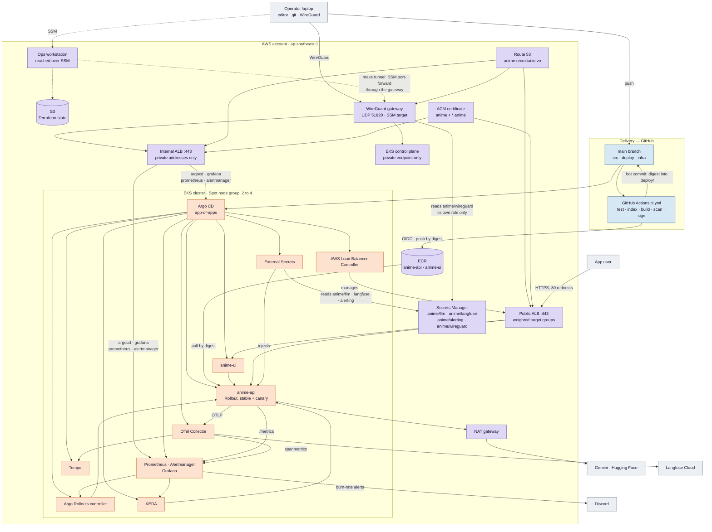
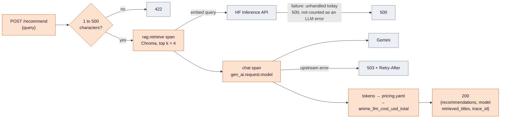
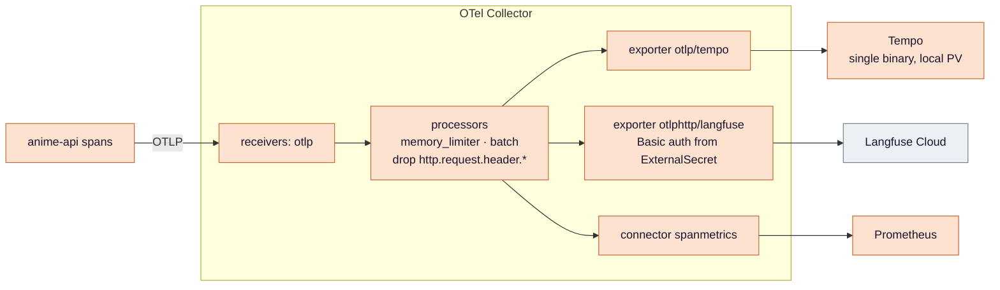
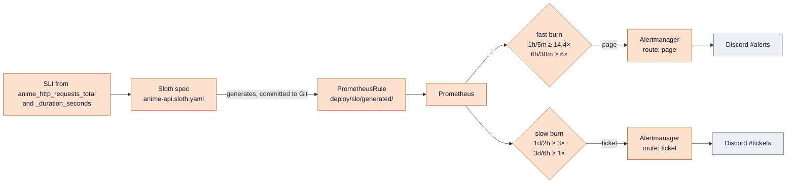
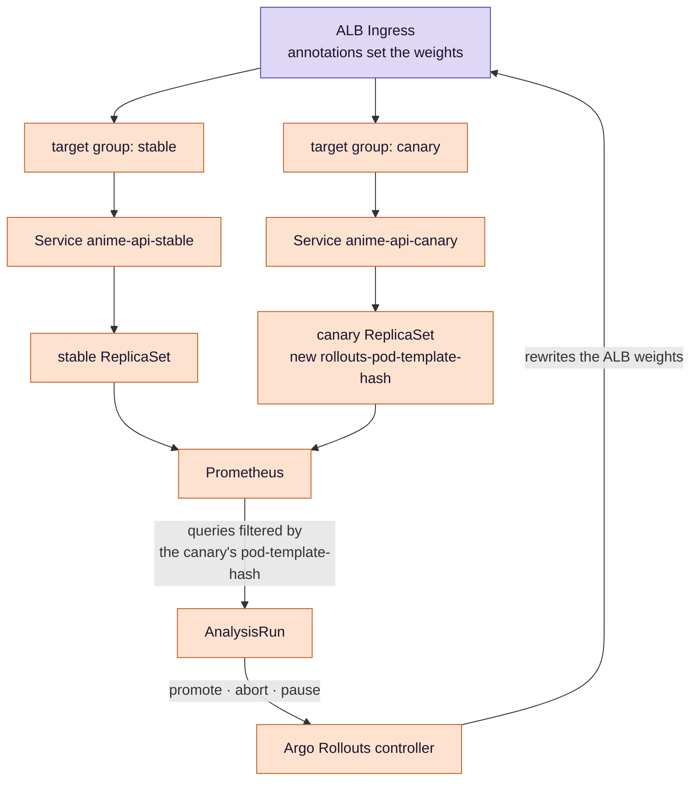
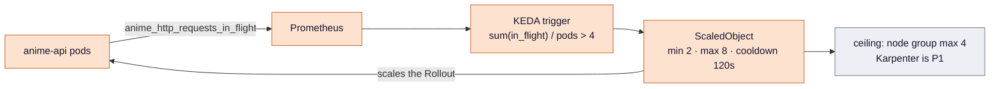
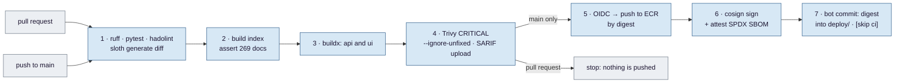
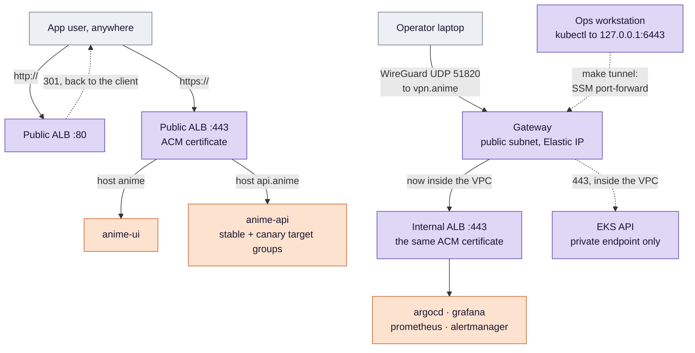

# Anime Recommender — EKS, SRE and LLMOps (Ops Upgrade Design)

The single design document for this repository. It is written once and **appended to**, never rewritten: the
criterion numbers in [§6](#6-verification-and-evidence-definition-of-done) are cited from everywhere else, and
renumbering them would break those references. When a build stage decides differently from what is written
here, the decision is appended to the end of the relevant `### 4.x` under a `**Changed in …**` heading.

Reader's map: [`README.md`](../README.md) states the idea and shows the three overview pictures.
[`docs/evidence/`](evidence/) holds every measurement. This file holds the parameters and the reasoning.

## 1. Goal

Run this recommender on **Amazon EKS** the way a production SRE team would:

- **SLOs** with multi-window burn-rate alerting, so an alert means *the error budget is burning* rather than
  *something happened*.
- **Progressive delivery**: an Argo Rollouts canary judged by Prometheus and rolled back without a human.
- **Autoscaling on the right signal** — in-flight requests, not CPU.
- **Load-tested capacity numbers**, so "it scales" is a figure and not an adjective.
- **LLM observability:** OpenTelemetry `gen_ai.*` traces, token counts and an estimated dollar cost.

Every P0 item must leave measurable evidence in `docs/evidence/`.

This is the **managed** counterpart to Medical-RAG-Chatbot, which runs a self-managed kubeadm cluster. The two
projects split the subject deliberately so that neither repeats the other:

| Concern | Medical (self-managed) | Anime (this repo, EKS) |
|---|---|---|
| Cluster | kubeadm on EC2, built by Ansible | EKS with a managed node group on Spot |
| CI | Jenkins, in the cluster | GitHub Actions, OIDC to AWS |
| Image signing | Cosign with an AWS KMS key | Cosign keyless, GitHub OIDC and Sigstore |
| Identity for pods | the node's instance role (no IRSA on kubeadm) | EKS Pod Identity, per controller |
| Focus | cluster operations, delivery, supply chain | SLOs, canary analysis, autoscaling, LLM observability |

### Non-goals

- **Certificates issued or renewed by anything we operate.** The names are real and the app is HTTPS-only,
  but every certificate comes from **ACM**: AWS issues it, validates it through Route 53 and renews it, and
  with default issuance the private key cannot be exported. (ACM added *exportable* public certificates in
  2025; this design does not use them, which is what makes the property hold.) Medical runs cert-manager with
  Let's Encrypt and therefore has to back the certificate up to Secrets Manager and restore it on every
  rebuild, because Let's Encrypt allows five
  issuances per seven days for one name set. That burden does not exist here and is not recreated. It is the
  same split as the signing keys: Medical holds a KMS key it manages, Anime signs keylessly and holds nothing.
- **A second ingress controller.** The AWS Load Balancer Controller serves both entry points, so there is no
  ingress-nginx and no in-cluster TLS termination. An ALB listener takes an ACM ARN and cannot read a
  Kubernetes Secret, so pairing it with cert-manager would mean importing each issued certificate into ACM on
  a schedule — possible, and one more moving part that expires silently when it stops. Not impossible;
  declined.
- **Multiple environments.** One `anime` namespace. The canary replaces a dev environment: a change is proven
  on real traffic in small slices instead of on synthetic traffic in a copy of production.
- **Kyverno or etcd operations.** Those belong to Medical, which has an etcd to operate.
- **Self-hosted Langfuse.** Tempo in the cluster is the source of truth; Langfuse Cloud is a second export.

## 2. Baseline (verified 2026-09-21)

The application layer is **done and measured**; nothing is deployed anywhere.

**What exists in the repository today**

| Path | What it is |
|---|---|
| `src/anime/` | Nine modules: `config`, `data`, `index`, `providers`, `recommender`, `metrics`, `pricing`, `telemetry`, `log` |
| `services/api/` | FastAPI on uvicorn, with its Dockerfile and a `test` build target |
| `services/ui/` | Streamlit, a thin client over the API, with no LangChain in it |
| `tests/` | 17 tests over providers, the index, and the API surface |
| `config/pricing.yaml` | USD per million input and output tokens, per model, with the date the prices were read |
| `docker-compose.yml` | api and ui, wired together, with the index built during the image build |
| `docs/evidence/local.md` | Every number quoted below |

**The six defects the app phase closed.** Each was a real property of the code before `f088d14`, and each is
now measured rather than asserted:

| Defect | Why it mattered | Closed by | Measured in |
|---|---|---|---|
| A single Streamlit process, no API | Websocket traffic has no HTTP status code to count and no request to replay: no SLI, no load test | The api/ui split | [drill](evidence/local.md#failure-drill-fake-provider), which counts statuses |
| `chroma_db/` gitignored, copied by `COPY . .` | A clean build ships an **empty** index and nothing complains | Index built during the image build, count asserted | [build](evidence/local.md#build-and-tests) |
| `LATENCY.observe(0.0)` at startup | A fake zero sample: the histogram count disagrees with the request count forever | Removed | [drill](evidence/local.md#failure-drill-fake-provider), where the two counts agree |
| `sentence-transformers` installed, unused | It pulls PyTorch: 6.45 GB of image for code nothing calls | Removed | 619 MB api, 559 MB ui |
| Histogram top bucket at 10 s | LLM calls land above it, so p95 is unmeasurable exactly where it matters | Buckets to 32 s | `src/anime/metrics.py` |
| No health endpoints; probes hit `/` | A probe that passes while the index is missing | `/healthz` and `/readyz` | [startup](evidence/local.md#startup-resilience) |

**One defect the app phase found by accident and fixed.** The first `docker compose up` could not bind port
8000, which left the container without networking, and the index load — which ran once and never retried —
failed permanently. Loading now runs in the background with capped exponential backoff, `/readyz` reports the
last error while it retries, and `/healthz` stays 200 so the orchestrator's startup probe decides when to give
up. Covered by `test_transient_startup_failure_is_retried`.

**What does not exist yet:** `infra/`, `deploy/`, `.github/`, `Makefile`, `loadtest/`, `eval/`. No AWS
resource for this project has ever been created. Two files from the original repository are still on disk and
are removed in the stage that replaces them: `llmops-k8s.yaml` (replaced by the Helm charts in the GitOps
stage) and the `MLops-Common` submodule (dropped once CI no longer uses the on-premises scripts).

### Prerequisites

- An AWS account, AWS CLI v2, Terraform ≥ 1.10, kubectl, Helm 3, and the `kubectl argo rollouts` plugin —
  all on the **ops workstation**, none on the laptop.
- A **WireGuard client** on the laptop. Nothing else is installed there: criterion #16's negative half needs
  `nslookup` and `curl`, and Windows 10 and 11 ship both.
- On the **ops workstation**, besides the tools above: the **Session Manager plugin** (without it
  `make tunnel` fails before it starts), `cosign` for criterion #3, and `k6` for [§4.5](#45-autoscaling-and-load-testing).
- Control of a subdomain. This project takes `anime.recruitai.io.vn` under the Route 53 public zone that
  Medical's `shared` stack already owns; Anime reads that zone with a `data` source and only ever creates
  records inside it. See [§11](#11-resolved-decisions) for the coupling this accepts.
- Admin on this GitHub repository, to create the OIDC trust and the Actions variables.
- A Gemini API key, and a Hugging Face token with the **Inference Providers** permission.
- A Langfuse Cloud project (free tier) with its public and secret keys.
- A Discord incoming webhook for alerts.

## 3. Architecture

One picture of the whole system. Every close-up in [§4](#4-components) is one box out of this picture, and
each says which box it is before it draws anything.



**Where each close-up goes:** [`API` → §4.1](#41-the-application) ·
[`OTEL` → §4.2](#42-opentelemetry-and-llm-observability) ·
[`PROM` → §4.3](#43-slos-and-alerting-deployslo) · [`ROLLOUTS` → §4.4](#44-progressive-delivery-argo-rollouts) ·
[`KEDA` → §4.5](#45-autoscaling-and-load-testing) · [`CI` → §4.6](#46-cicd-github-actions-githubworkflows) ·
[`ALB` and `IALB` → §4.7](#47-names-tls-and-the-two-ways-in).

### AWS resources (Terraform)

**Two stacks, split by lifetime** — the same division Medical settled on, and for the same reason: a nightly
`make down` must not destroy the registry, the signing trust or the certificate.

| Stack | Holds | Destroyed by `make down` |
|---|---|---|
| `infra/terraform/shared` | ECR, Secrets Manager, the GitHub OIDC provider and role, budgets, **the ACM certificate** and its validation record | **No** |
| `infra/terraform/cluster` | VPC, EKS, the node group, Pod Identity associations, the WireGuard gateway and its Elastic IP, the `vpn.anime` record | Yes |

Getting this wrong is not cosmetic. A certificate in the cluster stack is **re-issued** on every rebuild
rather than renewed, which quietly turns "AWS renews it for us" into a claim that never happens. In `shared`
it is issued once and AWS renews it, and nothing in a rebuild touches it.

- **State:** S3 backend with the native lockfile, shared by both stacks. No DynamoDB table.
- **Network:** a VPC across 2 availability zones — private subnets for nodes, public subnets for the public
  ALB and the VPN gateway, one NAT gateway. Subnet tags carry `kubernetes.io/role/elb` **and**
  `kubernetes.io/role/internal-elb`; without them an `Ingress` is created and simply never gets a load
  balancer, and the internal one fails independently of the public one.
- **EKS**, via `terraform-aws-modules/eks`:
  - the newest version still in **standard support** at build time, pinned exactly;
  - **the public endpoint is off.** `cluster_endpoint_public_access = false` in the module, which is
    `endpointPublicAccess` on the EKS API itself; the private endpoint stays on. The API server has
    no address on the internet at all, so there is no allowlist to keep correct;
  - access entries, not the `aws-auth` ConfigMap.
- **WireGuard gateway:** one small instance in a public subnet with an Elastic IP, UDP 51820, its key material
  in Secrets Manager and readable only by this instance's role. It does **two** jobs — it is the VPN that puts
  a laptop inside the VPC, and it is the SSM target that `make tunnel` forwards the Kubernetes API through.
  It lives in the cluster stack, so `make down` destroys it with everything else.
- **ACM certificate (`shared`):** one certificate covering `anime.recruitai.io.vn` and `*.anime.recruitai.io.vn`,
  DNS-validated through the existing Route 53 zone, attached to **both** load balancers. AWS renews it; no
  step in any rebuild touches it.
- **Route 53 records**, in Medical's existing zone, and **written by two different things** because they have
  two different lifetimes. Terraform (`cluster`) writes only `vpn.anime`, an A record for the gateway's
  Elastic IP. The six load-balancer names — `anime`, `api.anime`, and the four admin names — are written by
  **external-dns** from the Ingress objects. Terraform cannot write them: an alias record needs its target's
  DNS name and hosted-zone id at apply time, and both load balancers are created later, by a controller
  inside the cluster, from objects Terraform never sees.
- **Managed node group, Spot:** instance types `[t3.large, t3a.large, m5.large, m6i.large]`, desired 2, min 2,
  max 4; gp3 encrypted volumes; IMDSv2 with hop limit 1.
- **Addons:** vpc-cni, coredns, kube-proxy, aws-ebs-csi-driver, eks-pod-identity-agent.
- **Pod Identity associations:** AWS Load Balancer Controller; External Secrets (read `anime/*` only); EBS CSI;
  external-dns, scoped to `ChangeResourceRecordSets` on the one hosted zone and to record names under
  `anime.recruitai.io.vn` only — it shares a zone with Medical, and nothing in this cluster has any business
  editing Medical's records.
- **Registry:** ECR `anime-api` and `anime-ui`, scan on push, a lifecycle policy keeping the last 20 images.
- **GitHub OIDC provider and role:** trust limited to
  `repo:biabeogo147/Anime-Recommender:ref:refs/heads/main`, permissions limited to pushing to those two
  repositories.
- **Secrets Manager:** `anime/llm` (`GOOGLE_API_KEY`, `HF_TOKEN`), `anime/langfuse` (public and secret key),
  `anime/alerting` (the Discord webhook), and `anime/wireguard` (the gateway's keys, readable only by the
  gateway's own role — no node and no pod can read it).
- **Budgets:** alarms at 50 and 100 USD, with the same default tags as Medical.
- **Argo CD:** installed **in a second apply, after the tunnel is open** — not in the same run that creates
  the cluster. `make infra` builds AWS and stops; `make tunnel` opens the SSM port-forward; `make bootstrap`
  then runs the small Terraform configuration whose `helm_release` and `kubernetes` providers point at
  `127.0.0.1:6443`. A single `apply` cannot do both: with `endpointPublicAccess = false` the API server has no
  address the workstation can reach until the tunnel exists, and the tunnel needs the gateway that the same
  apply is still creating. Medical splits the same way for the same reason. Everything after Argo CD is
  reconciled from Git.

### In-cluster components (Argo CD Applications, `deploy/argocd/apps/`)

Each has a pinned chart version. Sync waves run in the order below, because each wave needs the one before it:

| Wave | Application | Needs the wave before it for |
|---|---|---|
| -2 | aws-load-balancer-controller, external-secrets | CRDs, and a load balancer for anything to be reachable at all. **Both** Ingress objects depend on this one controller |
| -1 | the `anime` namespace and its ExternalSecrets, **external-dns** | the secrets must exist before the api starts; external-dns needs the LBC's Ingress objects to appear before it has anything to publish |
| 0 | kube-prometheus-stack, argo-rollouts, keda, opentelemetry-collector, tempo | the api's Rollout and ScaledObject need their CRDs to exist |
| 1 | anime-api, anime-ui | — |
| 2 | slo (the generated PrometheusRule) | nothing, honestly — a rule over an absent metric is accepted and simply produces no series. The wave is for reading order, and is marked as such so nobody defends it as a dependency later |

**A single point of failure this introduces.** The load balancer controller at wave -2 is the only thing that
can create the ALB **and** the only thing that can shift traffic between the stable and canary target groups.
If it is unhealthy, the service is unreachable and no release can proceed. Its failure mode is recorded in
[§5](#5-error-handling-and-failure-modes) and it is the first thing to check when a rollout stalls.

## 4. Components

### 4.1 The application

**Where this sits.** The `API` box in [§3](#3-architecture).



**The two exits are not counted alike, and one of them is a defect to fix before the SLO means anything.**
A 422 is counted in `anime_http_requests_total` only; it never reaches the model, and it is not a 5xx, so it
stays out of the availability SLI by design. A 503 from the model is counted twice over — by status, and in
`anime_llm_request_duration_seconds{outcome="error"}`.

**The retrieval leg has no handler at all.** In `src/anime/recommender.py` only the `chat` span wraps its call
in `try`; `rag.retrieve` does not, and `BatchedEmbeddings._with_retry` re-raises the original exception rather
than an `UpstreamError`. A Hugging Face failure at query time therefore leaves the API as an unhandled
exception: **500, no `Retry-After`, and nothing recorded in the LLM error metric.** It still lands in the 5xx
SLI through the middleware's status fallback, so the SLO is not blind — but the failure is misclassified and
the client is told nothing useful. Closing this is a prerequisite for trusting
[§6](#6-verification-and-evidence-definition-of-done) row 11, and it is the reason the
diagram above draws an error exit from `HF` as well as from the model.

**Endpoints**

| Endpoint | Behaviour |
|---|---|
| `POST /recommend` | `{query}` validated at 1–500 characters; returns `{recommendations, model, retrieved_titles, trace_id}` |
| `GET /healthz` | Liveness. Stays 200 while the index is still loading, so a slow start is not a restart loop |
| `GET /readyz` | 503 until the index is loaded and `count == EXPECTED_DOCS`; the body is `{status}` plus the last load error while retrying — **not** the manifest, which is exposed only through `anime_index_info` |
| `GET /metrics` | Prometheus exposition |

**Metrics**, all prefixed `anime_` and all defined in `src/anime/metrics.py`:

| Metric | Type | Labels / buckets | Read by |
|---|---|---|---|
| `anime_http_requests_total` | Counter | route, method, status | the availability SLI |
| `anime_http_request_duration_seconds` | Histogram | route; buckets 0.1 … 32 s | the latency SLI, and the canary analysis |
| `anime_http_requests_in_flight` | Gauge | — | KEDA |
| `anime_retrieval_duration_seconds` | Histogram | — | dashboards: retrieval versus generation |
| `anime_llm_request_duration_seconds` | Histogram | model, outcome | dashboards, and the error accounting above |
| `anime_llm_tokens_total` | Counter | model, type | the LLM dashboard |
| `anime_llm_cost_usd_total` | Counter | model | cost per 1,000 requests |
| `anime_index_info` | Info | content_hash, count, embedding_model | which index a pod is serving |

**Configuration** is environment variables only, read once into a frozen `Settings` in `src/anime/config.py`:
`LLM_PROVIDER` (`gemini` default), `MODEL_NAME` (`gemini-3.5-flash-lite`), `EMBEDDING_MODEL_NAME`,
`RETRIEVER_K` (4), `LLM_TIMEOUT_S` (30), `FAKE_LATENCY_MS` (800), `FAULT_RATE` (0), `EXPECTED_DOCS` (269),
and the four paths. The Helm values set them per environment. Three reads live outside this module on
purpose and are the complete list: `src/anime/telemetry.py` tests `OTEL_EXPORTER_OTLP_ENDPOINT` to decide
whether tracing exists at all, and `services/ui/app.py` reads `ANIME_API_URL` and `ANIME_API_TIMEOUT_S` — the
UI is a separate process and does not import `anime.config`. The OTLP exporter reads the rest of the `OTEL_*`
family itself.

**Index reproducibility.** A build stage constructs the Chroma index from `data/anime_with_synopsis.csv` and
asserts the document count, failing the build otherwise. It writes a manifest — content hash, count,
embedding model — that the image copies in and `anime_index_info` exposes. `.dockerignore` excludes any local
`chroma_db/`, so the image can only ever contain the index the build produced. The Hugging Face token reaches
the build as a BuildKit secret mount and never becomes a layer, which is why it appears zero times in
`docker history` and `docker save`.

**The `fake` provider** is selected by `LLM_PROVIDER=fake` and exists **only** for load tests and failure
drills. It is set per rollout in values and is never the default.

| Piece | Behaviour |
|---|---|
| Embeddings | A deterministic 384-dimension hash vector. No network, identical every run |
| LLM latency | Sleeps around `FAKE_LATENCY_MS`, so a load test has a realistic shape without a bill |
| Errors | Raises with probability `FAULT_RATE` — a failure that can be asked for, at a chosen rate |
| Tokens | Synthetic counts, so the token and cost pipelines still run and can be tested |

The rule that keeps this honest: **a number produced in `fake` mode and a number produced in `gemini` mode are
different claims**, and every record states which mode it came from.

**Container hardening.** Multi-stage builds, non-root (UID 10001), read-only root filesystem, an `emptyDir`
for `/tmp`, dropped capabilities.

### 4.2 OpenTelemetry and LLM observability

**Where this sits.** The `OTEL` box in [§3](#3-architecture).



**Instrumentation already in the code.** `src/anime/telemetry.py` turns tracing on only when
`OTEL_EXPORTER_OTLP_ENDPOINT` is set, and instruments FastAPI with `/healthz`, `/readyz` and `/metrics`
excluded — probes would otherwise outnumber real traces by an order of magnitude.
`src/anime/recommender.py` opens two spans by hand: `rag.retrieve` with `rag.top_k` and `rag.docs_returned`,
and `chat <model>` with `gen_ai.operation.name`, `gen_ai.request.model`, `gen_ai.usage.input_tokens` and
`gen_ai.usage.output_tokens`.

Because those attributes are emitted directly, `opentelemetry-instrumentation-langchain` (OpenLLMetry) is
**optional here, not required**. It would add library-level spans; it also tracks LangChain's own versions
closely, and the original design listed a version mismatch as a risk. The manual spans are the primary path
and the library is an addition to evaluate, not a dependency to plan around.

**Prompt and response capture does not exist yet, and without it the Langfuse export is close to pointless.**
No span carries the prompt or the completion: `recommender.py` sets `rag.*` and `gen_ai.*` numbers and nothing
else, so Langfuse would receive timings and token counts with no text to inspect. The work is to add the two
content attributes behind a flag — `OTEL_CAPTURE_CONTENT`, which is **to be written**, not a setting that
exists — defaulting **on** here because the content is anime preferences, and documented as default-off for
any regulated context. Until that flag exists, treat criterion #11 as covering the span structure only.

**Grafana**, with dashboards as code in `deploy/dashboards/`, loaded by the sidecar ConfigMap label: an SLO
overview, an LLM dashboard (latency split into retrieval and generation, tokens per minute, cost per 1,000
requests) and a rollout dashboard. The Tempo datasource carries trace-to-metrics links.

### 4.3 SLOs and alerting (`deploy/slo/`)

**Where this sits.** The `PROM` box in [§3](#3-architecture).



**The two SLOs**, both over 28 days:

- **Availability 99.5%.** SLI = `1 − rate(anime_http_requests_total{route="/recommend",status=~"5.."}[5m])
  / rate(anime_http_requests_total{route="/recommend"}[5m])`, with Sloth substituting its own window per rule.
- **Latency: 95% of `/recommend` under T.** **T is not chosen; it is measured** — it comes from the k6
  baseline in `gemini` mode ([§4.5](#45-autoscaling-and-load-testing)), rounded to a histogram bucket
  boundary so the quantile is meaningful, and recorded in the spec with the date and the run that produced it.

**T governs the SLO and nothing else.** It is deliberately *not* the canary's latency gate. Every canary and
alert drill runs in fake mode, where `FAKE_LATENCY_MS` defaults to 800 ms against a measured gemini latency
near 3 s — a fake-mode p95 sits at roughly a quarter of T, so a `p95 ≤ T` gate would pass through saturation
and could never fail. [§4.4](#44-progressive-delivery-argo-rollouts) therefore compares the canary against the
stable version instead, in the same window and the same mode.

**Why Sloth output is committed, and why there is no Sloth operator.** `sloth generate` runs in CI and its
output is a plain `PrometheusRule` in Git — no `PrometheusServiceLevel` custom resource and no controller
watching for one. The rules carry alert annotations containing `{{ $labels }}`, which Helm would try to
render. The generated YAML is therefore a plain manifest
with its own Argo CD Application, and CI re-runs `sloth generate` and fails if the committed file differs —
otherwise the spec and the rules drift apart silently.

**One number is inherited, not derived.** The multipliers 14.4, 6, 3 and 1 are the standard values for a
**30-day** period. This SLO is stated over 28 days, where the equivalent fast-burn factor is 13.44. Keeping
14.4 means a page corresponds to 2.14% of the budget per hour rather than 2% — a 7% shift, accepted so the
numbers match every published reference, and written down so nobody later derives a contradiction from it.

**Each alert carries a `runbook_url`** pointing at `docs/runbooks/`, and the runbook entry is written **before**
the drill that fires the alert. An alert that arrives with no instructions is an interruption, not a signal.

**The alert drill, and why `FAULT_RATE=0.5`.** A drill runs a rollout pinned with **both**
`LLM_PROVIDER=fake` **and** `FAULT_RATE=0.5`, with analysis disabled, and measures time-to-alert.
`FAULT_RATE` alone does nothing: `providers.get_llm` passes it to `FakeLLM`, which is only constructed when
`LLM_PROVIDER == "fake"`. Set the fault rate on a `gemini` rollout and the drill injects **zero** faults, no
alert ever fires, and the absence looks like a healthy service.

At 10% errors the burn rate against a 99.5% target is 20×, and the 1-hour
window needs roughly 43 minutes before its average crosses 14.4× — a drill nobody will sit through, and one
that overlaps a teardown. At 50% the burn rate is 100× and the page should fire in about 9 minutes. The drill
value is chosen for the drill's own arithmetic, and the calculation is written down so the number is not
mistaken for a production condition.

### 4.4 Progressive delivery (Argo Rollouts)

**Where this sits.** The `ROLLOUTS` box in [§3](#3-architecture). The decision tree inside the analysis is in
the [README](../README.md#4-inside-the-canary); what follows is where the traffic actually goes.



**The label is the whole mechanism.** Both ReplicaSets export the same metric names; only
`rollouts-pod-template-hash` separates them. A query that forgets that filter measures stable and canary
together and will happily promote a broken version — which is why [§6](#6-verification-and-evidence-definition-of-done)
requires the AnalysisRun's recorded measurement to be non-empty and attributable.

**Steps:** `setWeight 10` → pause 2m → analysis; `setWeight 50` → pause 2m → analysis; `setWeight 100`.

**`AnalysisTemplate success-rate-and-latency`:** Prometheus provider, interval 30 s, count 4, failureLimit 1.
Two gates, both filtered to the canary's `rollouts-pod-template-hash`:

- **Success rate** ≥ 0.99.
- **Latency, relative:** canary p95 ≤ 1.2 × the **stable** ReplicaSet's p95 over the same window. Not `≤ T` —
  see [§4.3](#43-slos-and-alerting-deployslo): T is a gemini-mode number and the drills are fake-mode, so an
  absolute gate could not fail. A ratio between two ReplicaSets measured in the same window removes the mode
  from the question.

**Minimum-traffic guard:** fewer than 20 requests in the window returns `Inconclusive`, and the rollout pauses
for a human instead of promoting on no evidence.

**Traffic during a drill.** `loadtest/k6/steady.js` holds a constant **20 requests per second** in fake mode.
At the 10% step the canary receives about 2 RPS. Over a one-minute query window that is about 120 requests,
six times the guard; shorten the window to match the 30-second probe interval and it is still about 60. Drop
the generator to 5 RPS and the canary sees 0.5 RPS: about 30 requests per minute, or **15 per 30 seconds,
under the guard**. Even on the one-minute window 30 is only about two standard deviations above 20, so roughly
one measurement in forty-five returns `Inconclusive`, and across the four probes of the 10% step about one
run in twelve contains at least one. The rate is
chosen so the guard cannot bite at either window length — it is a property of the guard, not a round number.

**The rollback drill.** Push a values change carrying `LLM_PROVIDER=fake` **and** `FAULT_RATE=0.2` — the
fault rate is read only by the fake provider, so on a `gemini` rollout it injects nothing and the bad version
is **promoted**, which is the false pass named in [§6](#6-verification-and-evidence-definition-of-done) row 9.
The analysis fails at the 10% step and the Rollout aborts, returning 100% of traffic to stable.
Recorded: elapsed time from rollout start to abort,
the failed measurement value, and the share of requests that saw an error while the canary was live.

### 4.5 Autoscaling and load testing

**Where this sits.** The `KEDA` box in [§3](#3-architecture).



**Why in-flight requests and not CPU.** Each request spends almost all its time waiting on two remote APIs —
Hugging Face for the embedding, Gemini for the generation. CPU therefore barely moves under load, and a CPU
HPA would sit at 5% while requests queued. The gauge of requests currently being served is the only signal
that actually tracks demand here.

**The ceiling is real and must be reported.** KEDA may ask for 8 pods, but the node group stops at 4 nodes. A
ramp that plateaus has two possible causes — the service saturated, or the cluster ran out of room — and the
evidence has to say which. Record pod count *and* node count over time.

**k6 scripts (`loadtest/k6/`)**

| Script | Mode | What it produces |
|---|---|---|
| `baseline.js` | gemini, low rate, 5 min | Real p50 and p95 against `https://api.anime.recruitai.io.vn`, run **from the ops workstation**. **This sets T** — so the TLS handshake and the in-region round trip are inside it by construction, and a T measured from anywhere else is a different number |
| `ramp.js` | fake, 1 → 60 VUs over 10 min | Max RPS before p95 breaks away from this run's own low-load p95; error rate; pods and nodes over time. **Not compared with T** — see [§4.3](#43-slos-and-alerting-deployslo) |
| `steady.js` | fake, 20 RPS constant arrival | Traffic for the canary analysis and the alert drill |

Summaries are saved with `k6 --out json` into `docs/evidence/loadtest/`.

### 4.6 CI/CD (GitHub Actions, `.github/workflows/`)

**Where this sits.** The `CI` box in [§3](#3-architecture).



Stage 2 needs `HF_TOKEN` and is skipped for pull requests from forks, which cannot read repository secrets.
Stages 5 to 7 run only on `main`: a pull request is tested, built and scanned, but nothing it produces leaves
the runner.

**Keyless signing.** `cosign sign --yes <digest>` with `id-token: write`. The identity in the certificate is
this repository's workflow, so verification asks for
`--certificate-identity-regexp '^https://github\.com/biabeogo147/Anime-Recommender/.*$'` and
`--certificate-oidc-issuer https://token.actions.githubusercontent.com`. **The anchors are not decoration:**
cosign matches the certificate's SAN with Go regular-expression semantics, which are substring-based, so an
unanchored pattern also accepts any identity that merely *contains* it. And verification names the **digest**
recorded in `deploy/charts/anime-*/values.yaml`, never a tag — a tag can be moved to an image Argo CD is not
deploying. Unlike Medical, there is no key to
store, rotate, or grant anyone access to — the trade is that verification depends on the public Sigstore
infrastructure rather than on a key in our own account.

**The bot commit** edits the image digest in `deploy/charts/anime-*/values.yaml` and carries `[skip ci]` so it
cannot trigger itself. It is the only writer to `main` that is not a human. Argo CD auto-syncs the change and
the Rollout begins its canary.

**`eval.yml` (P1)** runs on pull requests touching `src/`, `data/` or `prompts/`: retrieval-only evaluation
over `eval/golden.jsonl` (20 queries with expected titles), computing `hit@4` and failing if it drops below
the baseline in `eval/baseline.json`. **No LLM calls**, so it costs nothing in generation — but it still has
to embed the 20 queries through the Hugging Face API to search an HF-built index, so it needs `HF_TOKEN`, it
*can* be rate-limited, and like stage 2 it is skipped on pull requests from forks.

### 4.7 Names, TLS and the two ways in

**Where this sits.** The `ALB` and `IALB` boxes in [§3](#3-architecture).



This section is what criteria **#15** (the app answers over HTTPS) and **#16** (the admin UIs answer only
over the VPN) measure.

**One certificate, two load balancers.** ACM issues a single certificate for `anime.recruitai.io.vn` and
`*.anime.recruitai.io.vn`, validated by a CNAME that Terraform writes into the Route 53 zone. Both the public
and the internal ALB reference it by ARN. AWS renews it on its own schedule, and the private key cannot be
exported from ACM — there is nothing to back up, nothing to restore, and no rebuild step that can forget it.

That last point is the whole reason for choosing ACM over the cert-manager path Medical runs. Let's Encrypt
issues at most five certificates per seven days for one set of names, so Medical has to copy its certificate
into Secrets Manager and restore it on every rebuild; forget the restore and a few rebuilds exhaust the quota
for a week. On a stack that is destroyed nightly that is a real operational tax, and it is the kind of thing a
reader should be able to see the two repositories answering differently on purpose.

**The public entry point.** One Ingress, `scheme: internet-facing`, `listen-ports: [{"HTTP":80},{"HTTPS":443}]`
and an `ssl-redirect: '443'` action on the HTTP listener, so port 80 exists only to answer 301. Two hosts:
`anime.recruitai.io.vn` to the UI, `api.anime.recruitai.io.vn` to the API. The API needs its own name because
the canary's weighted target groups live on this listener — that is where a release is actually split
([§4.4](#44-progressive-delivery-argo-rollouts)) — and because k6 has to address it directly.

**The internal entry point.** A second Ingress with `scheme: internal`, so its ALB has only private addresses.
`argocd`, `grafana`, `prometheus` and `alertmanager` under `.anime.recruitai.io.vn` are **public** alias
records pointing at it. **A public name answering with a private address is not a mistake; it is the design.**

The reason is DNS, not TLS. A private hosted zone would resolve only for clients using the VPC resolver,
which means pushing a DNS server into the WireGuard profile and keeping it correct on every laptop. A public
record resolves everywhere, for free, and hands back an address that is unroutable from the internet — the
tunnel, not the name, is what grants access. Two things this does **not** depend on, in case the shape
suggests otherwise: ACM validates a name through a `_<token>` CNAME and never looks at its A record (and
these four are covered by the wildcard, so they are never individually validated at all), and a browser
verifies a chain from the certificate's SAN list, not from whether the name resolves publicly.

**The Kubernetes API has no public address at all.** `endpointPublicAccess = false`. The ops workstation, in
a different VPC, reaches it the way Medical does — `make tunnel`, an SSM port-forward, except the SSM target
is the WireGuard gateway, which is the one machine this project owns inside the VPC:

```
aws ssm start-session --target <gateway-instance-id> \
  --document-name AWS-StartPortForwardingSessionToRemoteHost \
  --parameters host=<eks-private-endpoint>,portNumber=443,localPortNumber=6443
```

**One line of kubeconfig differs from Medical, and it is worth knowing why.** kubeadm generates the API
server's certificate, so Medical can put `127.0.0.1` in its SAN list and a tunnelled `kubectl` simply works.
A managed EKS endpoint's certificate is not ours to reissue, so the kubeconfig must carry
`tls-server-name: <the original endpoint hostname>` beside `server: https://127.0.0.1:6443`. Without it every
command fails on a certificate-name mismatch — and that failure reads very much like a dead cluster, which is
the second time this design has had to defend against a symptom that lies.

**Five preconditions the tunnel has, and one follow-up it leaves behind.** The port-forward is performed by
the SSM Agent *on the gateway*, not by the caller, so: the VPC needs `enableDnsSupport` and
`enableDnsHostnames` for the EKS-managed private hosted zone to answer; the gateway needs egress on 443 to
the cluster security group **and** that group needs 443 inbound from the gateway; the gateway needs an
instance profile with `AmazonSSMManagedInstanceCore` and an SSM Agent new enough for
`AWS-StartPortForwardingSessionToRemoteHost`. And afterwards: **`aws eks update-kubeconfig` rewrites the
cluster stanza and drops `tls-server-name`**, so the edit has to be re-applied every time it is run — a step
that silently reintroduces the certificate-name failure described above.

**What each door allows.** Named here because criterion #16 asks for these rules as evidence and a rule that
exists nowhere cannot be compared with anything:

| Security group | Inbound |
|---|---|
| Public ALB | 80 and 443 from `0.0.0.0/0` |
| Internal ALB | 443 from the VPN client CIDR and from the VPC CIDR |
| WireGuard gateway | UDP 51820 from `0.0.0.0/0`; nothing else |
| EKS cluster | 443 from the gateway's security group |
| Nodes | the node ports of both ALB security groups |

**The tunnel is one half of the gateway; the VPN is the other, and it needs more than a key.** The client CIDR
is its own small range; the profile's `AllowedIPs` covers the VPC CIDR only, so ordinary browsing does not go
through the tunnel; and the gateway needs IPv4 forwarding and a masquerade rule, or the internal ALB has no
return route to the client range and "VPN on, the UI loads" fails for a reason nothing else would explain.
The **gateway's** keys live in `anime/wireguard`; each operator generates their **own** keypair, keeps the
private half on their laptop, and sends only the public half to be added as a peer — a private key that has
been anywhere else is not a private key.

**What the load balancer needs from the workload**, none of it default:

- **`alb.ingress.kubernetes.io/target-type: ip`.** Argo Rollouts' weighted traffic routing splits between two
  target groups that track pod endpoints; with the default `instance` targets there is nothing to weight.
- **`healthcheck-path`.** The controller's default is `GET /` on the traffic port. `anime-api` serves no `/`,
  and Streamlit's health path is `/_stcore/health`, so both target groups would sit unhealthy and the ALB
  would answer 503 — while the certificate chain still verified perfectly. Set `/healthz` and
  `/_stcore/health` explicitly.
- **The admin UIs have to be told their own names.** Argo CD's server needs `server.insecure: true` behind a
  TLS-terminating ALB or it redirect-loops; Grafana needs `root_url`; Prometheus and Alertmanager need
  `--web.external-url`. Each is a component that works perfectly on `localhost` and breaks the moment it is
  given a hostname.

**The gateway earns its instance twice.** It is the VPN endpoint for a browser on the laptop, and the SSM
jump host for `kubectl` on the workstation. It sits in the cluster stack, so `make down` takes it, and a
rebuild brings back a new Elastic IP — the client profile's endpoint address changes with it, which is a
teardown consequence the runbook has to state rather than let a reader rediscover.

## 5. Error handling and failure modes

| Failure | Behaviour |
|---|---|
| Gemini 429 or 5xx | 503 with `Retry-After`, counted in `anime_llm_request_duration_seconds{outcome="error"}` and in the 5xx SLI. The retry is the client's own (`max_retries=1`); whether that means one retry or one attempt, and whether it jitters, is the library's behaviour and **no test in this repository covers it**. The jittered backoff we do own and test is `BatchedEmbeddings._with_retry`, on the embedding path |
| Hugging Face embedding failure at query time | **Today: 500, with no `Retry-After` and no LLM error metric** — the `rag.retrieve` leg has no handler and `BatchedEmbeddings` re-raises the original exception ([§4.1](#41-the-application)). It reaches the 5xx SLI only through the middleware's status fallback. The fix is to map it to `UpstreamError` like the model path. Readiness reflects only local state either way, so the probe does not flap on an upstream outage |
| Index missing or wrong in the image | `/readyz` returns 503, the new pods never become Ready, and the Rollout does not progress. The CI assertion should prevent it reaching here |
| Spot interruption | Managed node group rebalance handles the termination notice. `minAvailable: 1` PDB on the api; minimum 2 replicas spread across nodes |
| **Spot interruption during a canary analysis** | The canary ReplicaSet loses a pod mid-window. If a replica survives, the minimum-traffic guard should return `Inconclusive`. If the **last** canary pod goes, its series stop existing and the query returns an **empty vector** — which the `< 20` comparison never evaluates, so the run errors or measures nothing rather than pausing cleanly. The guard protects against thin traffic, not absent series; the analysis must treat an empty result as `Inconclusive` explicitly. Either way the record must say which happened, because an abort blamed on the release when capacity caused it is a wrong conclusion carried forward |
| Canary regression | The AnalysisRun fails, the Rollout aborts automatically, stable keeps 100%. The Argo CD Application shows `Degraded` until Git is fixed or reverted |
| Too little canary traffic | `Inconclusive` → the rollout pauses for a human. It never auto-promotes on no evidence |
| WireGuard gateway lost, or replaced by a rebuild | **The service keeps serving.** Argo CD runs inside the cluster and goes on reconciling, users reach the public ALB as before. What is lost is control and sight: no internal UI, and no `make tunnel`, so no `kubectl` either. A rebuild also gives the gateway a **new Elastic IP**, so a client profile that still names the old one fails to handshake — which looks exactly like a firewall problem and is not |
| ACM validation record missing from the zone | The certificate stays `PENDING_VALIDATION`, the ALB gets no HTTPS listener, and the Ingress looks healthy while port 443 answers nothing. The zone belongs to Medical's `shared` stack; Anime only writes records into it, so a zone that was deleted or recreated breaks this silently |
| AWS Load Balancer Controller unhealthy | No ALB can be created and no weight can be changed: the service is unreachable *and* releases stall. First thing to check when a rollout hangs with no AnalysisRun |
| OTel Collector or Langfuse unavailable | The SDK's batch exporter drops spans from a bounded queue; requests are unaffected. The collector's `memory_limiter` prevents it from being the thing that runs the node out of memory |
| Prometheus restarted or its volume lost | Every window starts empty. The longest burn-rate window is **3 days** (28 days is the budget period, not any rule's range), and on a stack torn down nightly even that rule returns an empty vector — which is *no data*, not *no errors*. See the false passes in [§6](#6-verification-and-evidence-definition-of-done) |

## 6. Verification and evidence (definition of done)

Each P0 item is done only when its check passes **and** the evidence is saved under `docs/evidence/`. These
numbers are frozen: they are cited from the README and from every later document.

The last column exists because of a lesson from the Medical project's CI phase, where five checks passed while
the thing they guarded was broken. **A check that cannot fail is worse than no check**, because it buys
confidence nobody earned. Each row therefore names the result that would *look* like success.

**Three of these are readings, not gates.** Rows 4, 6 and 7 record a figure; there is no threshold for them
to violate, and they are complete when the number and its conditions are written down. That is correct for a
baseline — a baseline cannot fail — but it means their column names how the *recording* misleads, not how a
check passes wrongly.

| # | Item | Verification | Evidence | What a false pass looks like |
|---|---|---|---|---|
| 1 | Terraform | Apply from empty, then `plan` reports no changes **against a stated expected resource count** | the count, and apply duration | `plan -refresh=false` prints "no changes" without ever asking AWS, so real drift stays invisible; so does re-reading a saved plan file. And a verdict with no expected count records a number instead of asserting one — write the count down first, then compare |
| 2 | GitOps | Every Argo CD Application `Synced` and `Healthy` after bootstrap | the Application list, by name | `Healthy` is the **unconditional default** for any resource Argo CD has no health check for — `AnalysisTemplate`, `ServiceMonitor` and the generated `PrometheusRule` all report it while doing nothing. Not `PrometheusServiceLevel` — [§4.3](#43-slos-and-alerting-deployslo) rejects the Sloth operator, so no such object exists here. Assert the literal set of names and its size, plus one named readiness field per custom resource |
| 3 | CI end to end | Push to main → signed image in ECR → Argo CD synced | `cosign verify` output, pipeline duration | `Synced` means synced to the revision Argo CD *has*, which a repo-server that cannot reach GitHub keeps indefinitely. Compare `status.sync.revision` against `git rev-parse origin/main`. Second: verifying by tag instead of by the digest pinned in `deploy/charts/anime-*/values.yaml` verifies a different image than the one running |
| 4 | Image size | `docker image ls` before and after the multi-stage build | MB before and after | A "before" taken from a different base image or a warm cache, or one image compared against two. State both images and the method |
| 5 | Index negative test | CI fails when the CSV is truncated | the CI run, with the error text | The build failing for an unrelated reason — a missing token, a network error — and being counted as the assertion firing. Require the literal `IndexValidationError` line |
| 6 | Latency baseline | k6 `baseline.js` in gemini mode | real p50 and p95 → the SLO threshold T | A threshold measured in `fake` mode and then enforced against `gemini` traffic, or the reverse. The mode belongs on the same line as the number |
| 7 | Scale | k6 `ramp.js` in fake mode | max RPS before p95 breaks away from the same run's low-load p95; pods and nodes over time; error rate | Two. A plateau caused by the node-group ceiling or by the load generator's own CPU, read as the service's limit — record node count and generator saturation. And comparing this run's p95 against **T**: T is a gemini-mode figure roughly four times a fake-mode p95, so that comparison passes through saturation and proves nothing |
| 8 | Canary promotion | A good version walks 10 → 50 → 100 | the Rollout timeline and each AnalysisRun's measured values | A query that matches **no series** — a metric typo, or a missing `rollouts-pod-template-hash` filter — returns an empty vector, and an empty result is not a failure by default. Worse, a filter that selects the **stable** hash returns a healthy non-empty number and promotes a broken canary. Require the recorded measurement to be non-empty **and** to carry the canary ReplicaSet's own `rollouts-pod-template-hash` |
| 9 | Canary rollback | A version with `LLM_PROVIDER=fake` **and** `FAULT_RATE=0.2` aborts itself | time to abort, the failing measurement, requests affected | **`FAULT_RATE` is read only by the fake provider.** Set it on a `gemini` rollout and it injects nothing: the canary stays healthy, the analysis passes, the release is promoted — and the drill gets filed as proof that rollback works. Assert a non-zero canary error rate *before* trusting the abort. Second: the rollout aborting for an unrelated reason (image pull, readiness probe) and being credited to the analysis; the record must carry the AnalysisRun's own failure |
| 10 | Alerting | The fast-burn page reaches Discord during the fault drill | time-to-alert, the message | Two of them: the rule firing while the webhook silently 404s, so nothing arrives; and the burn-rate query spanning more data than exists, returning an empty vector that can never fire. Assert `count_over_time` above a floor first, then assert delivery. And an arriving Discord message is not proof by itself: Alertmanager's always-on `Watchdog`, and any kube-prometheus-stack default, reach the same webhook and look identical. Record the `alertname` and the SLO label |
| 11 | Tracing | A `/recommend` trace shows retrieve and generate spans with **non-zero** tokens, in `gemini` mode | the span attributes as text, from both sinks | `recommender.py` writes `usage.get("input_tokens", 0)`, so when usage metadata is missing the attribute is **present and zero** — "the trace carries `gen_ai.*`" passes while token capture is entirely broken. Fake mode is worse: `FakeLLM` fabricates plausible counts, so a screenshot proves nothing. Assert non-zero values, name the mode, and check Tempo **and** Langfuse |
| 12 | Cost metric | The dashboard shows cost per 1,000 requests **in `gemini` mode** | the value, the mode, and the `pricing.yaml` date | **`config/pricing.yaml` carries a `fake:` entry priced identically to `gemini-3.5-flash-lite`**, and fake-mode metrics are labelled `model="fake"`. A fake-mode run therefore produces a realistic dollar figure out of fabricated tokens, numerically indistinguishable from a real one — it defeats the rule that the two modes are different claims, silently. Always read the `model` label. The other path is a `MODEL_NAME` absent from the file, where every price resolves to zero: a confident `$0.00` |
| 13 (P1) | Eval gate | A pull request that degrades retrieval is blocked | the CI run, `hit@4` before and after | A baseline regenerated inside the same pull request it is meant to judge. The baseline's commit must predate the pull request's base |
| 14 | Autoscaling | k6 `ramp.js` against a live `ScaledObject`: replicas move from 2 toward 8, and back after the cooldown | replica count over time, the trigger value that moved it, and the scale-down | §1 calls autoscaling a P0, so it needs a row of its own — #7 is measured in the stage **before** KEDA exists. Two false passes: replicas that grew because a deploy rolled pods rather than because the trigger fired (record the trigger's own value); and a run observed scaling out but never scaling back, which hides a stuck `ScaledObject` |
| 15 | Public TLS | For **both** `anime` and `api.anime`: port 80 returns 301, and HTTPS returns **200** with a chain that verifies with no `-k`. The served leaf's serial matches the one ACM certificate, read back from `describe-listener-certificates` | the two redirects, the two 200s, the certificate ARN and the matching serial | Testing with `-k`, or against the ALB's own `*.elb.amazonaws.com` name where a mismatch is expected and tells you nothing. A **verified chain over a 404 or 503** — TLS completes whether or not a listener rule matches or a target group is healthy, so the status code must be asserted beside the chain. A **different ACM certificate**: with no `certificate-arn` annotation the controller discovers one by host match, and the zone is shared with Medical, so "it verified" can be true of a certificate this design never mentions. And one name tested while two are claimed |
| 16 | Admin UIs are private | From the **laptop**, all four names, both ways: VPN off — each resolves to an RFC1918 address and the connection times out; VPN on — each returns 200 with a verified chain. Plus `Scheme: internal` on the load balancer | both runs over all four names, the `Scheme`, and the security group rules | **A timeout is also what "never deployed" looks like** — if the internal Ingress never got a load balancer, the negative half passes identically, which is why both halves must run in the same session over all four names. The behavioural test cannot see the security group at all: RFC1918 addresses are unroutable from the internet, so it times out whatever the rules say — the rules are a separate config read against the table in [§4.7](#47-names-tls-and-the-two-ways-in). And a **laptop on a 10.0.0.0/8 home network** may get `connection refused` from its own LAN instead of a timeout: that is a correct configuration failing a badly written assertion. Last: reachability is all this proves. Prometheus and Alertmanager carry no authentication, so every VPN peer and every pod in the VPC has full access, silences included |

## 7. Repo layout (after)

```
src/anime/                    shared package: config, data, index, providers, recommender, pricing, metrics, telemetry, log
services/api/                 FastAPI app + Dockerfile
services/ui/                  Streamlit app + Dockerfile
tests/  eval/  loadtest/k6/  config/pricing.yaml  data/
infra/terraform/{shared/, cluster/, bootstrap/}
deploy/{argocd/, charts/anime-api/, charts/anime-ui/, slo/, dashboards/}
.github/workflows/{ci.yml, eval.yml}
docs/{evidence/, runbooks/}
Makefile
```

Two files from the original repository are still present and are removed by the stage that replaces them:

| Still on disk | Removed by |
|---|---|
| `llmops-k8s.yaml` | the GitOps stage, once the Helm charts render the same objects |
| the `MLops-Common` submodule — a `.gitmodules` entry and an empty directory, never initialised | the CI stage, once nothing calls the on-premises scripts |

`app/app.py` and `pipeline/` were already removed by the app split; `services/ui` and `src/anime` replaced them.

## 8. Make targets and teardown

**None of these exist yet.** They are the interface the build stages are written against.

| Target | What it does |
|---|---|
| `make shared` | `terraform apply` on the stack that survives a teardown: ECR, secrets, the OIDC role, the ACM certificate |
| `make infra` | `terraform apply` on the cluster stack: VPC, EKS, nodes, the WireGuard gateway |
| `make bootstrap` | Argo CD and the root app-of-apps, **after `make tunnel` is open** |
| `make up` | `make shared`, `make infra`, `make tunnel`, `make bootstrap`, in that order |
| `make down` | Delete **both Ingress objects** first and wait for the controller to remove the load balancers and their target groups, then delete the remaining Argo CD Applications, then `terraform destroy` on the `cluster` stack only |
| `make loadtest-baseline`, `make loadtest-ramp` | The k6 runs of [§4.5](#45-autoscaling-and-load-testing) |
| `make drill-canary`, `make drill-alert` | The two drills |
| `make tunnel` | SSM port-forward to the private EKS endpoint, through the WireGuard gateway. Held open in a second window, exactly as on Medical |
| `make vpn-config` | Print the WireGuard client profile for the laptop, reading the gateway's current Elastic IP |

**Teardown order matters, and there are now two of them.** Both load balancers and all their target groups
are created by a controller inside the cluster, not by Terraform, so Terraform does not know they exist.
Destroying the VPC before they are gone leaves orphaned resources and a destroy that hangs on dependencies it
cannot see. `make down` therefore deletes **both** Ingresses first and waits for the controller to finish.
The ACM certificate and the Route 53 records outlive the cluster; the gateway's Elastic IP does not, which is
why a rebuild hands out a new VPN endpoint address.

## 9. Build order

No dates. Each stage exists because of what the one before it leaves unsolved — the same chain the README's
stack table reads out — and each ends with its own evidence.

| Stage | Adds | Closes |
|---|---|---|
| 1 | `shared`: ECR, Secrets Manager, OIDC role, budgets, the ACM certificate. Then `cluster`: VPC, EKS with a **private-only** endpoint, node group, the WireGuard gateway and `vpn.anime`. Then `make tunnel`, and only then `make bootstrap` for Argo CD and the root app | #1 |
| 2 | Argo CD Applications: load balancer controller, External Secrets, the app charts; **both** Ingress objects; the app answering over HTTPS and the four admin names answering only through the VPN | #2, #15, #16 |
| 3 | GitHub Actions: test, index assertion, build, Trivy, ECR by digest, cosign, bot commit | #3, #4, #5 |
| 4 | kube-prometheus-stack; k6 `baseline.js` and `ramp.js`; **T is measured here** | #6, #7 |
| 5 | Argo Rollouts, AnalysisTemplate, ALB traffic routing; the promotion and rollback drills | #8, #9 |
| 6 | Sloth SLOs, Alertmanager to Discord, runbook entries, the alert drill | #10 |
| 7 | KEDA on in-flight requests, re-run the ramp against it | #14 |
| 8 | OTel Collector, Tempo, Langfuse export, cost dashboard | #11, #12 |
| 9 (P1) | `eval.yml` and the golden set | #13 |

Two orderings are load-bearing. **Stage 4 comes before stage 6** because the SLO's latency target is **T**,
and T is a measurement, not a choice. **Rollouts come before the alert drill**, because that drill is defined
as a rollout pinned with a fault rate and analysis disabled — with no Rollout there is nothing to pin, and an
earlier draft of this plan had the drill a whole stage before the object it needs.

## 10. Risks

| Risk | Mitigation |
|---|---|
| Gemini and Hugging Face free-tier limits distort measurements | Real-provider runs are limited to the low-rate baseline; scale and canary numbers come from fake mode, and **every claim states its mode** |
| Spot capacity unavailable | Four instance types; fall back to an On-Demand node group (about +0.10 USD/h) |
| ALB traffic routing takes longer to wire than planned | Fallback: a replica-ratio canary with no traffic router, using the same AnalysisTemplate. Weaker, and the evidence would say so |
| **One NAT gateway, not one per zone** | A deliberate cost choice, and a single point of failure for everything the pods reach outside the VPC: Gemini, Hugging Face, Langfuse and the Discord webhook. A zone failure that takes the NAT takes all four at once, and the SLI records it as the service's own errors. Accepted; the alternative is a second NAT and its hourly cost |
| **The Route 53 zone belongs to Medical** | Anime reads it with a `data` source and writes only its own records. Destroying or recreating Medical's `shared` stack invalidates ACM's validation record and Anime's names at once. Accepted because a second registered domain costs money every year; recorded because the blast radius crosses a project boundary |
| **The WireGuard gateway is a single point of control** | Losing it costs every admin UI and `kubectl` at the same time, while the service itself keeps serving. That asymmetry is deliberate — nothing about operator access sits in the request path — but it means a rebuild's first check is the tunnel, not the app |
| The load balancer controller is a single point of failure | It gates both reachability and releases. Its health is a session-start check, and a stalled rollout with no AnalysisRun points here first |
| OpenLLMetry lags the LangChain version | The manual `gen_ai.*` spans are the primary path already; the library is optional |
| Langfuse Cloud outage or limits | Tempo stays the source of truth; the Langfuse exporter failing does not affect a request |
| Metrics history is destroyed by every teardown | Rule windows run up to 3 days, and over an empty store they return an empty vector, not a healthy one. (28 days is the budget period, not a rule's range.) Session-start checks assert a data floor before any window is trusted |
| The work overruns | Cut order: P1 → KEDA (keep a CPU HPA and say so) → the alert drill (keep the rules) → the Langfuse export (keep Tempo). Never cut the SLO rules, the canary analysis and rollback, or the k6 numbers |

## 11. Resolved decisions

| Decision | Choice |
|---|---|
| Cluster | EKS with a Spot managed node group (Medical uses kubeadm) |
| Repo layout | Everything in this repository |
| CI | GitHub Actions |
| CD | Argo CD |
| Signing | Cosign keyless, GitHub OIDC |
| Pod-level AWS identity | EKS Pod Identity, one association per controller |
| Environments | One namespace, with a canary instead of a dev copy |
| **EKS API endpoint** | **Private only.** No public address, therefore no allowlist to maintain |
| **How `kubectl` reaches it** | `make tunnel` — an SSM port-forward through the WireGuard gateway, plus `tls-server-name` in the kubeconfig |
| **Certificates** | **ACM**, one wildcard on both load balancers. No cert-manager, no Let's Encrypt, no backup and restore |
| **Names** | `anime.recruitai.io.vn` and `*.anime.recruitai.io.vn`, inside Medical's existing Route 53 zone |
| **Admin UIs** | Internal ALB with public names on private addresses, reachable only over WireGuard |
| **Ops workstation** | **Reuse Medical's**, which lives in a stack that is never destroyed |

**Why the endpoint is closed rather than allowlisted.** An earlier draft kept the public endpoint and
restricted it to the workstation's Elastic IP, on the reasoning that a home address rotates and that when it
does, `kubectl` fails with a timeout indistinguishable from a dead cluster — a wrong diagnosis guaranteed
before any measurement gets a chance. That reasoning was right and the conclusion was lazy. Once this design
needed a WireGuard gateway for the admin UIs, it had a machine of its own inside the VPC, which is exactly
what an SSM port-forward needs as a target. So the allowlist disappears along with the public endpoint, and
one mechanism — the gateway — carries both the browser and `kubectl`. The failure mode it removes is not
theoretical: an allowlist is a list that can be correct on the day it is written and wrong every day after.

**Why reuse the workstation.** It already carries every tool, it sits in a Terraform stack that is never torn
down, and it is reached over SSM with no SSH key anywhere. The cost is a coupling: one machine now serves two
projects, so destroying Medical's bootstrap stack would take Anime's access with it. That is written here so
it is a known coupling rather than a surprise.
