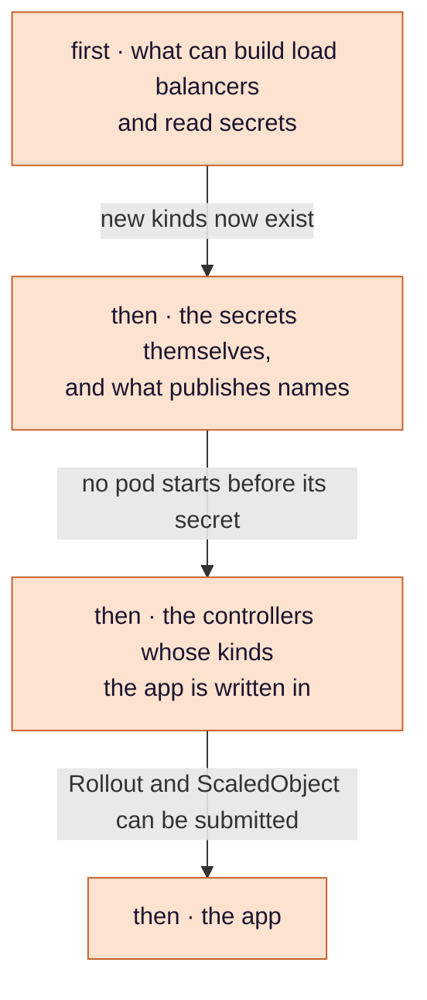
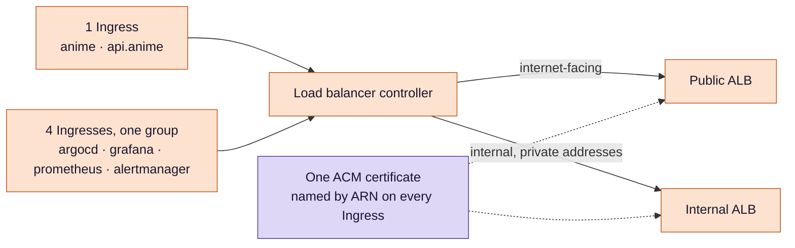
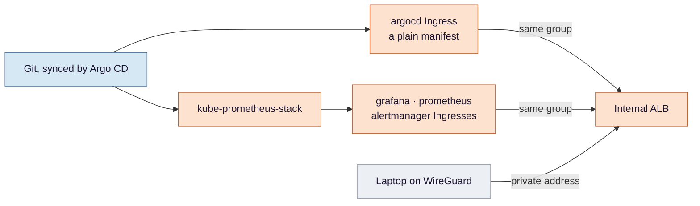

# Stage 2 — GitOps: from an empty cluster to two doors

**Argo CD turns a cluster that runs nothing into one that runs what Git says — and the first things Git says
are how traffic gets in, where secrets come from, and what the names are.**

**Where this sits.** The `ARGO`, `LBC`, `ESO`, `EDNS`, `ALB` and `IALB` boxes in
[design §3](../eks-sre-llmops-design.md#3-architecture). Criteria **#2**, **#15** and **#16**.

Ideas are in [`concepts.md`](concepts.md). Parameters — chart versions, annotations, security-group rules —
are in [design §3](../eks-sre-llmops-design.md#3-architecture) and
[§4.7](../eks-sre-llmops-design.md#47-names-tls-and-the-two-ways-in). This page is the reasoning.

## The problem

At the end of [stage 1](../terraform/README.md) there is a cluster reachable through a tunnel, with Argo CD
installed and one root Application pointing at a directory in Git. From the workstation you could
port-forward to Argo CD's UI. From anywhere else, nothing works:

- **no traffic can arrive** — an `Ingress` needs a controller to turn it into a load balancer, and there is none;
- **no secret can be read** — the Gemini key and the webhook are in Secrets Manager, and nothing in the cluster
  reads from there;
- **nothing has a name** — there are no load balancers yet, so nothing for a record to point at;
- **nothing can be looked at from a browser** — no UI answers on a hostname.

This stage fixes all four, in an order the cluster has to be able to enforce on its own.

## Decision 1 — Git is the only way in, and the order is Git's problem too

*Concepts: [§1 GitOps and the app-of-apps](concepts.md#1-gitops-pull-not-push-and-the-app-of-apps) ·
[§2 custom resources](concepts.md#2-custom-resources-and-their-definitions) ·
[§3 sync waves](concepts.md#3-sync-waves-and-the-health-check-that-makes-them-wait).*

After bootstrap nothing is applied by hand. Every component is an Application under the root; CI never talks
to the API server — it commits, and Argo CD pulls. That puts ordering in Git as well. Something that defines
a new kind of object has to exist before anything of that kind is submitted; a pod that needs a secret has to
start after the secret does. Waves say which comes first:

The picture is the finished system. Components enter Git in the stage that needs them — until stage 5 the api
is a plain Deployment, and until stage 7 it has no ScaledObject — so early on some waves are simply emptier.

Which component sits in which wave is in the
[design's table](../eks-sre-llmops-design.md#in-cluster-components-argo-cd-applications-rendered-by-deployargocdroot).
What matters here is the condition that makes the arrows real. **A wave only waits for the previous wave to be
healthy — and Argo CD has no built-in way to tell whether an Application is healthy.** Without one, each child
counts as healthy the instant it is created, and every wave starts at once. The picture above would describe an
intention, and the cluster would converge only because retries eventually paper over the ordering. And the check
has to read **sync as well as health**: Argo CD leaves resources that do not exist yet out of an Application's
health, so a child that has applied half its manifests still reads healthy. Medical learned that on a real
rebuild, with a health-only check that let every wave go at once; this design carries the corrected check into
the bootstrap values, before any wave exists.

## Decision 2 — one controller, two doors, five Ingresses

*Concepts: [§5 the load balancer controller and IngressGroups](concepts.md#5-the-aws-load-balancer-controller-and-ingressgroups) ·
[§6 target type, health checks and readiness gates](concepts.md#6-target-type-health-checks-and-readiness-gates) ·
[§7 TLS at the edge](concepts.md#7-tls-at-the-edge).*

The AWS Load Balancer Controller builds a load balancer from each Ingress it sees — unless several Ingresses
declare the same group, in which case it builds one for all of them. That is what makes the internal door
possible: the four admin UIs live in four namespaces, and an Ingress can only point at Services in its own.

**Five objects, two load balancers** — and the teardown has to know that. The controller creates the load
balancers, Terraform never sees them, and a VPC cannot be destroyed while they exist. Deleting "both
Ingresses" before `terraform destroy` would leave the internal load balancer standing.

**Why the controller matters more than it looks.** It builds both doors, and from stage 5 on it is the piece
that *applies* the traffic split between the stable and canary versions — Argo Rollouts decides the weights,
the controller writes them to the listener. If it is unhealthy, users cannot reach the app **and** no release
can move.

**The workload has to cooperate, in two ways that are easy to get silently wrong.**

- *How pods are registered.* Each pod is a target by its own IP. That skips a hop through the node that could
  deliver a request to a pod of the other version before the split applies, and it lets the next point work.
- *How health is judged.* Every target is health-checked on a path, and the default path is one neither app
  serves. The dangerous part is what happens next: **a load balancer whose targets are all unhealthy fails
  open and serves them anyway.** Users would never notice; the mistake would sit there until something else
  depended on health being real. So the app's namespace uses *readiness gates* — a pod is not Ready until the
  load balancer calls it healthy — and the same mistake instead stalls the rollout, loudly, on the first deploy.

That second point is the whole philosophy of this project in miniature: **when a misconfiguration is
possible, arrange for it to be loud.**

**TLS ends at the load balancers.** That follows from where the certificate comes from, not the other way
round. ACM was chosen because AWS renews it and nothing has to be backed up and restored on every rebuild —
and an ACM certificate can only be served by an AWS load balancer. So traffic behind it, inside the VPC, is
plain HTTP, and no second ingress controller is needed. Only the public load balancer listens on port 80, and
only to answer with a redirect.

## Decision 3 — secrets by name, never by pattern

*Concept: [§8 External Secrets](concepts.md#8-external-secrets).*

External Secrets copies values from Secrets Manager into Kubernetes Secrets, so Git holds the names of
secrets and never their values. How far it is allowed to reach was decided in
[stage 1](../terraform/README.md#decision-4--six-identities-and-none-of-them-is-a-key): three named secrets,
because the tidy wildcard would include the keys to the VPN. What this stage adds is the consequence — a new
secret needs two changes, a policy line and an ExternalSecret, and the second without the first fails loudly
rather than succeeding quietly.

## Decision 4 — the names follow the objects

*Concept: [§9 alias records and external-dns](concepts.md#9-alias-records-and-external-dns).*

A record for a load balancer is an *alias*, and an alias needs its target's address at the moment it is
written. The load balancers only exist after the controller has built them from Ingresses, so Terraform — which
runs first and never sees an Ingress — cannot write these records. **external-dns** watches the same Ingresses
the controller does and publishes a record per host once the load balancer exists.

It works in a zone that belongs to Medical, so it is held twice: a filter in its own configuration, and an
identity that cannot change records outside `anime.recruitai.io.vn` even if the filter is wrong. Configuration
can be mistaken; a permission boundary is what remains true when it is.

## Decision 5 — admin UIs: a public name, a private address

*Concepts: [§10 a public name for a private address](concepts.md#10-a-public-name-for-a-private-address) ·
[§11 telling an app its own name](concepts.md#11-telling-an-app-its-own-name).*

Each admin UI gets a name under `.anime.recruitai.io.vn`, published in the **public** zone, pointing at the
**internal** load balancer. Anyone can resolve it; nobody can route to what it returns without the VPN.

**All four doors come from Git, including Argo CD's own.** An Ingress for Argo CD's server is an ordinary
manifest; it does not require Argo CD to manage its own installation. Whether Argo CD should also upgrade
itself from Git after bootstrap, as Medical's does, is still open in the design — but it no longer decides who
owns the UI's name.

**This moves monitoring earlier than it would otherwise arrive.** Three of the four admin UIs come from
kube-prometheus-stack, and criterion #16 is about all four. So the monitoring stack enters Git in this stage,
two stages before anything uses it to measure. The alternative — closing #16 on one UI and re-opening it
later — would be a criterion that is only partly true on the day it is ticked.

Each UI must also be **told its own name**: behind a load balancer that ends TLS, a server that thinks it is
on `localhost` builds wrong links and redirects. The fault never appears in a port-forward, only on the day
the UI gets a hostname.

## How this stage can pass while being broken

*Concept: [§4 what Healthy means to Argo CD](concepts.md#4-what-healthy-means-to-argo-cd).*

The false passes for #2, #15 and #16 are listed one by one in
[design §6](../eks-sre-llmops-design.md#6-verification-and-evidence-definition-of-done). Read together they
share one shape, and it is worth naming because it recurs in every later stage:

**each check observes something the failure it guards against also produces.**

- "Healthy" is also what Argo CD reports for things it cannot judge — and "all of them" is also true of none.
- "The chain verifies" is also true in front of an app that answers 503, and of a certificate we did not mean.
- "It timed out without the VPN" is also what a load balancer that was never built looks like.

The defence is the same each time: pair the check with one that the failure could *not* produce — the names
and their count, the status code and the certificate serial, the positive half run in the same session. The
negative half of #16 has to run from the laptop because only the laptop is a VPN peer; the workstation, in
another VPC, can reach neither door's private side.

## What this stage proves, and what it only assumes

**Proves:** every Application syncs, checked by name; the app answers over HTTPS on both names with the
intended certificate; the four admin names answer through the VPN and time out without it.

**Assumes:** that the network the laptop sits on will hand back a private address for a public name. Some home
routers refuse to, as protection against a class of attack called DNS rebinding — and on such a network the
VPN-on half of #16 fails for a reason that has nothing to do with the cluster.

## Known limits

- **The load balancer controller is a single point of failure** for both reachability and releases.
- **Prometheus and Alertmanager have no login.** Anyone on the VPN, and any pod in the VPC, can read every
  metric and silence any alert. Accepted for one operator; not acceptable for a team.
- **Whether Argo CD manages its own installation** after bootstrap is undecided.

---

[Concepts](concepts.md) · [Design §3](../eks-sre-llmops-design.md#3-architecture) ·
[Design §4.7](../eks-sre-llmops-design.md#47-names-tls-and-the-two-ways-in) ·
[Criteria #2, #15, #16](../eks-sre-llmops-design.md#6-verification-and-evidence-definition-of-done) ·
Previous: [Terraform](../terraform/README.md) · Next: [CI/CD](../cicd/README.md)
