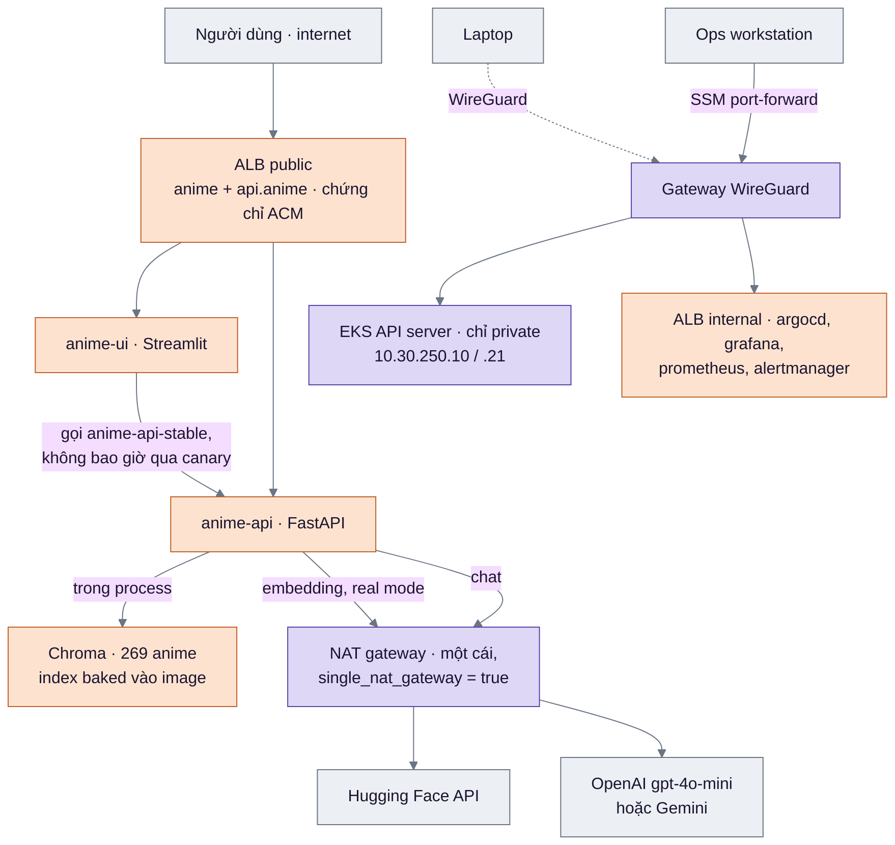
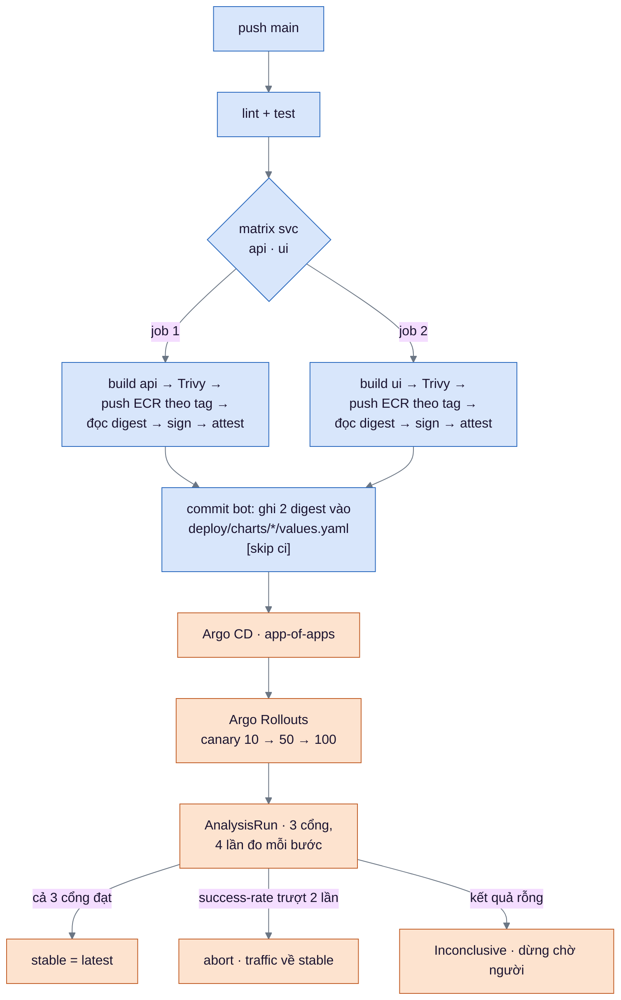
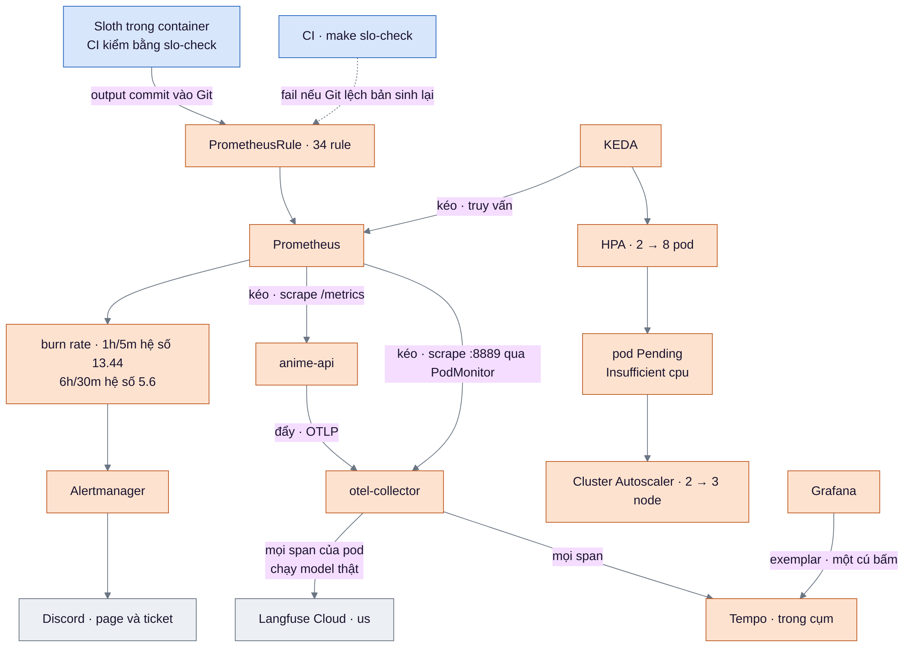
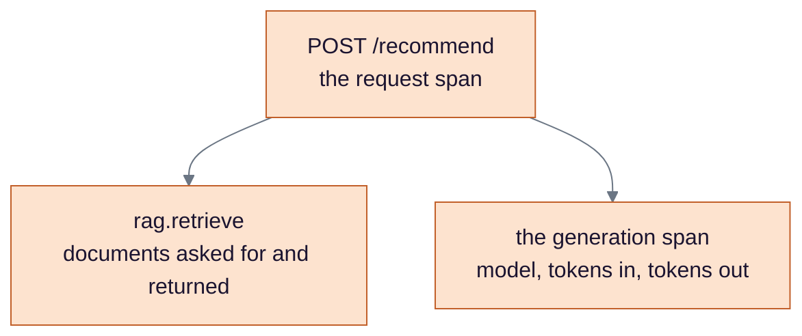
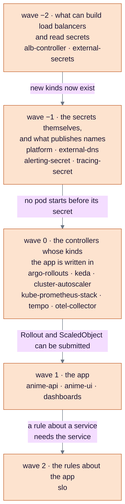
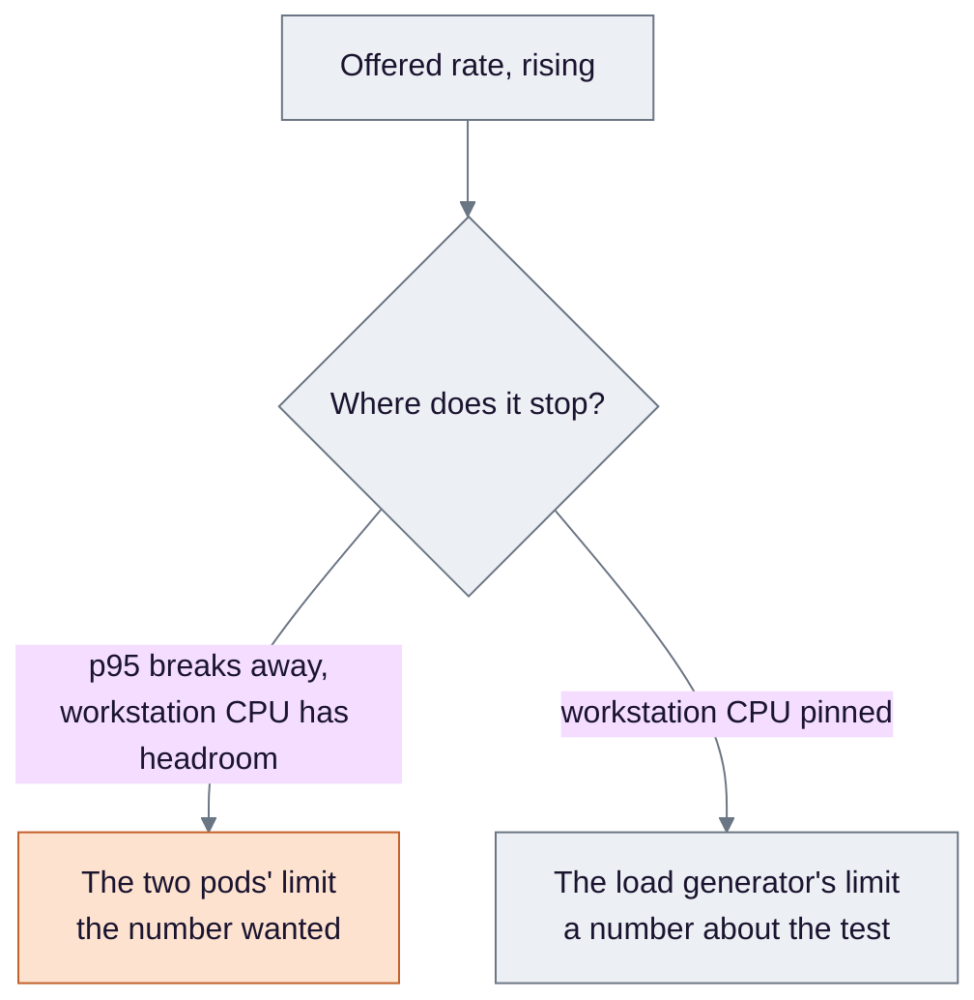
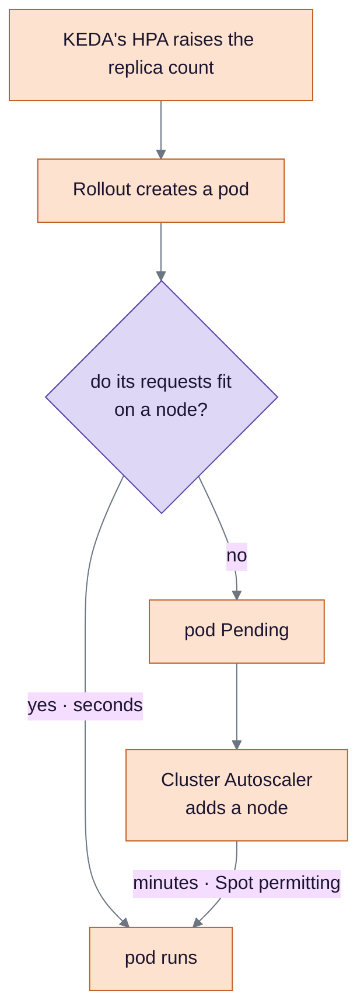

# Kiến trúc — bảy sơ đồ

Để mở ra khi bị nói "vẽ hệ thống của anh ra". Mỗi sơ đồ có một dòng tóm tắt bằng chữ ở trên, để đọc trên điện thoại
vẫn hiểu mà không cần phóng to.

Ba sơ đồ đầu **vẽ mới cho điện thoại**: sơ đồ tổng trong thiết kế §3 có 30 node trên ba lớp subgraph lồng nhau, không
đọc được ở bề rộng 390px. Bốn sơ đồ sau lấy **nguyên từ repo** — nguồn ghi ở cuối mỗi mục.

Màu hộp nói **công cụ nào tạo ra nó**: tím Terraform, cam Argo CD, xanh GitHub Actions, xám là thứ không phải mình
dựng.

---

## 1. Đường vào, và cái gì thật sự nằm trong pod

**Bằng chữ:** người dùng đi qua ALB public. Tôi đi qua tunnel SSM tới gateway WireGuard, hoặc qua VPN cho bốn UI nội
bộ. API server của EKS **không có địa chỉ public**. Và mỗi request thật gọi ra ngoài **hai lần** — embedding qua
Hugging Face, rồi chat qua OpenAI — **cả hai đi qua đúng một NAT gateway**.

Bốn điều đáng nói kèm, và ba trong số đó là chỗ dễ nói sai:

- **Chroma không phải service.** Nó nằm **trong process**, và index được build vào image lúc build — CI fail nếu số
  tài liệu thiếu. Nên không có gì để scale riêng, và một pod mới chỉ cần tải image.
- **EKS *có* cấp một tên DNS public** (`…gr7.ap-southeast-1.eks.amazonaws.com`), nhưng với
  `endpointPublicAccess=false` tên đó chỉ resolve ra địa chỉ **private**. Cái không tồn tại là *địa chỉ*, không phải
  *cái tên*. Gọi thẳng từ ngoài thì timeout sau 10 giây — nửa âm đã chạy, không chỉ đọc cấu hình.
- **UI gọi `anime-api-stable`, có chủ ý**, nên người dùng thật chỉ gặp canary qua `api.anime` theo trọng số ALB,
  không bao giờ theo tỉ lệ pod.
- **Hai ALB màu cam, không màu tím.** Terraform chỉ cấp cho controller cái policy của nó — trong toàn bộ
  `infra/terraform` không có một resource `aws_lb` nào. Load balancer do **controller trong cụm** tạo ra từ
  Ingress, nên nếu controller không chạy thì không có ALB nào tồn tại, và `terraform destroy` một mình sẽ để lại
  chúng. Đây là câu trả lời cho "ai sở hữu load balancer".
- **Hai con số sáu, và chúng là hai tập khác nhau.** Đừng gộp. "Decision 4" đếm **sáu thứ tác động lên AWS**:
  GitHub Actions, các controller trong cụm *tính chung một hàng*, node, service EKS, gateway WireGuard, và người
  vận hành. Con số sáu còn lại là **sáu association EKS Pod Identity** — ALB controller, External Secrets,
  **EBS CSI**, Cluster Autoscaler, external-dns, Argo Rollouts — tức là *một hàng* trong sáu hàng kia được mở ra.
  Điểm chung duy nhất: **không cái nào dùng access key** (`1-terraform/README.md`, "Decision 4").

---

## 2. Đường release — hai nhánh song song, rồi một commit bot

**Bằng chữ:** push vào `main` chạy **hai job song song**, một cho `api` một cho `ui`. Mỗi job build, quét, đẩy ECR
theo **tag**, đọc digest về, ký keyless, rồi attest SBOM. Sau đó **một commit bot** ghi digest vào Git, và Argo CD
làm phần còn lại.

Bốn chi tiết hay bị hỏi:

- **Đẩy theo tag rồi đọc digest về**, không phải "đẩy theo digest": pipeline `docker push` tag commit, rồi hỏi ECR
  digest của thứ vừa đẩy — và **đó** là digest Git ghi lại và chữ ký ký lên.
- **Ký keyless**: `cosign sign --yes` dùng token OIDC của workflow, danh tính là
  `…/.github/workflows/ci.yml@refs/heads/main`, và bản ghi nằm trên **Rekor công khai**. Chữ ký kiểm theo danh tính
  của nhánh khác thì bị từ chối.
- **Giao việc bằng commit bot đẩy thẳng `main`** bằng deploy key, không phải pull request — nên `[skip ci]` trong
  message là cái chặn vòng lặp. (Bản sửa template AnalysisRun thì *đi qua* pull request, vì nó là code trong chart.)
- **Nhánh `Inconclusive` tồn tại và đã được đóng sẵn, ở hai trong ba cổng.** Với `success-rate` và
  `latency-ratio`, cả `successCondition` lẫn `failureCondition` đều mở đầu bằng `len(result) > 0`, nên một vector
  rỗng — canary mất pod cuối cùng — không khớp cái nào, phép đo thành `Inconclusive` và rollout **dừng chờ người**
  thay vì abort bản release vì một sự kiện về capacity. Cổng thứ ba, `canary-requests`, khác hẳn: nó có
  `failureCondition: "false"`, nghĩa là **nó không bao giờ có thể làm abort**. Nó chỉ đạt, hoặc thành
  `Inconclusive` khi chưa đủ lưu lượng. Đó là cổng *khối lượng*, và nói nó "chặn bản xấu" là nói sai.

Còn hai thứ không nằm trong sơ đồ mà nên biết: **`ci-ok` là required check duy nhất** chặn merge, và phép kiểm index
âm chạy ở một **workflow riêng** (`index-negative.yml`).

---

## 3. Đường quan sát — một luồng span, hai đích, và ai gọi ai

**Bằng chữ:** api **đẩy** span qua OTLP tới collector; collector tách hai đích. Prometheus và KEDA thì **kéo** —
Prometheus scrape api, KEDA truy vấn Prometheus. Chiều mũi tên trong sơ đồ này là chiều *ai chủ động*.

Ba chỗ đáng nói:

- **Sloth chạy trong container, cả ở CI.** CI chạy `make slo-check` — sinh lại bằng Sloth vào file tạm và fail nếu
  khác file trong Git — và rule đang commit chính là bản CI sinh ra (artifact `slo-regenerated`, commit `0ce2de8`).
  Nên thứ Prometheus nạp **luôn là thứ nằm trong Git**, và không có Sloth operator nào.
- **Connector spanmetrics là nguồn của 6076 span** trong phép đếm rò Langfuse — nó biến span thành metric, và
  **Prometheus scrape cổng `8889` của collector qua PodMonitor**; collector không đẩy metric đi đâu cả. Đó là cách
  tôi chứng minh trace *có tồn tại* trong lúc Langfuse trống.
- **Langfuse không nhận "chỉ span LLM".** Filter đọc
  `resource.attributes["anime.llm.provider"]`, và resource attribute được đặt **một lần cho cả process**. Nên
  pipeline giữ hoặc bỏ **toàn bộ** traffic của một pod — span retrieval đi kèm span generation. False pass ở đây
  là tưởng mình đã chứng minh một bộ lọc *theo từng span*: chưa, cái đã chứng minh là **chế độ của pod** quyết
  định pod đó có xuất hiện trong Langfuse hay không.
- **Exemplar** là trace id gắn kèm một mẫu histogram, nên một điểm trên biểu đồ độ trễ mở ra đúng trace đằng sau nó.

---

## 4. Một request, ba span

**Bằng chữ:** mỗi `/recommend` sinh một span cha và hai span con: một cho retrieval, một cho lần gọi model.

Span generation là chỗ mang `gen_ai.usage.input_tokens` và `output_tokens` — 957 và 461 trong trace thật đã kiểm. Và
tổng 1418 token mà Langfuse báo đúng bằng 957 + 461, nên hai nơi nhận đang giữ **cùng một request**, không phải chỉ
cùng có dữ liệu.

*Nguồn: `8-tracing/README.md`.*

---

## 5. Sync wave — năm bước, và vì sao mỗi bước phải chờ

**Bằng chữ:** Argo CD áp dụng theo wave. Wave chạy từ **−2 tới 2 — năm bước, không phải bốn**. Mỗi wave chỉ bắt
đầu khi wave trước xong, và nhãn trên cạnh nói **vì sao** nó phải chờ.

**"8 trên 8" là cây lúc bootstrap stage 2, không phải cây hôm nay.** Đó là con số duy nhất evidence giữ
(`evidence/gitops.md:24`), và nó đúng với thời điểm của nó. Cây hiện tại lớn hơn gấp đôi: stage 5 thêm
`argo-rollouts`, stage 6 thêm `alerting-secret` và `slo`, stage 7 thêm `keda` và `cluster-autoscaler`, stage 8 thêm
bốn Application tracing —
**16 Application con, cộng chính `root` là 17**. Con số 17 là *thuộc tính của manifest*, đếm được từ
`deploy/argocd/root/templates/`; nó **không phải một phép đo**, vì không có lần chạy nào ghi lại cả 17 cùng
`Synced/Healthy` trong một output.

Đòi **cả hai** trạng thái là chỗ quan trọng: `Healthy` là mặc định vô điều kiện cho resource Argo CD không có
health check, nên một cây `Healthy` mà vẫn đang lệch khỏi Git đúng là false pass mà tiêu chí #2 tồn tại để loại.

*Nguồn: `2-gitops/README.md`, `deploy/argocd/root/templates/*.yaml`, `evidence/gitops.md:24`.*

---

## 6. Cái trần đó là của ai?

**Bằng chữ:** khi tốc độ phục vụ dừng lại trong lúc tốc độ gửi vẫn leo, có **hai** thứ có thể là nguyên nhân — và
chỉ một trong hai là câu trả lời.

Số iteration bị bỏ **một mình không phân biệt được hai nhánh** — một service đang chậm cũng làm cạn pool của máy
phát tải. Đó là lý do CPU của workstation được ghi ngay cạnh: đo được **46%** và **54%**, nên máy phát tải không phải
là giới hạn.

*Nguồn: `4-load/README.md`.*

---

## 7. Hai autoscaler, đi tuần tự

**Bằng chữ:** KEDA thêm **pod** trong vài giây. Nếu pod không vừa node nào, Cluster Autoscaler thêm **node** trong
vài phút.

Câu hỏi ở giữa là về **request**, không phải mức dùng — scheduler xếp pod theo cái nó *xin*, và Cluster Autoscaler
thêm hay bớt node theo cùng thước đó. Đó là lý do dự đoán viết trước khi chạy đúng được cả hai nửa: node 1 còn 420m
nhận thêm một pod 250m rồi 170m còn lại không nhận nổi cái nào, node 2 còn 1090m nhận bốn — nên **7 pod vừa hai
node, pod thứ 8 thì không**.

Và một chi tiết đo được mà sơ đồ không nói: node thứ ba **đã `Ready` mà vẫn không nhận được pod**, vì còn taint khởi
tạo. Tồn tại không đồng nghĩa với nhận việc được — đó là lý do node tính bằng phút, và lý do ramp phải giữ đỉnh mười
phút.

*Nguồn: `7-scaling/README.md`.*

---

## Ba câu hay bị hỏi ngay sau khi vẽ

**"Ai vào được cụm?"** → Không ai từ internet. API server chỉ private; tôi vào qua tunnel SSM, UI nội bộ qua
WireGuard. Nhưng nói cho đúng: phép kiểm đó chứng minh **khả năng tới được**, không chứng minh phân quyền —
Prometheus và Alertmanager không có xác thực nào.

**"Cụm này chịu được gì?"** → Hai node Spot (co giãn 2–4) ở hai AZ; pod api tối thiểu 2 replica có `topologySpreadConstraints`
`ScheduleAnyway`, và PodDisruptionBudget `minAvailable: 1` — nhưng PDB chỉ ăn vào **eviction tự nguyện** như drain,
không ăn vào một lần thu hồi Spot. Và trong hai ngày chạy **không có lần thu hồi nào**, nên cả ba lớp là *cấu hình*,
chưa lớp nào được kiểm chứng.

**"Dựng lại mất bao lâu?"** → **Chưa đo.** Đó là M8, một trong hai phép đo còn thiếu (cái kia là thời lượng
pipeline của #3). Con số tôi *có* là ba
stack Terraform dựng từ trống trong 0m55s + 12m18s + 1m14s, và cây Argo CD lên 8/8.

---

[Chế độ đo](modes.md) · [Dòng CV](cv-lines.md) · [Thuật ngữ](glossary.md) ·
[Bộ đề](../common/questions.md) · [Evidence](../evidence/)
