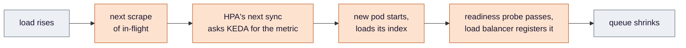
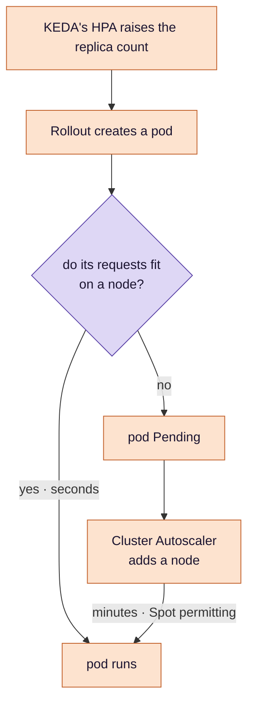

# Stage 7 — Scaling: more pods before the knee, more nodes when they do not fit

**KEDA adds api pods when requests start to queue, and the Cluster Autoscaler adds nodes when the pods have
nowhere to run. Both are control loops with delays, both read signals that can vanish, and each can look like it
worked while the other did not.**

**Where this sits.** The `KEDA` and `CAS` boxes in [design §3](../eks-sre-llmops-design.md#3-architecture).
Criterion **#14**.

Ideas are in [`concepts.md`](concepts.md); this stage also leans on stage 2's
[readiness gates](../gitops/concepts.md#6-target-type-health-checks-and-readiness-gates) and stage 5's
[Rollout](../delivery/concepts.md#1-a-rollout-instead-of-a-deployment). The trigger, bounds, fallback and windows
are in [design §4.5](../eks-sre-llmops-design.md#45-autoscaling-and-load-testing). This page is the reasoning.

## The problem

[Stage 4](../load/README.md) measured what the minimum deployment can carry and where it bends. Past that point
requests queue, latency climbs, and the SLO from [stage 6](../slo/README.md) starts to burn. Nothing adds capacity:
the number of pods is whatever was committed, whatever the traffic.

## Decision 1 — scale on the queue, at a threshold that was measured

*Concepts: [§1 the signal that tracks demand](concepts.md#1-scaling-on-the-signal-that-tracks-demand) ·
[§3 Little's law](concepts.md#3-littles-law).*

A request here is mostly waiting — on the embedding API, on the model — so a busy pod has an idle CPU and a queue
behind it. The signal that tracks load is requests in flight per pod, and the target for it is not a choice either:
stage 4's capacity run read the in-flight count at the knee directly, and Little's law — rate times mean latency — is
the cross-check that the reading makes sense. The trigger sits below that number, not at it, for the reason in the
next decision.

There is a subtlety that makes this transferable at all. The capacity run used the fake provider; production traffic
uses the real one, several times slower. A knee measured in *requests per second* would not carry across modes. A
knee that is a *concurrency limit* — a fixed number of requests a pod can hold at once — does, because it does not
care how long each one takes. The api's worker pool is most likely that limit, which is why the threshold is
expressed in requests in flight rather than in rate.

## Decision 2 — a loop with delays, so headroom is not optional

*Concept: [§4 a control loop and its delays](concepts.md#4-a-control-loop-and-its-delays).*

Load keeps climbing during every link. The pod's own readiness probe keeps traffic off it until its index has loaded,
and the readiness gate keeps the rollout from counting it as available until the load balancer agrees. The margin
between the trigger and the knee is what pays for all of that; set the trigger at the knee and every scale-out arrives
late.

Two things make the loop fragile under exactly the conditions it exists for. The api's health and metrics endpoints
still share a worker pool with the requests they report on, so at saturation the scrape and the probe would queue
behind the work — the signal going stale and a busy pod marked unready at the knee. The design moves them off that
pool before the capacity run. And in real-model mode a new pod's startup calls the embedding API, so if that provider is down, new pods cannot
become ready and scale-out stalls while existing pods carry on.

## Decision 3 — two autoscalers, and what decides whether the second ever acts

*Concept: [§7 pods and nodes](concepts.md#7-pods-and-nodes-two-autoscalers).*

The question in the middle is about **requests**, not usage. The scheduler places pods by what they ask for, and the
Cluster Autoscaler adds and removes nodes by the same measure. A pod that asks for little fits almost anywhere.

That creates an honest dilemma. The api's requests are set from what a pod actually used at the capacity run's knee.
If, at those requests, the maximum number of pods still fits on the minimum number of nodes, no pod ever goes Pending
and the node autoscaler never acts. The temptation is to raise the requests until it does. That would produce a
satisfying graph about a number nobody measured. So if it happens, the node half of criterion #14 is recorded as
**not exercised**, and the reason is written down.

## Decision 4 — coming back down, pods and nodes separately

*Concepts: [§2 KEDA and the HPA underneath](concepts.md#2-keda-and-the-hpa-underneath) ·
[§5 scale-down and the stabilisation window](concepts.md#5-scale-down-and-the-stabilisation-window).*

Out fast, in slowly: adding capacity late costs users, removing it early costs a second scale-out a minute later. The
trap is where the scale-in setting lives. KEDA has one called *cooldown*, and it is inert here — it only applies to
scaling to zero. Pods come back down on the schedule of the Kubernetes autoscaler underneath KEDA.

Nodes come back on a third schedule: a node is removed only after it has sat unneeded for a while, never soon after a
scale-up, and never while it holds a pod that has not said it may be moved. So "the system returned to its minimum"
has two answers and two clocks, and the scaling run reports both.

## Decision 5 — when the signal disappears, never scale down

*Concept: [§6 what happens when the metric disappears](concepts.md#6-what-happens-when-the-metric-disappears).*

If the api's series vanish, the query returns nothing, and by default KEDA reads nothing as zero requests in flight —
scaling to the minimum in the middle of whatever load there was. It is stage 4's lesson with teeth: an empty result is
not a zero, and here the difference is an outage. Worse, the vanishing is likeliest precisely at saturation, when a
starved scrape is the first thing to fail.

The fix has two parts, and the second is the one usually missed. An empty result is made an error, so the autoscaler
holds its count. But if errors persist, KEDA switches to a fallback — and a fallback that is simply "run *n* replicas"
will scale **down** to *n* just as readily as up. The fallback is set to keep the current count whenever that is
higher. A signal that disappears should hold the line, not move it.

## Decision 6 — scaling a release that is halfway out

*Concept: [§8 scaling during a canary](concepts.md#8-scaling-during-a-canary).*

During a canary the Rollout does not split its replicas between versions. The stable version stays at full size — so
an abort can take all traffic back at once — and the canary's pods are added on top, in proportion to its weight.
Midway through a release there are noticeably more pods than the replica count says, and every one of them requests
room. A scale-out during a canary therefore asks the node autoscaler for more than the in-flight arithmetic alone
would suggest. Traffic is still split by load-balancer weight, so the canary's *share* is unaffected.

## How this stage can pass while being broken

The false passes for #14 are in
[design §6](../eks-sre-llmops-design.md#6-verification-and-evidence-definition-of-done). The shape here: **one half of a
two-part system working, reported as the whole** — pods that rose while nodes could not, a scale-down that came from a
missing signal rather than falling load, a return to the minimum timed against a setting that never applies.

## What this stage proves, and what it only assumes

**Proves:** under rising load the api gains replicas on its own signal and returns to its minimum afterwards; and, if
requests make it possible, nodes are added and removed — each delay recorded, or the node half recorded as not
exercised.

**Assumes:** that Spot capacity exists when a node is needed, and that the embedding provider is up when a pod starts.
Either failing stalls scale-out while the service keeps running on what it has.

## Known limits

- **Four nodes is the ceiling.** Past it, pods stay Pending; a smarter node provisioner is P1.
- **Node scale-out takes minutes.** Sudden load outruns it; only the pod threshold's headroom absorbs the gap.
- **The signal is a sampled gauge.** A burst between two scrapes is invisible to the autoscaler.

---

[Concepts](concepts.md) · [Design §4.5](../eks-sre-llmops-design.md#45-autoscaling-and-load-testing) ·
[Criterion #14](../eks-sre-llmops-design.md#6-verification-and-evidence-definition-of-done) ·
Previous: [SLO](../slo/README.md) · Next: [Tracing](../tracing/README.md)
