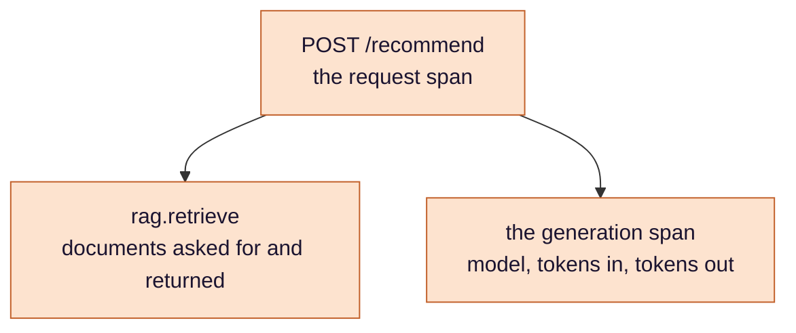
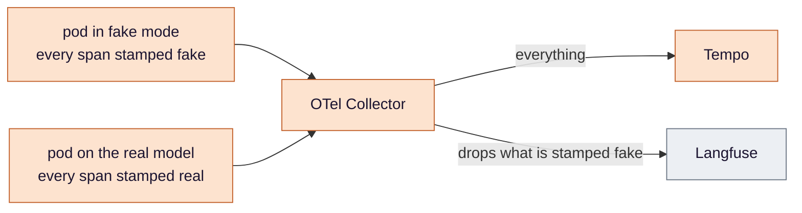

# Stage 8 — Tracing: where the time went, and what it cost

**OpenTelemetry follows each request through retrieval and generation, keeps every trace for debugging and the
real-model ones for reading, and turns token counts into an estimated price. The work is less in collecting the data
than in deciding what goes where — and in never mistaking a number that exists for a number that means something.**

**Where this sits.** The `OTEL`, `TEMPO` and `LF` boxes in [design §3](../eks-sre-llmops-design.md#3-architecture).
Criteria **#11** and **#12**.

Ideas are in [`concepts.md`](concepts.md); this stage also leans on stage 4's
[fake provider](../load/concepts.md#7-the-fake-provider-as-a-load-source) and
[empty results](../load/concepts.md#8-an-empty-result-is-not-a-zero). Pipelines, attributes, exemplar settings, the
cost query and each criterion's false passes are in
[design §4.2](../eks-sre-llmops-design.md#42-opentelemetry-and-llm-observability) and
[§6](../eks-sre-llmops-design.md#6-verification-and-evidence-definition-of-done). This page is the reasoning.

## The problem

Every stage so far treats a request's latency as a set of averages. The metrics already split retrieval time from model
time in aggregate, but when one request is slow nothing can say where *its* time went, and nothing leads from a slow
point on a graph to a request that was in it. Nor can anything say what a request cost: the model is paid per token,
and the tokens are counted but sit on no dashboard. And the text of a bad answer, the thing
most worth reading when an LLM service misbehaves, is not recorded at all.

## Decision 1 — one trace per request, one span per stage

*Concepts: [§1 a trace and its spans](concepts.md#1-a-trace-and-its-spans) ·
[§3 GenAI semantic conventions](concepts.md#3-genai-semantic-conventions).*

The value is in the split. Retrieval and generation fail differently and cost differently, and with one span each
the question "which half got slower?" has an answer. The generation span uses the OpenTelemetry names for generative
AI, so a tool built for LLM traces recognises it; the design lists the two places where the code does not yet follow
those conventions fully.

The spans are written in the application by hand. A library that patches LangChain would add more detail, and it
stays an option — but the numbers this project depends on do not wait for a library to keep pace with LangChain's
releases.

## Decision 2 — two destinations with two jobs, split by pod

*Concepts: [§2 OpenTelemetry and the collector](concepts.md#2-opentelemetry-and-the-collector) ·
[§4 pipelines and a filter](concepts.md#4-pipelines-and-a-filter).*

Tempo, inside the cluster, is for debugging — including every drill. Langfuse, outside it, is for reading real prompts
and answers. The drills make that split necessary: they run the fake provider hard and long, and sending those traces
to Langfuse would spend its allowance on a model that does not exist.

The interesting part is *how* the collector tells them apart:

The natural attribute to filter on — the model name — sits only on the generation span. Filtering on it would drop that
one span and forward the rest of each drill's trace, and Langfuse would fill with traces that have no generation in them.
The mode is a property of the *pod*, not of any one span, so the pod stamps it on everything it emits and the filter
reads the stamp. A filter has to key on something that is present everywhere it needs to act.

## Decision 3 — span metrics are for finding traces, not for measuring

*Concept: [§5 span metrics, and two tools that disagree](concepts.md#5-span-metrics-and-two-tools-that-disagree).*

The collector can turn spans into metrics, and those overlap with the api's own histograms without matching them.
Rather than reconcile two measurements of one thing, the design gives each a single job: the api's histograms decide
things; span metrics carry *exemplars* — a sample trace attached to a point on a graph — so a slow bar can be clicked
through to a request that was in it.

That click is worth knowing about because it is fragile in a particular way. It depends on four separate settings in
three different components, and missing any one of them does not produce an error. The graph simply renders with
nothing to click, and nobody notices until they need it.

## Decision 4 — what goes to a third party, decided in the open

*Concept: [§6 capturing content](concepts.md#6-capturing-content).*

Langfuse is most useful for the text. Recording it means copying what users type to an outside service — and the box
is free text, whatever it was meant for. Capture is **not built yet**. When it is, it will be on for this single-operator
demonstration and off by default anywhere regulated, and the page with the input box will say which. Until then the
spans carry numbers only, and criterion #11 is judged on their shape.

## Decision 5 — cost is an estimate, and its labels are part of the number

*Concepts: [§7 tokens and the cost of a request](concepts.md#7-tokens-and-the-cost-of-a-request) ·
[§8 an attribute that is present and zero](concepts.md#8-an-attribute-that-is-present-and-zero).*

Tokens times a list price gives an estimated cost per model, and cost per thousand requests divides that by a request
rate. Each half of that division has a way to lie.

The numerator is only honest if it is restricted to real models: the fake provider is priced like a real one, so drills
would add realistic-looking dollars. The denominator is only honest if it can be restricted *the same way* — and the
obvious request counter has no model label, so it would count every drill request and dilute the figure. The design
uses a request count that does carry the model. **A ratio is only as filtered as its less-filtered half.**

And a value can be present without being real. When the model reports no usage, the token attributes are written as
zero — so "the span has token attributes" is true of a span with no token data at all, and the cost built on it is a
cheap day that never happened.

## Decision 6 — capture the evidence before the teardown

*Concept: [§9 where traces live](concepts.md#9-where-traces-live).*

Tempo's traces die with the cluster each night; Langfuse keeps the real ones for as long as its plan retains data. So the
evidence for this stage is gathered during the session, from both. A trace present in Langfuse tomorrow and absent from
Tempo is the expected state.

## How this stage can pass while being broken

The false passes for #11 and #12 are in
[design §6](../eks-sre-llmops-design.md#6-verification-and-evidence-definition-of-done). The shape in this stage:
**a value that exists and means nothing** — a default zero, a dollar made of synthetic tokens, a filter that removed one
span and passed the rest, a graph that renders without the links it was built for. Each is caught by asking what the
value is *about* before asking what it *is*.

## What this stage proves, and what it only assumes

**Proves:** a real-model request produces a trace with a retrieval span and a generation span, the latter carrying
non-zero token counts, in both Tempo and Langfuse, while a fake-mode request from the same session, looked up by its
trace id, is in Tempo and absent from Langfuse; the dashboard shows an
estimated cost per thousand real-model requests.

**Assumes:** that the list prices are still current — they are read by hand and dated, not fetched; and that the token
counts the provider reports are the ones it would bill.

## Known limits

- **Prompt capture is not built yet.**
- **Tempo keeps nothing across a teardown.**
- **The cost is an estimate at list price**, for a project that runs on a free tier — what the traffic *would* cost.

---

[Concepts](concepts.md) · [Design §4.2](../eks-sre-llmops-design.md#42-opentelemetry-and-llm-observability) ·
[Criteria #11, #12](../eks-sre-llmops-design.md#6-verification-and-evidence-definition-of-done) ·
Previous: [Scaling](../scaling/README.md)
